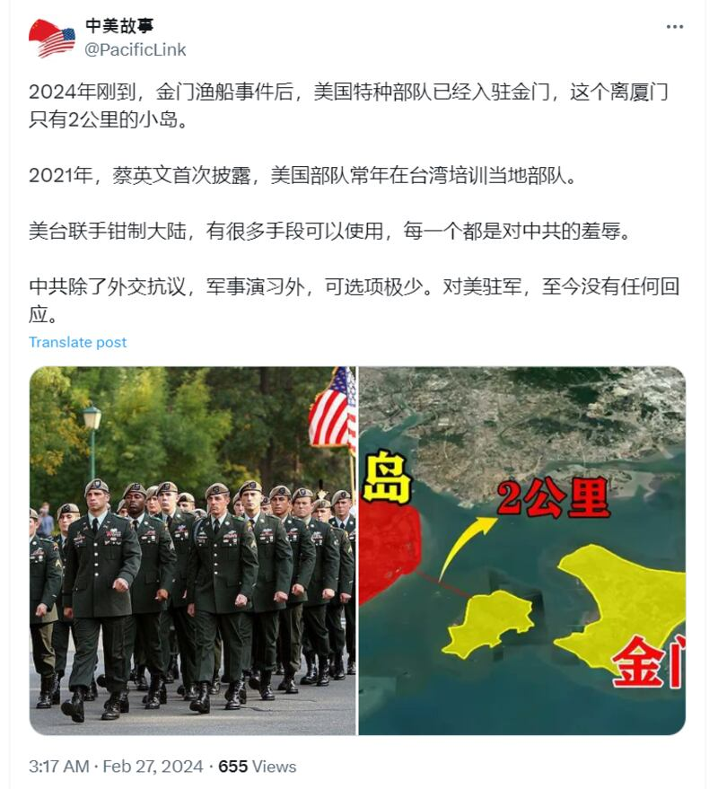

# Does a photo show US troops stationed in Taiwan’s Kinmen islands?

## Verdict: False

By Taejun Kang for RFA

2024.04.18

Taipei, Taiwan

## A photo shared by Chinese-speaking social media users claims to show American soldiers stationed on Taiwan's Kinmen islands this year. But the claim is false. The photo in fact shows U.S. troops attending a New York funeral in 2007.

The claim was [shared](https://twitter.com/PacificLink/status/1762195283260363149) on X, formerly known as Twitter, on Feb. 27.

“The year 2024 has just arrived, and US Special Forces have been stationed in Kinmen, a small island just 2 kilometers from Xiamen, after the Kinmen fishing boat incident,” the claim reads in part.

Netizens on X claim that U.S. soldiers were stationed in Taiwan’s Kinmen islands. (Screenshot/ X)

The photo began circulating following an incident on Feb. 14, in which two Chinese men drowned near Kinmen, an island under Taipei's control that is just 10 kilometers (6 miles) from the Chinese city of Xiamen, while being chased by a Taiwanese coast guard vessel.

The incident has exacerbated tensions between Beijing and Taipei, especially after a survivor allegedly claimed the boat was “rammed.”

Similar claims have been shared on X [here](https://twitter.com/Jerry00107966/status/1762282175473614998) and [here](https://twitter.com/zhongdaotahai3/status/1762114973655003232).

But the claim is false.

## A funeral in New York

A reverse image search on Google and TinEye found the same photo [published](https://wp.yellowribbonamerica.org/annual-christmas-drive-2/downing-internment/) on the website of Yellow Ribbon America, a group that provides support for U.S. military personnel, their families and communities.

“U.S. Army Rangers with the 75th Ranger Regiment make up the ‘honor platoon’ in a funeral procession to the gravesite of Gen. (retired) Wayne A. Downing during his interment service at West Point, NY, Sept. 27, 2007,” the caption of the photo reads.

A keyword search found an exact matching photo posted on the website TogetherWeServed, an online community of the U.S. military veterans, stating that the [funeral](https://army.togetherweserved.com/army/servlet/tws.webapp.WebApp?cmd=LegacySBV&type=Person&ID=121672#:~:text=General%20Downing%20was%20buried%20in%20the%20West%20Point%20Cemetery%2C%20West%20Point%2C%20New%20York%20on%20September%2027%2C%202007.%20His%20grave%20is%20just%20north%20of%20the%20main%20cemetery%20building.) of Gen. Wayne A. Downing was held on Sep. 27, 2007 at the [West Point Cemetery](https://www.westpoint.edu/directory/west-point-cemetery), which is located on the grounds of the United States Military Academy in New York state.

## US troops in Taiwan

In 2021, Taiwan's President Tsai Ing-wen [acknowledged](https://www.reuters.com/world/asia-pacific/taiwan-president-confirms-us-troops-training-soldiers-island-cnn-2021-10-28/) for the first time since 1979 — the year the last U.S. garrison departed following Washington's shift of diplomatic recognition to Beijing — that American troops were present on the island to train with Taiwanese soldiers.

In a separate [report](https://focustaiwan.tw/politics/202403140016) published by Taiwan's Central News Agency on March 14, 2024, the region's defense minister affirmed U.S. troops were also positioned on the outlying islands as part of an exchange program, described as a "learning opportunity" for the armed forces of the democratic island.

## *Edited by Shen Ke & Malcolm Foster.*

*Asia Fact Check Lab (AFCL) was established to counter disinformation in today's complex media environment. We publish fact-checks, media-watches and in-depth reports that aim to sharpen and deepen our readers' understanding of current affairs and public issues. If you li* *ke our content, you can also follow us on*   [*Facebook*](https://www.facebook.com/asiafactchecklabcn)  *,*   [*Instagram*](https://www.instagram.com/asiafactchecklab/)   *and*   [*X*](https://twitter.com/AFCL_eng)  *.*

[Original Source](https://www.rfa.org/english/news/afcl/fact-check-us-troops-kinmen-04182024163316.html)