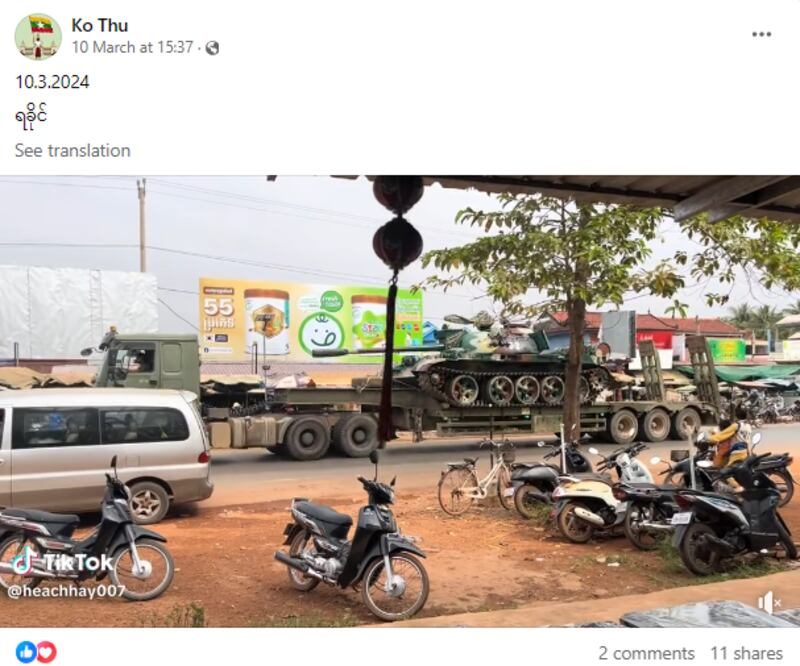
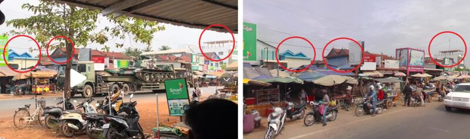

# Does this video show a military convoy in Myanmar’s Rakhine state?

## Verdict: False

By Taejun Kang for RFA

2024.04.22

Taipei, Taiwan

## A video of tanks being transported has been shared repeatedly in Burmese-language social media posts that claim it was taken in Myanmar’s Rakhine state in March 2024.

## But this is false. The video was in fact filmed at a market in the southwestern part of Cambodia and began to circulate online as early as January.

The video was [shared](https://www.facebook.com/100077005012525/posts/1111542726732569/) by several Facebook [users](https://www.facebook.com/61555856305817/posts/1513752169173043/) on March 10, 2024, and shows what appears to be a convoy of large trucks transporting tanks adorned in camouflage patterns along a roadway.

“10/3/2024 Rakhine,” reads the headline in Burmese.

A screenshot of the Facebook post, taken on April 8, 2024. (Screenshot/Facebook)

Rakhine, formerly known as Arakan, is a state situated on Myanmar’s western coast. It has witnessed a series of violent clashes between local militant organizations such as the Arakan Army, or AA, and the Myanmar military.

Following the launch of a new offensive in November 2023, the AA has [captured](https://www.rfa.org/english/commentaries/commentary-arakan-army-myanmar-04052024205852.html) six of Rakhine's 17 townships, several smaller settlements, around 170 junta camps and numerous military facilities.

As of early April, the AA is still advancing across the state and pursuing ongoing offensives against several towns in the region still defended by Myanmar's military junta.

## Filmed in Cambodia, not Myanmar

The video of the purported military convoy features a TikTok user handle named “@heachhay007” first seen in the lower left and then in the lower right corner of the clip.

A keyword search of this username turned up a [video](https://www.tiktok.com/@heachhay007/video/7328235851358424322) published on Jan. 26 by a TikTok user who regularly uploads videos in Khmer, the national language of Cambodia.

The location in the video features multiple billboards written in Khmer, which utilizes a script distinct from Myanmar’s official language.

A combination of keyword and reverse image searches found the video was in fact filmed at [Tram Kak market](https://maps.app.goo.gl/DdVBidsA9HJicfZm9) in Cambodia's Takeo province, a location from which the user has previously [published](https://www.tiktok.com/@heachhay007/video/7220264291113438465) multiple videos.

Below are two screenshots comparing the video in the false post (left) and the Google Street View image of Cambodia’s Tram Kak market (right). The corresponding features are circled in red.

A screenshot comparison of the video in the false post (left) and the Google Street View image of Cambodia’s Tram Kak market (right) with corresponding features highlighted in red circles. (Screenshots/ Facebook & Google Image)

## *Edited by Shen Ke and Matt Reed.*

## *Asia Fact Check Lab (AFCL) was established to counter disinformation in today's complex media environment. We publish fact-checks, media-watches and in-depth reports that aim to sharpen and deepen our readers' understanding of current affairs and public issues. If you like our content, you can also follow us on*   [*Facebook*](https：//www.facebook.com/asiafactchecklabcn)   *,*   [*Instagram*](https：//www.instagram.com/asiafactchecklab/)   *and*   [*X*](https：//twitter.com/AFCL_eng)   *.*

[Original Source](https://www.rfa.org/english/news/afcl/military-convoy-rakhine-04222024150750.html)