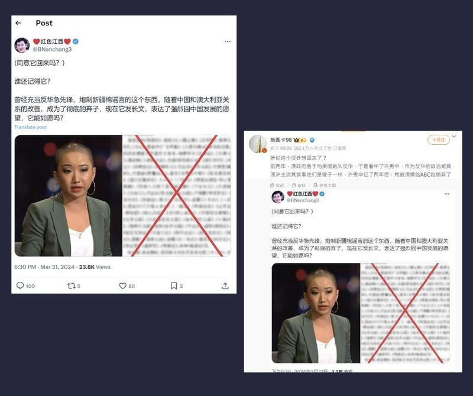

# Is journalist Vicky Xu preparing to return to China?

## Verdict: Lack of evidence

By Alan Lu for Asia Fact Check Lab

2024.04.23

Taipei, Taiwan

## Chinese social media influencers have recently claimed that prominent Chinese-born Australian journalist Vicky Xu had posted a message saying she planned to return to China.

## There is no evidence for this. The source did not provide evidence to support the claim, and Xu herself later confirmed to AFCL that she has no such plans.

Currently working as an analyst at the Australian Strategic Policy Institute, or ASPI, Xu has previously written for both the Australian Broadcasting Corporation, or ABC, and *The* *New York Times.*

A Chinese language netizen on [X initially claimed](https://twitter.com/BNanchang3/status/1774383638676705482) on March 31 that the changing geopolitical relations between Sydney and Beijing had caused Xu to become an expendable asset and that she had posted a message expressing a strong desire to return to China. An illegible, blurred photo of the supposed message accompanied the post.

This claim was retweeted by a widely followed influencer on the popular Chinese social media site [Weibo](https://weibo.com/3279710155/5018275930965698) one day later, who additionally commented that Xu was a "traitor" who had been abandoned by Australian media.

Rumors surfaced on X and Weibo at the end of March that Vicky Xu - a Chinese-born Australian journalist who exposed forced labor in Xinjiang - was returning to China after becoming an "outcast" in Australia. (Screenshots / X & Weibo)

Following the publication [of an ASPI article](https://www.aspi.org.au/report/uyghurs-sale) in 2021 which exposed forced labor conditions in Xinjiang co-authored by Xu, the journalist was labeled "morally bankrupt" and "anti-China" by the Chinese state owned media outlet *Global Times* and [subjected](https://www.rfa.org/cantonese/features/hottopic/reporters-03222023093342.html) to an influx of threatening messages and digital abuse, eventually forcing her to temporarily close several of her social media accounts.

AFCL found that neither [Xu's active X](https://twitter.com/veryvickyxu) nor [LinkedIn](https://www.linkedin.com/in/veryvickyxu/) account has any mention of her supposed return to China, and received the following response from Xu herself about the rumor:

“I can confirm that I don’t have plans to go back to China. I think if I do go back I’ll most definitely be detained or imprisoned - so the only career I’ll be having is probably going to be prison labor or something like that, which wouldn’t be ideal.”

Neither a keyword search nor reverse image search on the photo attached to the original X post turned up any text from Xu supporting the netizens’ claims.

## *Translated by Shen Ke. Edited by Shen Ke and Malcolm Foster.*

*Asia Fact Check Lab (AFCL) was established to counter disinformation in today's complex media environment. We publish fact-checks, media-watches and in-depth reports that aim to sharpen and deepen our readers' understanding of current affairs and public issues. If you like our content, you can also follow us on*   [*Facebook*](https://www.facebook.com/asiafactchecklabcn)  *,*   [*Instagram*](https://www.instagram.com/asiafactchecklab/)   *and*   [*X*](https://twitter.com/AFCL_eng)  *.*

[Original Source](https://www.rfa.org/english/news/afcl/fact-check-vicky-xu-04232024131753.html)