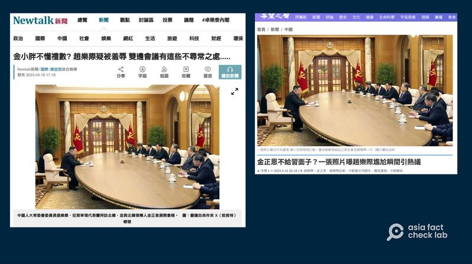
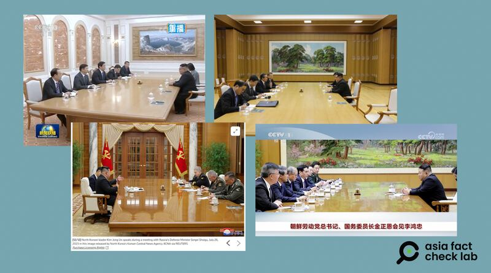

# Did North Korean leader humiliate Chinese delegation with seating arrangement?

## Verdict: Lack of evidence

By Zhuang Jing for Asia Fact Check Lab

2024.04.24

Taipei, Taiwan

## A photo of North Korean leader Kim Jong Un’s meeting with senior Chinese official Zhao Leji in Pyongyang this month has been shared in Chinese-language social media posts, claiming that it shows Kim “humiliating” Zhao with the seating arrangement – Kim alone on one side of a big oval table and nine or 10 Chinese officials facing him on the other.

## But the claim lacks evidence. The same seating arrangement has been used before at several meetings Kim conducted with senior Chinese and Russian officials. Experts on North Korean matters also dismissed the claim.

The claim was [shared](https://twitter.com/wuzuolai/status/1779712714862178749?ref_src=twsrc%5Etfw%7Ctwcamp%5Etweetembed%7Ctwterm%5E1779712714862178749%7Ctwgr%5E51e507f885d95f2d00279a927fc3f99d389f8b41%7Ctwcon%5Es1_&ref_url=https%3A%2F%2Fwww.ntdtv.com%2Fb5%2Fmkt_ipad%2F2024%2F04%2F17%2Fa103872000.html) on X on April 15, 2024.

“The senior Chinese Communist Party officials are treated as ministerial officials in front of Kim Jong Un,” it reads. “It not only severely humiliated Zhao Leji, but also mocked the core of Xi.”

The claim was accompanied by what appears to be a photo of North Korean leader Kim Jong Un’s meeting with Zhao Leji, who ranks third in the Chinese Communist Party hierarchy and heads the ceremonial parliament.

A reverse image search on Google found the same photo published [here](https://english.news.cn/20240414/4bbb33cf783e47399a8cd709b34c598d/c.html) by China's state-run Xinhua News Agency on April 14, 2024.

Newtalk News, Sound of Hope and other outlets repeated claims that the unusual seating arrangement for Kim Jong Un’s meeting with Zhao Leji was a deliberate snub against the Chinese officials. (Screenshots / Newtalk News and Voice of Hope)

The seating arrangement in the photo has led some online commentators to interpret the scene as though Kim is being briefed by the Chinese officials, suggesting a dynamic where Kim appears in a more senior capacity.

The photo and the similar claims have been shared on other Chinese-language media outlets [here](https://newtalk.tw/news/view/2024-04-16/916244), [here](https://www.soundofhope.org/post/807853?lang=b5) and [here](https://www.ntdtv.com/b5/mkt_ipad/2024/04/17/a103872000.html).

But the claim lacks evidence.

## Seating arrangement

A combination of keyword and reverse image searches found that the same seating arrangement has been used before at several meetings Kim conducted with senior Chinese and Russian officials as seen [here](https://tv.cctv.com/2018/09/09/VIDE28fjG6FguB0oWTKq6T9W180909.shtml) and [here](https://www.guancha.cn/politics/2018_09_10_471408.shtml?s=wapzwyxgtjbt?web).

The similar seating arrangement was also used at meetings between Kim and now Foreign Minister [Wang Yi](http://kp.china-embassy.gov.cn/zcwj/201805/t20180504_1074154.htm) in May 2018, China's Vice Chairperson of the Standing Committee of the National People's Congress [Li Hongzhong](https://tv.cctv.com/2023/07/29/VIDE1kQo77aYxO0oMK3AXkCS230729.shtml) and Russian Defence Minister [Sergei Shoigu](https://www.reuters.com/world/north-koreas-kim-jong-un-meets-russian-defence-minister-2023-07-27/) in July 2023 as well as Russian Foreign Minister [Sergei Lavrov](https://apnews.com/article/russia-north-korea-ukraine-munitions-kim-putin-3f9e87984e704eb5bc3481552eed08f1) in October 2023.

When receiving past delegations of Chinese and Russian officials, Kim has frequently been seated alone except for a single interpreter. (Screenshots/ CCTV, Reuters and the official website of the Chinese Embassy in North Korea.)

## Oval table

The use of an oval table is what sets Kim’s meeting with Zhao apart from other meetings mentioned above, where a rectangular table was used.

But AFCL found that there is no particular stigma associated with oval tables in either Chinese or Korean diplomatic culture.

For instance, South Korea [chose](https://edition.cnn.com/asia/live-news/north-korea-south-korea-summit-intl/h_a2fd2821f6c450c3cfd247053e97adcb) an oval table for the April 2018 Inter-Korean summit in order to allow the two sides to sit closer and facilitate dialogue.

Apart from that, the [official Chinese protocol](https://www.mfa.gov.cn/web/ziliao_674904/lbzs_674975/200705/t20070524_7949249.shtml) for diplomatic meetings lists both rectangle and oval tables as common and acceptable table shapes used for bilateral talks.

[Lim Eul-chul](https://ifes.kyungnam.ac.kr/ifeseng/6620/subview.do?enc=Zm5jdDF8QEB8JTJGd29ya2VyJTJGaWZlc2VuZyUyRjclMkYyMDgwJTJGdmlldy5kbyUzRg%3D%3D), director of North Korea Research Center at Kyungnam University believes there was no reason for Kim to humiliate Zhao and that if the North Korean leader had wanted to do so he simply would have canceled the meeting.

He noted, however, the decision to have Kim seated across from nine senior officials on his own may have been a subtle move meant to highlight the leader’s self-confidence.

[Lin Chih Hao](https://indsr.org.tw/en/member?resid=5&uid=2&pid=150), an assistant research fellow at Taiwan's Institute for National Defence and Security Research with expertise on North Korean politics, said Zhao's trip to Pyongyang was actually one the warmest receptions a Chinese delegation has received in the last six years.

Lin also pointed out Kim has consistently chosen to meet with foreign officials alone over the last few years.

## *Translated by Shen Ke. Additional reporting by RFA Korean. Edited by Shen Ke, Taejun Kang and Malcolm Foster.*

*Asia Fact Check Lab (AFCL) was established to counter disinformation in today's complex media environment. We publish fact-checks, media-watches and in-depth reports that aim to sharpen and deepen our readers' understanding of current affairs and public issues. If you like our content, you can also follow us on*   [*Facebook*](https://www.facebook.com/asiafactchecklabcn)  *,*   [*Instagram*](https://www.instagram.com/asiafactchecklab/)   *and*   [*X*](https://twitter.com/AFCL_eng)  *.*

[Original Source](https://www.rfa.org/english/news/afcl/fact-check-north-korea-china-seating-04242024144920.html)