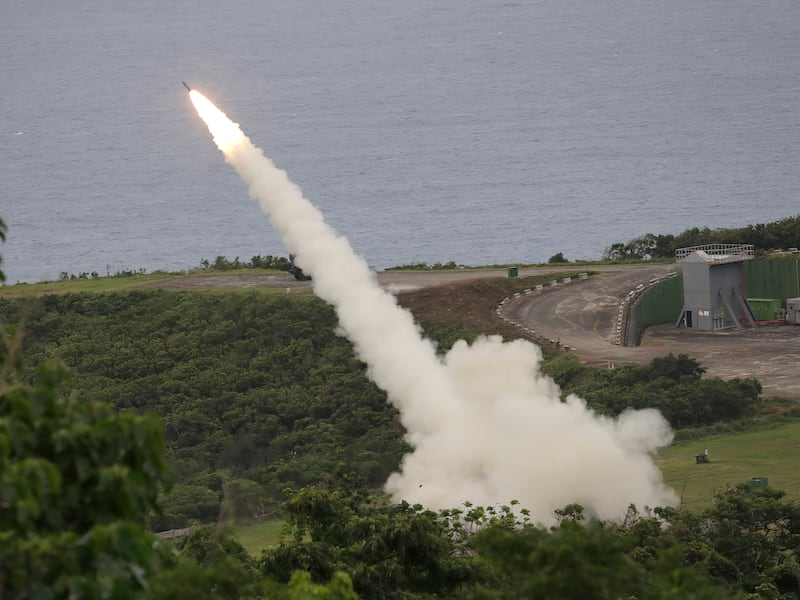
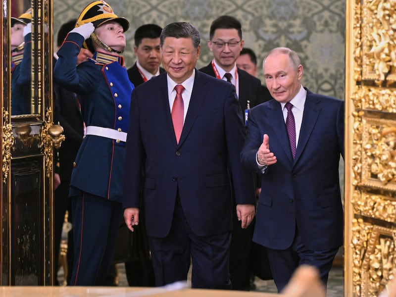
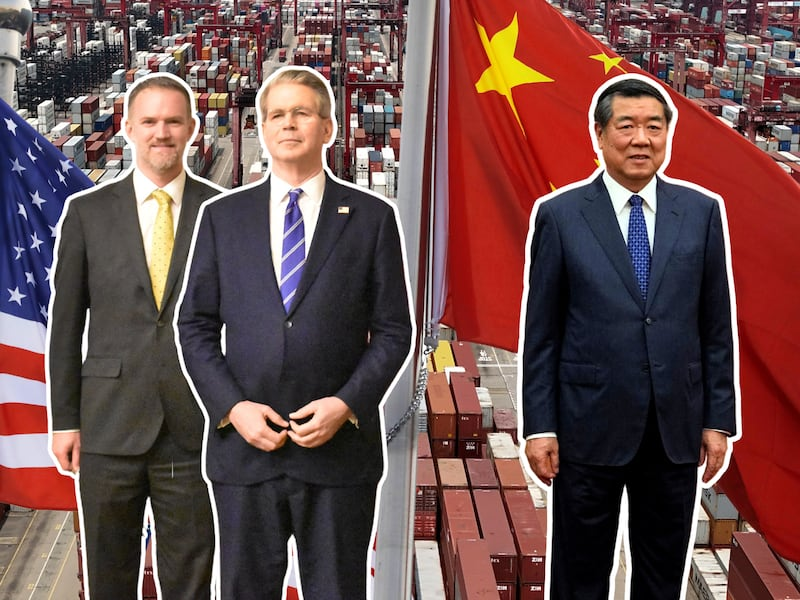

# INTERVIEW: Examining fake news sites generating Chinese propaganda

## Researchers find over 100 supposedly local news sites set up by a Chinese PR firm.

By Li Sai for Asia Fact Check Lab

2024.04.24

*Japan's “Ginza Daily,” Italy's “Milano Moda Weekly,” South Korea's “Incheon Focus,” France's “Friendly Paris” and Ecuador's “Iguazu.”*

*All these innocent-sounding websites from around the world provide local news, crime reports, entertainment and dining guides – but they have one thing in common: their narratives align with that of Chinese propaganda. For example, they all offered similar criticism of Taiwanese President Tsai Ing-wen and accused a public health researcher in Hong Kong of being a "traitor" and a "fraud.”*

*Some of these sites have caught the attention of authorities in various countries. In December,*   [*AFCL reported*](2023-12-01_Media Watch： Chinese firms running fake S Korean news sites.md)   *that South Korea's national intelligence agency warned that 18 such sites were connected to a Chinese company, while Italian media also investigated*   [*a group of fake news websites*](https://decode39.com/8109/network-fake-china-news-websites-italy/)   *that had origins in China.*

*Researchers at The Citizen Lab, a research institute that’s part of the Munk School of Global Affairs at the University of Toronto, have examined these sites and found that they were part of a network of over 100 websites in 30 countries that originated from one company: Shenzhen, China-based Haimai, an abbreviation of Haimaiyunxiang Media Corp.*

*They dubbed the operation “PaperWall.”*

*Despite having little to no traffic, these sites disseminated Chinese propaganda and attempted to influence search engine recommendations, according to a February report by The Citizen Lab titled, "PaperWall: Chinese Websites Posing as Local News Outlets Target Global Audiences with Pro-Beijing Content.” Some of these sites have since gone blank.*

*Asia Fact Check Lab, a unit of Radio Free Asia, talked to Alberto Fittarelli, a senior researcher at The Citizen Lab, about “PaperWall.”*

## AFCL：  As a senior expert in the field of information security, how did you pivot from consulting tech companies to studying misinformation and disinformation in the media? And how did you become aware of the " PaperWall " campaign?

**Alberto Fittarelli:** I am a threat intelligence and cyber security researcher with about 15 years of experience, mostly in the private sector and mostly focused on threats to online communities. But over the past decade, I've prioritized investigating information operations, the act of potentially manipulating information in order to deceive or deceptively influence.

I want to be upfront and say I am not necessarily an expert of China or any other region. Although I've been working more on specific regions, my focus is on looking and finding similarities among information operations from around the globe.

After joining the Citizen Lab, I started researching the ["Hong Kong Leaks"](https://hongkongfp.com/tag/hk-leaks/) [a website targeting democratic activists, human rights defenders, and journalists in Hong Kong, disclosing the personal information of nearly 3,000 people], which our team issued [a report on in July 2023](https://citizenlab.ca/2023/07/hkleaks-covert-and-overt-online-harassment-tactics-to-repress-the-2019-hong-kong-protests/%E2%80%9D) explaining what they were and revealing who was behind it. That campaign lasted for a couple of years and is still technically visible, though perhaps not very active.

PaperWall gave me an opportunity to use my experience in dealing with the specific tactics utilized by information operations in order to understand how such operations cross reference and intersect with each other, and how they can form an ecosystem.

Last year, I found an article in the Italian newspaper *Il Foglio* claiming some websites were managed from China, and were part of an information operation. That got me wondering: is it even true? Could there be more? Could it be more than a few Italian websites? I wanted to verify the claims, and started investigating with my colleagues at the Lab.

## AFCL： How do Chinese information operations work in practice? What’s new about “PaperWall”?

**Fittarelli:** Online Chinese information operations have been around for quite some time. The most well known is Spamouflage, also known as Dragonbridge, a large network of collaborating entities, potentially including corporations. We're talking about hundreds of thousands of coordinated accounts aggressively spreading targeted pieces of disinformation. While the content spread on Dragonbridge potentially intersects with what we found on PaperWall, the two networks' preferred tactics differ.

Spamouflage utilizes a large number of spam accounts on social media to harass its targets. The content of this spam is primarily commercial, but occasionally turns into political attacks. That's been known for years, and Meta and Twitter (now X) actually disrupted a number of such operations.

“HK leaks” was different, using doxxing [maliciously searching and spreading private and identifying information about the targeted individual] to target specific almost 3,000 individuals associated or involved with the Hong Kong protests. While distinct from Spamouflage, some of the former’s tactics were employed to amplify the effect of the harassment.

What we believe to have found with “PaperWall” was something quite different: A private company creating a number of websites pretending to be local media organizations in targeted countries where they clearly don't have any physical presence. While we haven’t seen any in the U.S. and Canada (with the exception of a single website aimed at U.S. audiences), there’s a lot from Mexico, as well as in Europe, Japan, South Korea and a number of other Asian countries.

So again, different tactics, different audiences, same goal. We assume the goals are the same because the political content they use to attack is similar to that of “Dragon Bridge.”

## AFCL： You mentioned the collaboration between the Chinese government and private PR companies. How does this type of collaboration play into the current information operations?

**Fittarelli:** To be honest, we can't confirm that relationship. However, while there's no direct evidence to prove that these networks or this PR company were directed by the Chinese government, the political content that's published by them is so aggressive, so explicit and so obviously aligned with Beijing's interests that it's difficult to believe it's just a coincidence.

For example, all PaperWall websites have attacked Yan Limeng [a Hong Kong University researcher who accused the Chinese government of manufacturing the COVID-19 virus]. Regardless of who exactly the attacks are targeting, the clear coordinated operations against individuals known to be on the Chinese government’s bad side. We found a similar alignment with Beijing’s interests in content on Spamouflage.

It's a very complex network. Perhaps “PaperWall” is primarily motivated by money, and perhaps the Chinese government is one of their clients. But that doesn't rule out secondary political motivations as potentially influencing the network’s choice of client.

## AFCL： Do these websites have much traffic? What has been the impact?

**Fittarelli:** We used open source tools to measure these sites' traffic and found that most of them did not even appear in their database. That typically means they're getting almost no traffic, with a few of them, particularly English language ones, having only about 50 individual visits per day. There's also no social media accounts working to promote their visibility.

So it's a trade-off. We, the researchers, are providing visibility to unknown websites, but at the same time saying, hey, they're fake, you might want to be careful.

## AFCL： Asia Fact Check Lab had a story during the Taiwan election that a Taiwanese journalist was paid by the Chinese government to set up a group of local news websites in Taiwan to spread false information. It sounds very similar to “PaperWall.” However, in this case the mainstream media eventually picked up content from these websites. Could this be the potential outcome of PaperWall?

**Fittarelli:** That was probably their goal too. While there was some traffic for "PaperWall," we didn't find it getting picked up by news aggregators like Google News, Yahoo News.

However, if these operations do manage to produce a high enough volume of political content that it eventually starts being picked up by such services, you have a successful operation.

## AFCL： We tried to check some of the websites’ pages and found that most of them are blank now. Is it because of the report?

**Fittarelli:** I see that most of the non-English local websites appear to be gone, which is a bit surprising given that they're technically hosted in China and could stay online. It seems like they're winding down the operation after the report was published. A couple of the English speaking websites are still online and actively publishing content, such as one called "euleader," which I believe was targeting the U.K., and another called "world development press-WDPP."

## AFCL： So they are scaling down the campaign because of the report? Has Haimai, the Chinese PR company ever responded to the report?

**Fittarelli:** It's possible. Exposing it probably defused the operation.

While our team didn't request a response from Haimai, I've noticed that Japan’s NHK did their own investigation on “PaperWall” and requested one response from Haimai. And according to my poor Japanese skills and automatic translation, it seems like Haimai replied with something along the lines of, “We didn't read the report” and “It's not us,” which is not surprising.

## AFCL： What do you find most surprising about “PaperWall”? What is the danger of such operations?

**Fittarelli:** The most peculiar feature of "PaperWall" was its rapid replication. If you look at the timeline, while they initially created only a couple of websites in 2019, starting in mid 2020 they created about 120 websites in a few years.

This is an operating model that can be replicated quickly and could eventually become extremely dangerous if it started to be legitimized. If given a wider audience by a politician’s reference or by mainstream media coverage, the amount of people confused by or sold on its contents would exponentially increase. At that point, the damage is done and it would be difficult to go back and tell people, “Just forget what you saw. ”

I really want to emphasize that while the impact of PaperWall so far has been negligible, that doesn't mean it's not dangerous.

I personally have seen a decade of information operations, most of which were completely innocuous up until the point they were impactful. People need to know that such operations are not necessarily dormant; they are a potential time bomb that may very well explode someday.

## AFCL： What does PaperWall forebode for information operations? Is China changing its tactics?

**Fittarelli:** That's my speculation. As social media companies have heavily fought information operations over the past few years, especially in 2016 and 2017, they've gotten wise to how fake accounts are most commonly created or used to spread specific pieces of content on their platforms.

Malicious actors using outdated tactics will get shut down very quickly on these sites and so they’ve had to find novel means to achieve the same ends.

For example, after Twitter shut down an operation targeting the Hong Kong protests, the first of the “HKLeaks” websites came out. Again, this is an assumption, but this turn of events was probably due to these malign actors wanting to continue impacting the protests without being shut down by social media companies they had no control over.

“PaperWall” might be another piece of this same puzzle. As a website hosted in China by the local conglomerate Tencent, nobody can shut down their servers or restrict the website domains they can reach globally. And that's probably why they didn't use social media in the first place - they didn’t need to in order to have an influence, and they knew that if they tried, they were likely going to get caught.

## AFCL： How about the future? The current hot topic is generative AI, how do you see it assisting with information operations from China or other places?

**Fittarelli:** I'll decouple this topic from China, because it's applicable to any area in the future.

Take “PaperWall” for example, these people stole content from real news organizations. But they did so in a very conspicuous manner. Italian websites publish local news in Italian, but this political content is in English and possibly not even understood by all people who came across it.

In the future, AI could allow such malicious actors to generate independent content instead of directly stealing it. Every article will be unique and look like a real news organization, and be unable to be traced back to its sources.

This applies just as much to audio and video content too. Deep fake videos of politicians or influential figures could be made saying something that the person never uttered. Such videos will be difficult to trace or even prove false, particularly if they were supported by a network of social media accounts simultaneously pushing a matching narrative.

We already saw a couple of information operations using such videos, with AI generated news anchors in Venezuela looking so real that they were difficult to be recognized as fake . This could be done by any government or any private actor for that matter.

## AFCL： That sounds so pessimistic for the future.

**Fittarelli:** I don't want to sound pessimistic. I think we also have opportunities.

While we are perhaps not yet ahead of these malign actors or the national security concerns they raise, we can quickly identify their tactics, and anticipate future scenarios. We need to be aware of these actors’ potential in order to be able to combat them as quickly and effectively as possible.

On a positive note, the fact that “PaperWall” is being wiped out after getting exposed is good news. It means that exposure can have a serious impact on such operations, and that it will likely help counter similar future operations as well, regardless of whether or not they employ AI.

## *Edited by Shen Ke and Malcolm Foster.*

*Asia Fact Check Lab (AFCL) was established to counter disinformation in today's complex media environment. We publish fact-checks, media-watches and in-depth reports that aim to sharpen and deepen our readers' understanding of current affairs and public issues. If you like our content, you can also follow us on*   [*Facebook*](https://www.facebook.com/asiafactchecklabcn)  *,*   [*Instagram*](https://www.instagram.com/asiafactchecklab/)   *and*   [*X*](https://twitter.com/AFCL_eng)  *.*

## MORE  China

[### Taiwan test fires new U.S.-supplied rocket system for first time](/english/china/2025/05/12/taiwan-china-missiles/)

---

[### US and China agree to slash tariffs for 90 days](/english/china/2025/05/12/china-us-tariff-deal/)

---

[### Now ‘friends of steel’: Xi and Putin meet in Moscow](/english/china/2025/05/08/china-russia-xi-jinping-putin-partnership/)

---

[### Hong Kong removes protection against land reclamation in Victoria Harbor](/english/china/2025/05/08/china-hong-kong-harbor/)

---

[### US, China in for protracted trade talks, warn experts ahead of crucial Geneva meet](/english/china/2025/05/07/china-us-trade-talks-analysis/)

## MOST READ  RFA

1.

[### Protests by unpaid Chinese workers spread amid factory closures](/english/china/2025/04/29/china-us-tariff-protests-workers-wages/)

---

2.

[### Vietnam enters fray at disputed South China Sea sandbank](/english/southchinasea/2025/05/05/vietnam-china-philippines-sandy-cay/)

---

3.

[### Chinese exporters use ‘origin washing’ to evade U.S. tariffs](/english/china/2025/05/06/china-tariff-exports-origin-washing/)

---

4.

[### Lao troops killed in attack tied to drug crackdown: report](/english/laos/2025/05/05/armed-group-attacl/)

---

5.

[### Uncovering injustice: Key stories from RFA Uyghur](/english/uyghur/2025/05/07/uyghur-rfa-highlights/)

[Original Source](https://www.rfa.org/english/news/china/china-news-sites-propaganda-04242024163518.html)