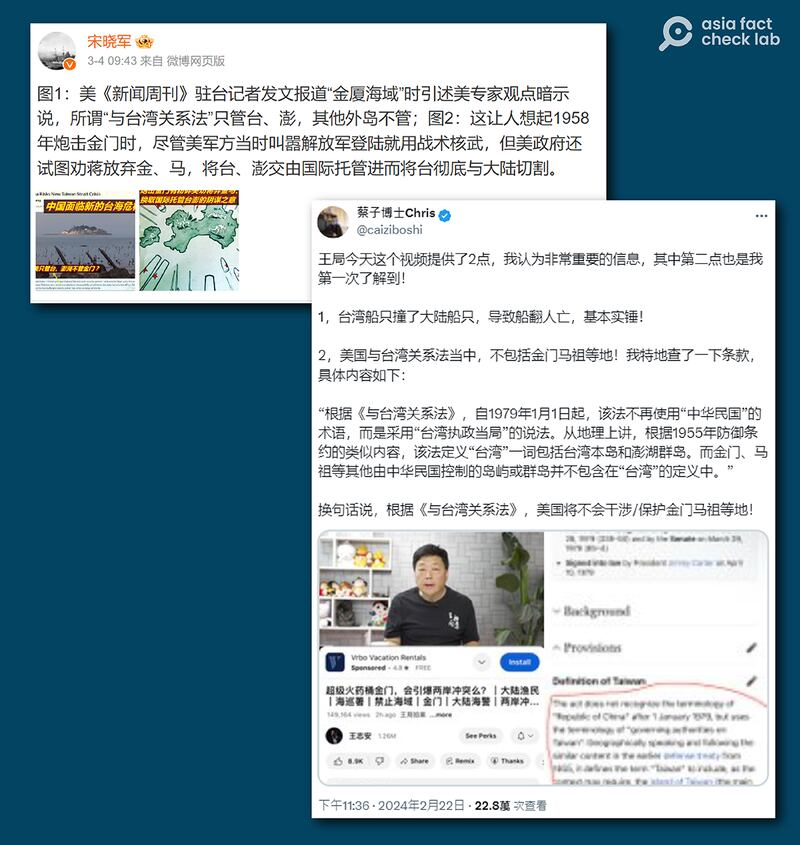

# Does US’s Taiwan Relations Act not cover Kinmen islands?

## Verdict: Misleading

By Zhuang Jing for Asia Fact Check Lab

2024.04.26

Taipei, Taiwan

## A misleading claim emerged in Chinese-language social media posts about the U.S. policy to act in support of Taiwan, citing a   *Newsweek*   article, saying that the policy does not cover Taiwan's Kinmen islands.

## The United States’ Taiwan Relations Act, designed to regulate unofficial relations between Washington and Taipei, contains no clause commenting on what Taiwanese territories the U.S. will or will not defend.

The claim was [shared](https://archive.ph/LyjZy#selection-165.3-165.136) on the popular Chinese social media platform Weibo on March 4, 2024.

"A *Newsweek* correspondent in Taiwan reported, citing the views of U.S. experts, that the so-called 'Taiwan Relations Act' only covers Taiwan's main island and Penghu. It doesn't cover other outer islands," the claim reads in part.

Recent disputes around Kinmen between China and Taiwan have increased tensions in the region, with several Chinese influencers claiming that the U.S. has officially stated it will not help defend Taiwan from China. (Screenshot/ Weibo, X)

The Taiwan Relations Act, or TRA, is a congressional act passed in 1979 that broadly defines U.S. policy towards Taiwan.

Similar claims were also shared on Reddit and X, with some users claiming that the TRA precludes the United States from intervening to defend Kinmen or Matsu from attack.

But the claim is misleading.

## *Newsweek*   article

A keyword search found the *Newsweek* article cited by Chinese-language social media users [published](https://archive.ph/QLBj9) on Feb. 29.

*Newsweek* quoted the director of the China Power Project at the Center for Strategic and International Studies Bonny Lin who did say the TRA "does not cover Kinmen."

“The 1979 law makes it U.S. policy to consider a quarantine of Taiwan ‘a threat to the peace and security of the Western Pacific area and of grave concern to the United States,’ but it does not cover Kinmen, said Bonny Lin, director of the China Power Project at the Center for Strategic and International Studies think tank in Washington,” reads the article in part.

But AFCL found Chinese users partly cited Lin’s comments in their claim.

Lin also told *Newsweek*: "The TRA does not state specifically what the United States would do in this context, but provides a basis for U.S. leaders to act in support of Taiwan in such scenarios."

## TRA on Taiwan

The TRA defines Taiwan as “the islands of Taiwan and the Pescadores,” and it does not explicitly exclude either Kinmen or Matsu.

[Hsiao-ting Lin](https://www.hoover.org/profiles/hsiao-ting-lin), curator of the Modern China and Taiwan collection at Stanford University, said the legislation was meant to regulate unofficial relations between Washington and Taipei and does not explicitly require the United States to defend any part of Taiwan and the neighboring Pescadores islands.

Instead it only commits to supply Taiwan with “arms of a defensive character,” Lin added.

## Strategic ambiguity

Lin, who is also author of the book on the formation of modern Taiwanese state [Accidental State](https://www.amazon.com/%E6%84%8F%E5%A4%96%E7%9A%84%E5%9C%8B%E5%BA%A6-%E8%94%A3%E4%BB%8B%E7%9F%B3%E3%80%81%E7%BE%8E%E5%9C%8B%E3%80%81%E8%88%87%E8%BF%91%E4%BB%A3%E5%8F%B0%E7%81%A3%E7%9A%84%E5%BD%A2%E5%A1%91-Traditional-Chinese-%E6%9E%97%E5%AD%9D%E5%BA%AD-ebook/dp/B07NNVJVD4), also said that the U.S. had adopted its policy of strategic ambiguity towards Kinmen and Matsu even when it still maintained official relations with Taiwan prior to 1979.

The legislation that outlined U.S. policy towards Taiwan at that time was a mutual defense treaty signed in December 1954 following a Chinese bombardment of Kinmen in September 1954, Lin wrote in the book.

While this event convinced many in Washington that the Taiwan Straits was likely to become the next major Cold War battleground and increased their resolve to speedily sign a defense treaty with the country for deterrence, it also made the U.S. wary of unwittingly getting embroiled in a larger war due to small conflicts breaking out in the area, according to Lin’s book.

This led to the treaty adopting a deliberately ambiguous policy towards the defense of these islands, postponing any decision on the U.S. part until a potential conflict actually loomed near.

“As both sides had previously agreed, the treaty deliberately avoided the question of whether the U.S. would defend the outer islands [Kinmen and Matsu] in the hope that such strategic ambiguity would have the simultaneous effect of deterring the CCP and preventing [then executive head of Taiwan] Chiang Kai-shek from using the islands as a springboard to attack the mainland,” Lin wrote.

## Current U.S. policy towards Taiwan

The American Institute in Taiwan, or the AIT – the de facto U.S. embassy in Taiwan – was established under the TRA and continues to operate.

It provides services to Kinmen, which a spokesperson for the organization previously [described as being](https://www.facebook.com/AIT.Social.Media/posts/10158627533858490/) "the backdrop of many years of fascinating U.S.-Taiwan cooperation" in 2020.

Brent Christensen, former director of the AIT Taipei Office, also emphasized the importance of U.S.-Taiwan security cooperation while attending a commemorative event held in Kinmen in August 2020.

In response to AFCL’s inquiries about the TRA-related claims, a spokesperson for the State Department’s Bureau of East Asian and Pacific Affairs said: “We continue to urge restraint and no unilateral change to the status quo, which has preserved peace and stability in the Taiwan Strait and throughout the region for decades.”

“The United States shares with other countries an abiding interest in peace and stability across the Taiwan Strait and in the broader Indo-Pacific region, which impacts global security and prosperity. We urge the PRC to engage in meaningful dialogue with Taiwan to reduce the risk of miscalculation.”

## *Translated by Shen Ke. Edited by Shen Ke, Taejun Kang and Malcolm Foster.*

*Asia Fact Check Lab (AFCL) was established to counter disinformation in today's complex media environment. We publish fact-checks, media-watches and in-depth reports that aim to sharpen and deepen our readers' understanding of current affairs and public issues. If you like our content, you can also follow us on*   [*Facebook*](https://www.facebook.com/asiafactchecklabcn)  *,*   [*Instagram*](https://www.instagram.com/asiafactchecklab/)   *and*   [*X*](https://twitter.com/AFCL_eng)  *.*

[Original Source](https://www.rfa.org/english/news/afcl/fact-check-taiwan-act-04262024161241.html)