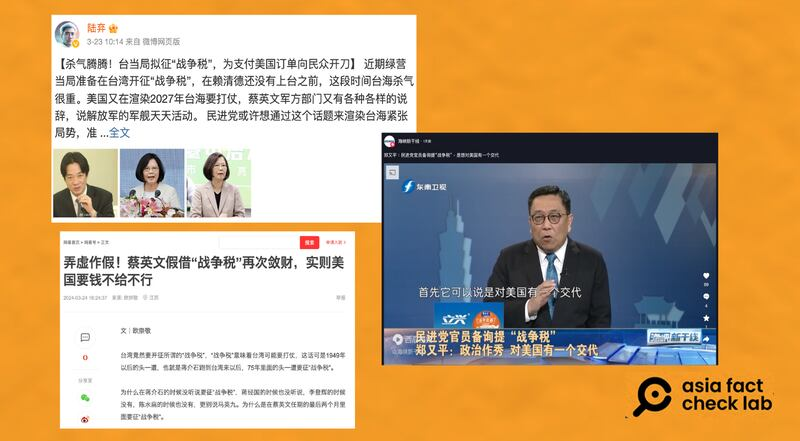

# Media Watch: China spins Taipei’s war tax debate to stoke distrust

## Despite Taiwan’s reassurances, pro-China media used the news to spread disinformation

By Zhuang Jing for Asia Fact Check Lab

2024.04.29

Taipei, Taiwan

On March 20, when asked by a Taiwanese legislator about the possibility of raising taxes in a war scenario, Taiwan’s Finance Minister mentioned it as “an item for consideration.”

Despite subsequent reassurances from the Taiwanese government that no such policy was planned, the statement ignited a media frenzy across the Taiwan Strait.

In China, in particular, pro-Beijing media in China exploited this news for disinformation campaigns aimed at fueling distrust against the United States among Taiwanese, while depicting the island’s citizens as victims of the ruling Democratic Progressive Party.

Moreover, these outlets attempted to stir doubts about Taiwan’s capability to defend itself in a potential cross-Straits conflict.

Some domestic voices within Taiwan also played a role in amplifying these narratives.

Below are details of what AFCL found.

## Stoking distrust

AFCL found that pro-Beijing media outlets used discussions of Taiwan’s war tax to stoke distrust about the United States within Taiwan.

For example, Ta Kung Pao, a Hong Kong-based pro-China outlet, used remarks from U.S. Indo-Pacific Commander John Aquilino to allege collusion against Taiwanese interests by leaders of Taiwan and the United States.

During a Congressional hearing on March 20 – the same day as Taiwan’s war tax discussion – Aquilino highlighted concerns that China might be preparing to invade Taiwan by 2027, a prediction originally made by former commander Philip Davidson in 2021.

Pro-Beijing media outlets also criticized Aquilino’s comments, suggesting they were a covert push for the DPP to introduce the war tax, accusing Taiwanese politicians of using it as a pretext to buy more American arms, or as a form of subtle coercion by the U.S. military.

These articles generally lacked substantial evidence and failed to acknowledge the clarifications issued by the Taiwanese government.

Some domestic voices within Taiwan also played a role in amplifying these narratives.

Some prominent political commentators, for instance, appeared on TV [news](https://youtu.be/I9ZUE5t3dm8?feature=shared&t=1351) [programs](https://www.youtube.com/watch?v=jEls3m1J7xM) to claim the DPP was using the tax to demonstrate it was committed to preparing for a protracted future conflict and the United States and Taiwan had colluded to propose the tax.

Chinese netizens and Taiwanese political commentators suggested that U.S. interests towards Taiwan spurred the proposal of a war tax. (Screenshots/Weibo, NetEase and YouTube)

Such views echo what Beijing's Taiwan Affairs Office spokesperson Chen Binhua [said](http://www.gwytb.gov.cn/xwdt/xwfb/xwfbh/202403/t20240327_12608821.htm) at a press conference on March 27.

In response to the media inquiry on Taiwan's "war tax' discussions, Chen [criticized](http://www.gwytb.gov.cn/xwdt/xwfb/xwfbh/202403/t20240327_12608821.htm) the DPP for deliberately creating Cross Strait tension in order to benefit their party at the expense of Taiwan's citizens.

Chen also portrayed the United States as taking advantage of the Taiwanese people, calling Aquilino’s statement regarding war preparations as a deliberate exaggeration of China’s military threat to Taiwan in order to enrich American arms dealers through spreading fear.

Chen warned that this will only escalate cross-Strait tension and push the region into an increasingly dangerous geopolitical situation, inflaming doubts of inability to resist.

## Doubts about Taiwan’s capability to defend itself

Beijing-backed media, while consistently underscoring the dangers of a cross-Strait conflict, also sought to portray Taiwan’s military as helpless in any potential confrontation, seemingly aiming to psychologically intimidate Taiwan into capitulating without resistance.

This narrative was bolstered by selectively airing clips from Taiwanese news out of context, thus magnifying local citizens’ purported lack of confidence in their military.

A prime example of this tactic was the widespread distribution of an interview segment from Taiwanese outlet CTI News, where a young man comments: “We can’t win the war anyway, so we might as well just surrender.”

This clip was extensively shared across platforms like [Douyin](https://www.douyin.com/user/MS4wLjABAAAAYb2be9SpBWMEfwntO8dPI9xS2XaQ4FD5copjRY-_T4A?modal_id=7349003525952752915), [Weibo](https://weibo.com/5333693607/O651S378c), [TikTok](https://www.tiktok.com/@lkcyedan/video/7349254608893594886), and [YouTube](https://www.youtube.com/watch?v=sGk2u-CQmNA) by official Chinese media and popular social media influencers.

An interview with young Taiwanese by CTI News was later republished by Chinese official media and influential social media users across a number of platforms. (Screenshots/YouTube,Douyin & Weibo)

These posts often included messages promoting negotiations between China and Taiwan as the preferable solution to avoid conflict.

## *Translated by Shen Ke. Edited by Shen Ke, Taejun Kang and Malcolm Foster.*

[Original Source](https://www.rfa.org/english/news/afcl/media-watch-china-taiwan-war-tax-04292024103303.html)