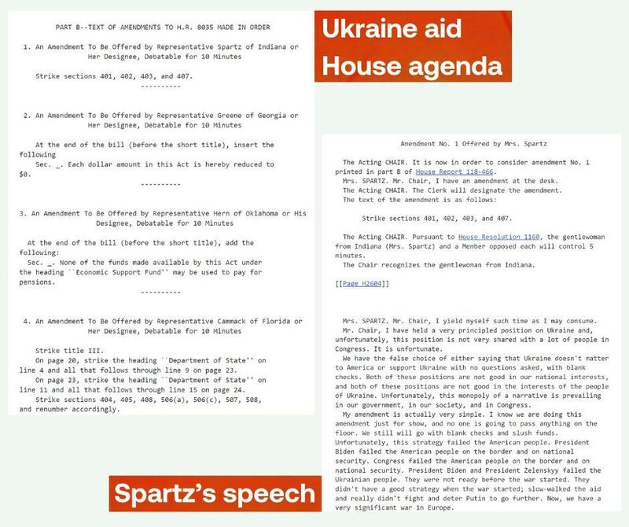

# Did a Ukrainian-American congresswoman oppose Ukraine support?

## Verdict: Misleading

By Alan Lu for Asia Fact Check Lab

2024.04.30

## Following the U.S. approval of a Ukraine aid package in April, a misleading claim emerged on Chinese-language social media that Ukrainian-American congresswoman Victoria Spartz opposed it by proposing four amendments. It is true that Spartz voted against the bill, but she also noted that she was in favor of supporting Ukraine, and she proposed only one amendment.

## Social media users also cited a clip, claiming that Spartz stated Russian President Vladimir Putin was not a dictator, unlike U.S. President Joe Biden and former President Barack Obama. A review of the clip shows that Spartz made no mention of a dictator.

The claim was [shared](https://weibo.com/1859508735/OaRIX947V?refer_flag=1001030103_) on the popular Chinese social media platform Weibo on April 22, 2024.

“Spartz, a Ukrainian-born U.S. Congressman, voted against aid to Ukraine … She also proposed 4 amendments to humiliate Ukraine,” the claim reads.

“She says: I grew up in the Soviet Union (not recognizing Ukraine’s independence) and I know what a dictatorship is. Putin is not [a dictator]. But Obama and Biden are,” it reads further.

The claim was shared alongside a 37-second clip that shows Spartz speaking at what appears to be the U.S. Congress.

Victoria Spartz is a Ukrainian-American politician and businesswoman who is the representative for Indiana’s 5th congressional district.

Spartz, a Republican and the first and only Ukrainian-born member of Congress, emerged early on as a natural advocate for supporting her native country in its war with Russia.

The claim began to circulate online after the United States last week approved a US$61 billion military assistance package to help Ukraine in its defense against Russia, which invaded the country in 2022.

Similar claims were also shared on [X](https://x.com/hxr001/status/1782217757322256790?s=46&t=OcwRl26KwGrlCoefgaqyvw) and [Threads](https://www.threads.net/@new_27_brigade/post/C6DPMsDyxax/?xmt=AQGzxbjXqU9Et5YdHW37NrA7jz34M7RpcB-vtA1j0nF6tg).

Chinese netizens across several social media platforms spread rumors that Ukrainian-American congresswoman Victoria Spartz had proposed amendments to the newest Ukraine aid package to “humiliate” Ukraine. (Screenshots/X, Weibo & Threads)

But the claims are misleading.

## Spartz on the Ukraine aid bill

It is true that Spartz [voted against](https://www.congress.gov/congressional-record/volume-170/issue-70/house-section/article/H2593-1?s=3&r=2) the bill, but she noted that she was in favor of supporting Ukraine, and she proposed only one amendment.

"We have the false choice of either saying that Ukraine doesn't matter to America or support Ukraine with no questions asked, with blank checks," said Spartz on April 20, as cited by the [official record](https://www.congress.gov/congressional-record/volume-170/issue-70/house-section/article/H2593-1?s=3&r=2) of the congressional discussion preceding the passage of the bill.

“Both of these positions are not good in our national interests, and both of these positions are not good in the interests of the people of Ukraine. Unfortunately, this monopoly of a narrative is prevailing in our government, in our society, and in Congress,” she added.

On April 20, four lawmakers were scheduled to propose amendments to the Ukraine aid bill. Spartz was just one of the proposers, suggesting an amendment to the bill’s sections “401, 402, 403, and 407,” which was intended to change the amount of aid increase to fund Ukraine. Her proposal was rejected in the end.

Besides Spartz’s, two of the other amendments proposed by Georgia’s Marjorie Taylor Greene and Florida’s Kat Cammack were also rejected after discussion, while the third by Kevin Hern of Oklahoma was not brought up that day.

Official records of Spartz amendments and relevant comments about the bill show that she did not propose any motions “humiliating” to Ukraine. (Screenshots/Congress official website)

## Spartz’s video

A reverse image search on Google found the video of Spartz shared in misleading social media posts [published](https://www.youtube.com/watch?v=iia7lACdqik) on YouTube on March 12, more than a month before the Ukraine aid bill was passed in the House.

A review of the clip shows that she made no mention of either Biden or Obama being a dictator, although she criticized them for “emboldening tyranny” in the United States. Additionally, she made no comments suggesting that Russian President Vladimir Putin was not a dictator.

## *Translated by Shen Ke. Edited by Shen Ke, Taejun Kang and Malcolm Foster.*

*Asia Fact Check Lab (AFCL) was established to counter disinformation in today's complex media environment. We publish fact-checks, media-watches and in-depth reports that aim to sharpen and deepen our readers' understanding of current affairs and public issues. If you like our content, you can also follow us on*   [*Facebook*](https://www.facebook.com/asiafactchecklabcn)  *,*   [*Instagram*](https://www.instagram.com/asiafactchecklab/)   *and*   [*X*](https://twitter.com/AFCL_eng)  *.*

[Original Source](https://www.rfa.org/english/news/afcl/fact-check-ukraine-aid-congresswoman-04302024144649.html)