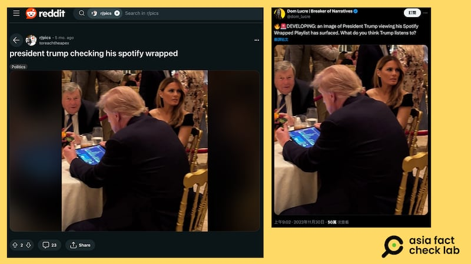
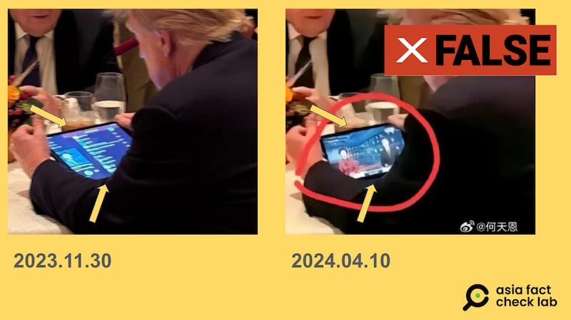
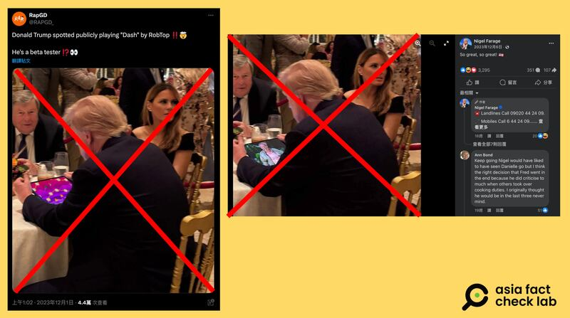

# Was Trump watching Chinese state TV on his iPad at an April banquet?

## Verdict: False

By Dong Zhe for Asia Fact Check Lab

2024.05.01

Taipei, Taiwan

## Updated May 06, 2024, 10：24 p.m. ET.

## A photo of Donald Trump has been shared repeatedly in Chinese-language social media posts that claim it shows the presumptive Republican presidential nominee watching a China state-run broadcaster’s news program on his tablet at an April banquet.

## But the photo has been digitally doctored. The original photo, which began to circulate online as early as November 2023, shows Trump looking at a playlist on digital music service Spotify.

The claim was [shared](https://archive.ph/3uTsq) on the popular Chinese social media platform Weibo on April 24, 2024.

“While attending a banquet at around 7:00 pm last night, Trump was bored and pulled out his tablet to kill time by watching CCTV News,” the claim reads.

The claim was accompanied by a photo showing the back of a person resembling the presumptive Republican presidential nominee Donald Trump holding a tablet PC, with what looks like a news broadcast visible on the screen.

CCTV, or China Central Television, is the national television broadcaster of China.

Comments on the post suggest that some users were misled by the claim.

“A must-watch program for successful people,” one user said in the comment section.

“What an international channel,” another wrote.

The same photo and claim have been shared on other Chinese social media platforms, including a video-sharing website [bilibili](http://bilibili).

Netizens on popular Chinese social media platforms like Weibo and bilibili claim that Trump watched CCTV news at a banquet in April. (Screenshots/Weibo & bilibili)

But the claim is false. The photo has been digitally doctored.

## Checking Spotify playlist

A reverse image search on Google found the corresponding photo started to circulate online as early as November 2023, as seen [here](https://twitter.com/Snshores/status/1730009629126545577) and [here](https://twitter.com/rapmusic/status/1730263788644081926).

The photo shows Trump sitting next to his wife Melania Trump at a banquet with his back turned to the camera, holding a tablet with its screen showing a Spotify playlist.

The photo quickly went viral online, leading to coverage by several media outlets, including  [*Newsweek*](https://www.newsweek.com/donald-trump-spotify-wrapped-playlist-1848375) .

The original image shows Trump scrolling through a Spotify playlist. (Screenshots/ X & Reddit)

A closer look at the doctored image shows that there is a curve in on the tablet, a sign of digital manipulation. The width of the screen is also not consistent on all sides, in contrast to the original image where the screen is flat.

Below is a screenshot comparison between the original photo (left) and the digitally doctored photo (right):

The edges of the Ipad screen are slightly unaligned in the photo featuring the CCTV broadcast. (Screenshots/X & Weibo)

## Altered several times

The original image had previously been altered several times. An X account posted a version of the image showing Trump playing a video game in one example.

Separately, the British tabloid Daily Mail released a visual parody depicting the former president watching Nigel Farage, the former leader of the U.K. Independence Party.

This edited photo was later shared on Farage’s official X account with the caption, “So great, so great!”

The original image of Trump at the banquet has been altered and spoofed several times by netizens. (Screenshots/ Facebook & X)

Neither the posters of the original photo nor Trump’s media team have responded to inquiries regarding the exact time and location of the image as of this writing.

## *Translated by Shen Ke. Edited by Shen Ke, Taejun Kang and Malcolm Foster.*

## *This story was updated to clarify Donald Trump’s current status.*

*Asia Fact Check Lab (AFCL) was established to counter disinformation in today's complex media environment. We publish fact-checks, media-watches and in-depth reports that aim to sharpen and deepen our readers' understanding of current affairs and public issues. If you like our content, you can also follow us on*   [*Facebook*](https://www.facebook.com/asiafactchecklabcn)  *,*   [*Instagram*](https://www.instagram.com/asiafactchecklab/)   *and*   [*X*](https://twitter.com/AFCL_eng)  *.*

[Original Source](https://www.rfa.org/english/news/afcl/ipad-05012024114112.html)