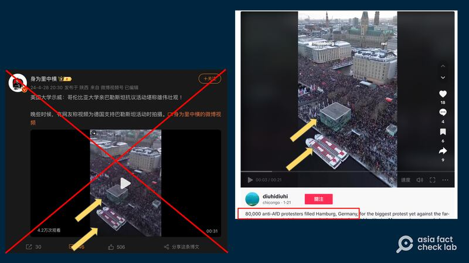
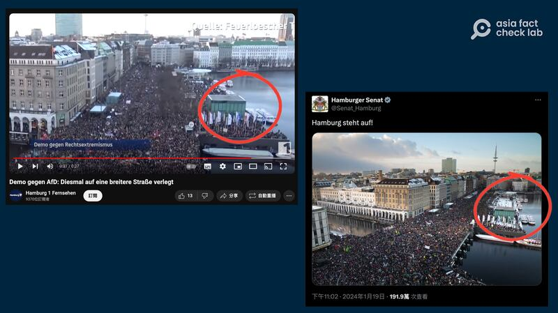
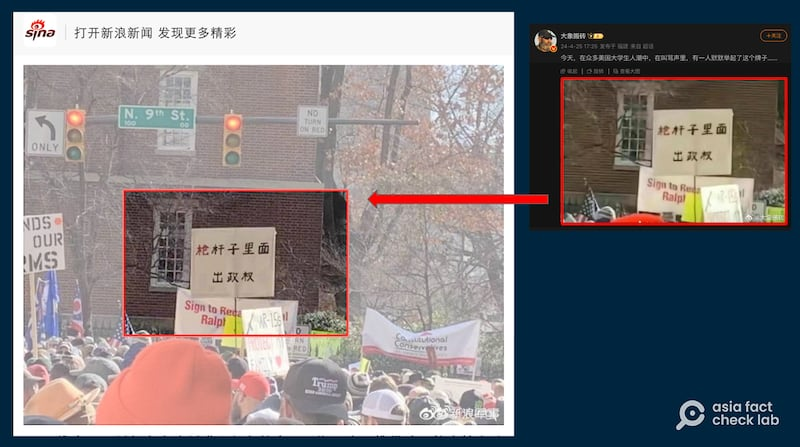
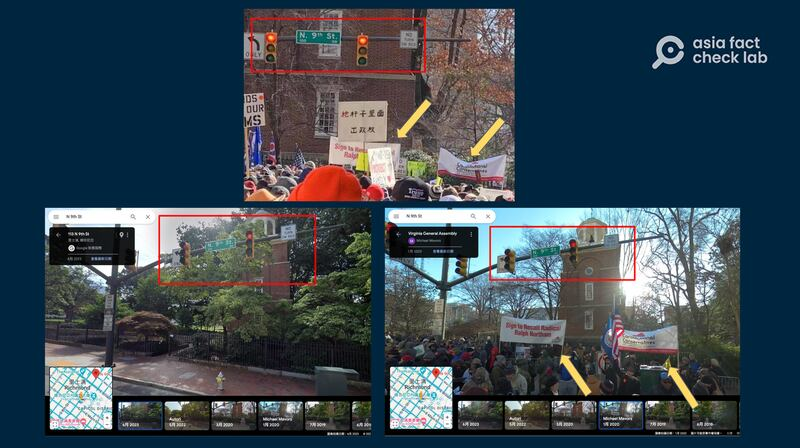

# Fake images of US college protests circulate in China

## Images, including one of Mao's slogans, are from unrelated events months or years earlier.

By Dong Zhe for Asia Fact Check Lab

2024.05.06

Taipei, Taiwan

## Pro-Palestinian protests on U.S. college campuses have gotten attention on Chinese social media, but some of these posts show unrelated demonstrations that happened months or even years earlier.

## One   [aerial video showing a massive gathering](https：//weibo.com/2110587294/ObQry1cjl)   of thousands of people packed together – purported to be at Columbia University in New York – is actually a demonstration in January in Hamburg, Germany, against a far-right political group.

[**Another photo**](https://archive.ph/lVnCD)   **claimed to show a protester holding up a famous Mao Zedong quote in Chinese, "Political power grows out of the barrel of a gun." But Asia Fact Check Lab found this to be from a pro-gun rally held in Virginia in 2020.**

As the Israeli-Hamas conflict drags into its seventh month, student demonstrations supporting the Palestininans and calling for a cease-fire have spread across dozens of U.S. university campuses.

The aerial video of thousands gathered in public was [shared](https://weibo.com/2110587294/ObQry1cjl) on the popular Chinese social media platform Weibo on April 28, with the breathless caption: "U.S. university demonstration: Pro-Palestinian protest at Columbia University is majestic!"

Chinese netizens claimed that a video posted on Weibo shows a pro-Palestinian demonstration in April, but in reality it wasn't. (Screenshot/Weibo and TikTok)

But a reverse image search found the video, [shared](https://www.tiktok.com/@diuhidiuhi/video/7326221805868338462) on TikTok Jan. 21, 2024, actually depicted 80,000 people in Hamburg, Germany, protesting against the far-right Alternative for Germany, or AfD, party "since their 'secret meeting' with the fascist Identitarian Movement was revealed.

Keyword searches including "AfD" found the Hamburg demonstrations were one amongst a series of protests to break out against the party after a [news report](https://correctiv.org/en/latest-stories/2024/01/15/secret-plan-against-germany/) surfaced that the group had considered a plan to expel all people of "non-German backgrounds" from the country, including immigrants who have already obtained residency at a meeting with influential leaders.

Video of demonstrations against the AfD released by German media and government agencies match the purported footage of pro-Palestianian demonstrations at Columbia University spread on Weibo. (Screenshots/YouTube)

In another case, a number of [Weibo](https://archive.ph/lVnCD) [influencers](https://archive.ph/XkIdY) and X accounts also recently claimed that one protester at an unspecified college campus held up a poster with the Mao quote, "Political power grows out of the barrel of a gun."

But this is false. The photo is from a pro-gun rally held in Virginia in 2020, and has nothing to do with any pro-Palestine demonstration.

The photo of a purported April protest recently spread on Weibo has actually been circulated online since 2020. (Screenshot/Sina Military and Weibo)

A reserve image search reveals that a version of the same image shown in a larger frame was published in an [article](https://k.sina.cn/article_1499104401_p595a849102700nbe9.html?from=mil) published on the Chinese military news blog Sina Military in 2020

Keyword searches using visual clues from the photo, including a banner that reads Constitutional Conservatives, found that it shows a [rally](https://apnews.com/article/ap-top-news-richmond-virginia-charlottesville-us-news-2c997c92fa7acd394f7cbb89882d9b5b) held by pro-gun advocates from all across the U.S. in Richmond in 2020.

A closer look at the image also shows a street sign reading “N. 9th St.” at the top of the frame. A search in Google Maps found that this was a street in Richmond and not part of the university campus.

A person uploaded a photo of the pro-gun rally to Google Maps in January 2020 in real time as it was happening. (Screenshot/Google Maps)

## *Translated by Shen Ke. Edited by Shen Ke, Taejun Kang and Malcolm Foster.*

*Asia Fact Check Lab (AFCL) was established to counter disinformation in today's complex media environment. We publish fact-checks, media-watches and in-depth reports that aim to sharpen and deepen our readers' understanding of current affairs and public issues. If you like our content, you can also follow us on*   [*Facebook*](https://www.facebook.com/asiafactchecklabcn)  *,*   [*Instagram*](https://www.instagram.com/asiafactchecklab/)   *and*   [*X*](https://twitter.com/AFCL_eng)  *.*

[Original Source](https://www.rfa.org/english/news/afcl/fact-check-college-palestinian-protests-china-05062024175337.html)