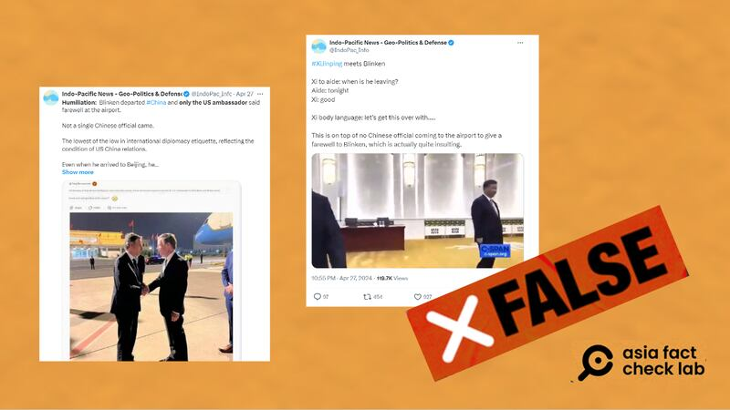
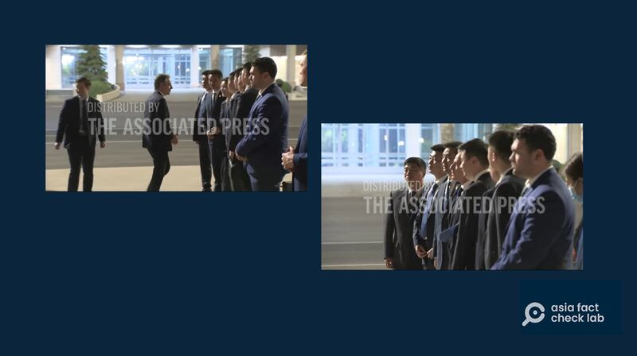
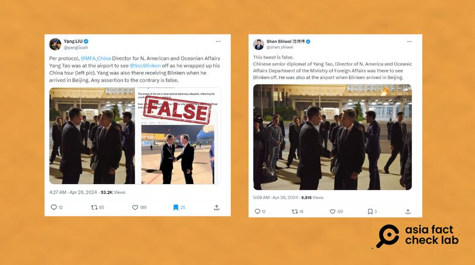
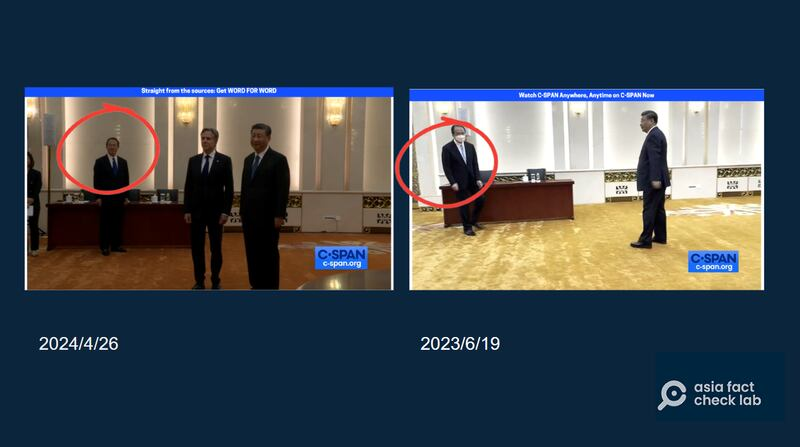
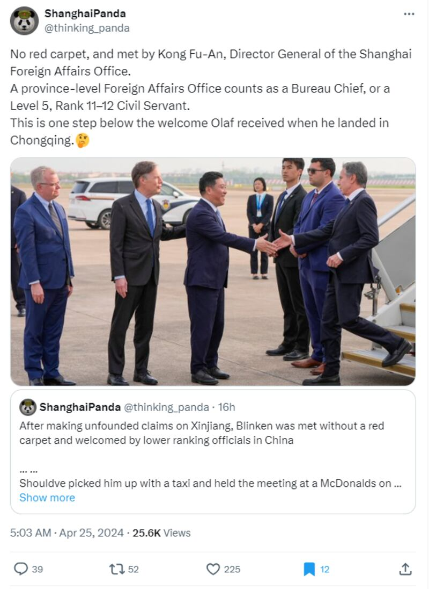
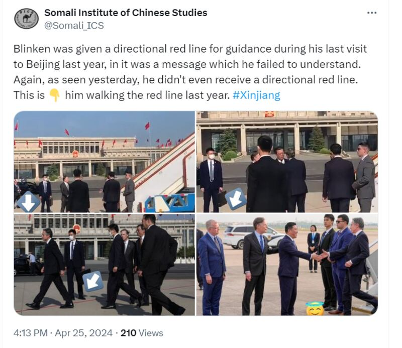
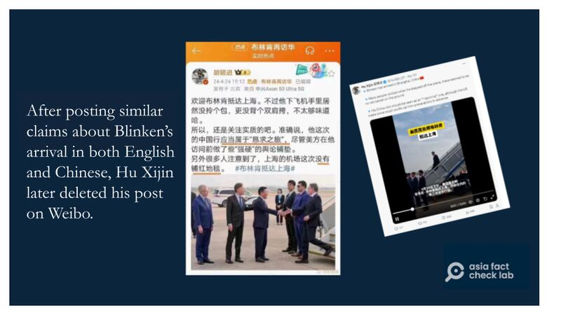

# Media Watch: Blinken’s April China visit fuels online rumors

## Rumors in Chinese and English aimed to downplay the significance of the US Secretary of State’s visit.

By Rita Cheng for Asia Fact Check Lab

2024.05.08

Washington, DC

Following U.S. Secretary of State Antony Blinken’s visit to China in April, where he met with Chinese President Xi Jinping, various rumors around his visit surfaced in social media posts in both Chinese and English.

Below is what AFCL found.

## Did Chinese officials not accompany Blinken to the airport?

A X user “Indo-Pacific News - Geo-Politics & Defense” claimed that Blinken was “humiliated” by Chinese officials who decided not to greet his arrival and departure.

"Blinken departed #China and only the US ambassador said farewell at the airport … Even when he arrived to Beijing, he was only greeted by a low-level official and US embassy staff," reads the claim [shared](https://perma.cc/XV6G-SD2M) in X post on April 27.

Claims that Chinese officials and Xi himself deliberately snubbed Blinken were false. (Screenshot/X)

This is false. Images taken by Reuters and Associated Press show that several Chinese officials saw Blinken off, taking a group photo with the secretary of state before he boarded the plane.

Blinken poses for a photo with Chinese officials that accompanied him to the airport before boarding the plane. (Screenshot/Associated Press)

Former Washington correspondent at China's state-run Xinhua News Agency [Yang Liu](https://perma.cc/7YE8-EQNA) and current CCTV reporter [Shen Shiwei](https://perma.cc/Z9X3-2E25?type=image) also noted that the claim was false, posting a photo of the Director General of the Chinese Foreign Ministry's Department of North American and Oceanian Affairs [Yang Tao](https://www.fmprc.gov.cn/eng/wjb_663304/zzjg_663340/bmdyzs_664814/) shaking hands with Blinken at the airport as he saw him off.

Chinese news reporters Yang Liu and Shen Shiwei posted a photo of Chinese officials seeing off Blinken at the airport (Screenshot / X)

## Did Xi express impatience with Blinken?

The X user “Indo-Pacific News - Geo-Politics & Defense” also claimed that Xi expressed impatience with Blinken through his body language before the meeting began, as well as responding “good” when told that Blinken would be leaving on the night of the meeting.

The claim was shared alongside a 40-second clip that shows Xi greeting Blinken and posing for the press.

But the claim is false. The clip is taken from [footage](https://www.c-span.org/video/?528849-1/secretary-blinken-meets-chinese-president-xi-jinping) of Blinken and Xi's prior meeting in June 2023, not in April 2024.

A review of the 2024 meeting's [clip](https://www.c-span.org/video/?535227-1/secretary-blinken-meets-chinese-president-xi-jinping) shows several key differences; including the lighting of the room, the color of Xi's tie, and a change in the mask and tie of [Hong Lei](https://www.fmprc.gov.cn/eng/wjb_663304/zzjg_663340/lbs_665286/) -- the Director-General of the Chinese Foreign Ministry's Protocol Department who is shown in both videos.

Furthermore, Xi did not respond “good” after being told that Blinken would leave that night, but rather only repeated the phrase “leaving tonight.”

Several differences exist in the footage of last year and this year's meetings. (Screenshot/C-SPAN)

## Was Blinken’s reception a slight in comparison to German Chancellor Scholz?

Another X user "ShanghaiPanda" [claimed](https://perma.cc/BH8X-ADU8?type=image) in a post on April 25 that China gave Blinken a downgraded diplomatic reception compared to German Chancellor Olaf Scholz, who visited China in mid-April.

“No red carpet, and met by Kong Fu-An, Director General of the Shanghai Foreign Affairs Office. A province-level Foreign Affairs Office counts as a Bureau Chief, or a Level 5, Rank 11–12 Civil Servant. This is one step below the welcome Olaf received when he landed in Chongqing,” reads the claim.

Shanghai Panda claims China offered a downgraded reception for Blinken compared to Scholz. (Screenshot/X)

But the claim is misleading. Both the political status and nature of the two politicians’ visits differed significantly, which makes a direct comparison between their respective receptions inaccurate.

The choices of reception arrangement for the two men are in line with official protocol [guidelines](https://www.mfa.gov.cn/web/lbfw_673061/lbzn_673063/202201/t20220114_10495537.shtml) outlined by the Chinese Foreign Ministry and adhere to the spirit of the [Vienna Convention on Diplomatic Relations](https://legal.un.org/ilc/texts/instruments/english/conventions/9_1_1961.pdf).

The German chancellor is the head of the country's federal government, while the U.S. secretary of state is a cabinet official. Blinken's two diplomatic trips to China were both labeled as " [visits](https://www.fmprc.gov.cn/wjdt_674879/wsrc_674883/202404/t20240422_11285856.shtml)," while Scholz's trip was more formally designated an " [official visit](https://www.fmprc.gov.cn/wjdt_674879/wsrc_674883/202404/t20240412_11280713.shtml)."

China’s guidelines dictate that national leaders be received by a red carpet and the corresponding level of local officials at whatever airport they are landing in.

This customary practice was followed when Scholz landed at his first stop at Chongqing airport, where he was greeted by the city's Vice Mayor Zhang Guozhi and Chinese Ambassador to Germany Wu Ken, as [reported](https://www.reuters.com/world/china/germanys-scholz-kicks-off-china-trip-amid-tensions-over-evs-russia-2024-04-14/) by Reuters.

The guidelines do not stipulate that cabinet officials be similarly received.

AFCL [debunked](https://www.rfa.org/cantonese/news/factcheck/visit-06202023143808.html/ampRFA) similar rumors about China extending humiliating receptions of Blinken when the secretary first visited China in 2023.

## Did China deliberately not arrange a “red line” at the airport in order to show displeasure?

The Somali Institute of Chinese Studies [claimed](https://twitter.com/Somali_ICS/status/1783590211353530826) on X on April 26 that China had deliberately omitted a "guiding red line" when the secretary disembarked off his plane at Shanghai in order to signal displeasure.

“Blinken was given a directional red line for guidance during his last visit to Beijing last year, in it was a message which he failed to understand. Again, as seen yesterday, he didn’t even receive a directional red line,” reads the claim in part.

The message referenced a red line visible in front of the secretary when he disembarked at the Beijing airport during his 2023 trip.

But the claims are false.

The line was merely an equipment restriction area marking at the airport that did not hold any figurative significance, as [reported](https://www.rfa.org/cantonese/news/factcheck/visit-06202023143808.html/ampRFA) by AFCL.

The Somali Institute of Chinese Studies said that China's deliberate omission of a red line at the airport was meant to signal displeasure to Blinken. (Screenshot/X)

A [video](https://x.com/jmhansler/status/1783424884737208781) on X posted by Jennifer Hansler -- a CNN reporter who accompanied the U.S. officials during Blinken's recent trip – clearly shows a similar line painted in an unclear color behind Chinese officials standing to receive Biden as he walks down a gangway while disembarking at the Beijing airport.

## Was Blinken’s trip a US plea to China ?

Hu Xijin, former editor-in-chief of the Chinese state-run tabloid Global Times, commented in a [Weibo post](https://xijin.news.blog/2024/04/24/%e6%ac%a2%e8%bf%8e%e5%b8%83%e6%9e%97%e8%82%af%e6%8a%b5%e8%be%be%e4%b8%8a%e6%b5%b7%e3%80%82%e4%b8%8d%e8%bf%87%e4%bb%96%e4%b8%8b%e9%a3%9e%e6%9c%ba%e6%89%8b%e9%87%8c%e5%b1%85%e7%84%b6%e6%b2%a1%e6%8b%8e/) before Blinken's arrival that the trip was a "pleading tour."

“To be precise, his trip to China should be considered a ‘pleading tour,’ despite the fact that the U.S. side made some ‘tough’ publicity before his visit.”

Hu Xijin, former editor-in-chief of the Global Times, deleted a Weibo post in which he mockingly referred to Blinken’s visit to China as a “pleading tour” (left). (Screenshot /Weibo & X)

This is false. China's Foreign Ministry announced before Blinken's [arrival](https://www.fmprc.gov.cn/wjdt_674879/wsrc_674883/202404/t20240422_11285856.shtml) that the visit was "at the invitation of Wang Yi." The ministry also [announced](https://www.fmprc.gov.cn/wjdt_674879/wsrc_674883/202306/t20230614_11096559.shtml) before the secretary's previous visit in June 2023 that all arrangements were agreed upon beforehand by China and the U.S.

## *Translated by Shen Ke. Edited by Shen Ke, Taejun Kang and Malcolm Foster.*

*Asia Fact Check Lab (AFCL) was established to counter disinformation in today's complex media environment. We publish fact-checks, media-watches and in-depth reports that aim to sharpen and deepen our readers' understanding of current affairs and public issues. If you like our content, you can also follow us on*   [*Facebook*](https://www.facebook.com/asiafactchecklabcn)  *,*   [*Instagram*](https://www.instagram.com/asiafactchecklab/)   *and*   [*X*](https://twitter.com/AFCL_eng)  *.*

[Original Source](https://www.rfa.org/english/news/afcl/blinken-april-visit-rumors-05082024112508.html)