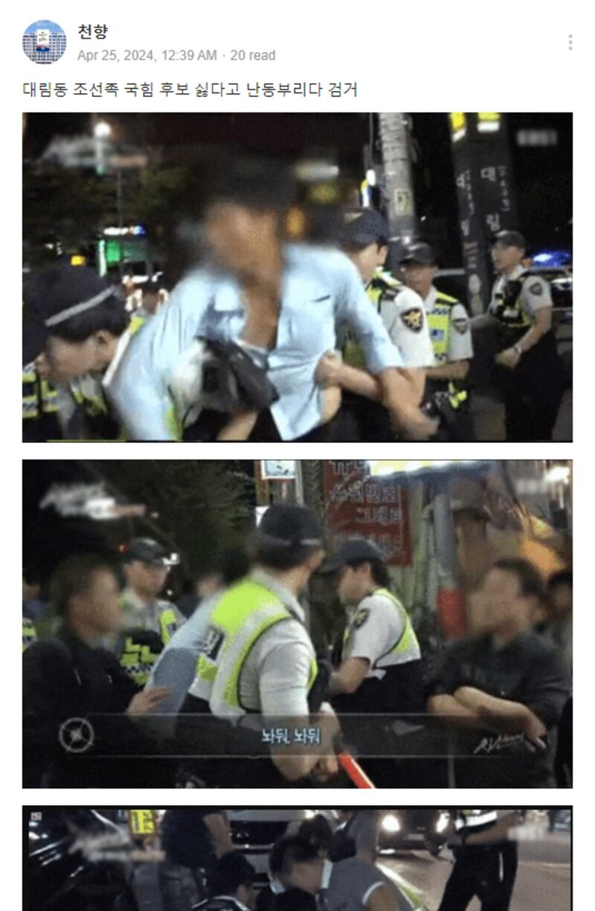

# Was a Chinese man arrested during South Korea’s April election campaign?

## Verdict: False

By Taejun Kang for RFA

2024.05.20

Taipei, Taiwan

## Photos emerged in Korean-language social media posts that claim they show a Chinese man arrested in Seoul’s Daerim-dong area for heckling a conservative candidate during South Korea’s April local election.

## But the claim is false. The photos were taken from a 2016 documentary. Keyword searches found no credible reports to show that there was an arrest of a Chinese citizen in Daerim-dong area during the April election.

The claim was [shared](https://archive.ph/f7VhJ) on South Korea's popular Band social media platform on April 24, 2024.

“A Joseonjok man was arrested after heckling a candidate from [conservative] People’s Power Party in Daerim-dong,” read one post.

Joseonjok refers to ethnic Korean citizens of the People’s Republic of China, one of its recognized ethnic minority groups.

The claim was shared alongside three images that show South Korean police arresting a man whose face is blurred.

Screenshot of the Band post, taken on May 14, 2024.

Daerim-dong is a neighborhood-level subdistrict of Yeongdeungpo district in Seoul, where many Joseonjok immigrants live.

[Multiple](https://www.asiae.co.kr/article/2021012910413860432) South Korean media outlets [report](https://www.hani.co.kr/arti/society/society_general/925990.html) that Joseonjok [immigrants](https://www.donga.com/news/Society/article/all/20181021/92510342/1) are frequent targets of discrimination and are often stereotyped as contributing to a rise in violent crime.

There have been claims that voters in areas with high Joseonjok populations in South Korea have a tendency to support political parties with pro-China and anti-U.S. stances, which has [allegedly put](https://www.yna.co.kr/view/AKR20220602180900502) the ruling People's Power Party at a disadvantage, given its pro-U.S. position.

An identical claim that the photo shows a Joseonjok man's arrest in April was [shared](https://archive.ph/5oz6r) on another Band group.

But the claim is false. The images were in fact taken from an old documentary.

## 2016 documentary

Keyword and reverse image searches on Google found the images were [included](https://home.ebs.co.kr/inthelineoffire/main) in the documentary series "In the Line of Fire", aired by South Korea's public education broadcaster EBS.

The images came from the episode "Police Patrol Unit: Guardians of the Night", aired in 2016 and published on the broadcaster's [official YouTube channel](https://www.youtube.com/watch?v=zDtyXwlpTUQ).

The images in the false posts were stills taken at the episode's [11:35](https://youtu.be/zDtyXwlpTUQ?si=LeU3e8jMUGap7m7S&t=694), [11:30](https://youtu.be/zDtyXwlpTUQ?si=-1m9ElFk5PKv4Z3k&t=688) and [21:35](https://youtu.be/zDtyXwlpTUQ?si=Az_CpdFGIiuxKgw4&t=1284) marks.

The episode followed the activities of a mobile police unit in Daerim-dong on an evening in September 2016.

According to the documentary, the first two images show police subduing and arresting men involved in a fight, while the third image shows other officers detaining a man for carrying a knife.

The documentary made no mention of elections or political candidates.

Keyword searches found no credible reports to show that there was an arrest of a Chinese citizen in Daerim-dong area during the April election.

## *Edited by Malcolm Foster and Eugene Whong.*

*Asia Fact Check Lab (AFCL) was established to counter disinformation in today's complex media environment. We publish fact-checks, media-watches and in-depth reports that aim to sharpen and deepen our readers' understanding of current affairs and public issues. If you like our content, you can also follow us on*   [*Facebook*](https://www.facebook.com/asiafactchecklabcn)  *,*   [*Instagram*](https://www.instagram.com/asiafactchecklab/)   *and*   [*X*](https://twitter.com/AFCL_eng)  *.*

[Original Source](https://www.rfa.org/english/news/afcl/chinaman-korea-arrest-05202024234458.html)