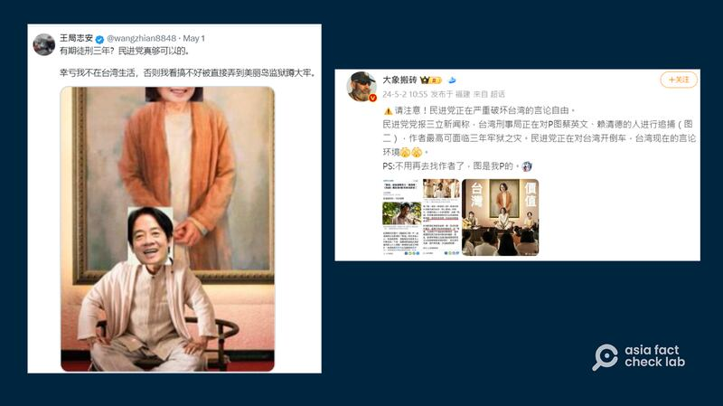

# Is Taiwan prosecuting citizens for creating political memes?

## Verdict: Misleading

By Zhuang Jing for Asia Fact Check Lab

2024.05.22

Taipei, Taiwan

## A claim emerged in Chinese-language posts that Taiwan’s freedom of speech is in decline because the island’s ruling party is arresting citizens for creating a satirical political meme.

## But the claim is misleading. The Taiwanese police were investigating those who posted the meme over copyright violations after receiving a complaint. Police later dropped the case.

The claim was [shared](https://weibo.com/1944375784/Ocoob1aR6?type=repost) on the Chinese social media platform Weibo on May 2, 2024.

“The DPP is seriously undermining freedom of speech in Taiwan. Taiwan’s Criminal Affairs Bureau is on the hunt for people who photoshopped Tsai Ing-wen and Lai Ching-teh,” the post reads in part.

The DPP refers to Taiwan’s ruling Democratic Progressive Party. Tsai and Lai are the island’s former and current presidents, respectively.

Widely followed influencers claimed that Taiwan was attempting to restrict political speech after netizens posted several altered stills from a popular Taiwanese film which depict Tsai, Lai and Hsiao seated on stage. (Screenshots/X and Weibo)

The claim was shared alongside an image that shows what appears to be a film still. The faces of characters appearing in the still picture have been digitally altered and replaced with those of Tsai, Lai and Taiwan’s Vice President Hsiao Bi-khim.

The claim also accompanied what appears to be a screenshot of a news article.

But the claim is misleading.

## Political meme

A reverse image search on Google found a film still of the Taiwanese movie “The Pig, The Snake and The Pigeon” was used in the political meme shared in social media posts.

The movie tells the story of Chen Kui-lin, a Taiwanese hitman diagnosed with terminal cancer. Facing his own mortality, he decides to take out two criminals at the top of the most wanted list, successfully killing both by the film’s end.

The altered still is from a scene where the character Chen “Bullhead” Lu-ho, Taiwan’s most wanted criminal who has gone into hiding and reinvented himself as a cult leader, sits surrounded by his followers. Later, Chen shoots Lu in the head in front of his followers.

## Public incitement

A keyword search found a report [published](https://news.ltn.com.tw/news/society/paper/1643186) by the Taiwanese outlet Liberty Times on April 28 that said Taiwan's Criminal Investigation Bureau (CIB) received a complaint, from someone who said the person who uploaded the altered film still may have committed public incitement.

A police source was cited explaining that the creators of the meme possibly committed incitement due to the violent connotations of associating political figures with a mass murderer who is later killed during the film.

Similar reports were soon issued by the [China Times](https://www.chinatimes.com/realtimenews/20240430000949-260402?chdtv) and [mnews](https://www.mnews.tw/story/20240430nm006).

## Copyright violation

The police also stated that the altered image potentially violated Article 65 of the island’s copyright law and that authorities were investigating whether it exceeded the scope of fair use.

The Liberty Times cited a lawyer as saying that the images could possibly inculcate violent thoughts in viewers. The lawyer also said that such memes could both be interpreted as a normal expression of political demands.

The lawyer also pointed out that because the accused were not trying to make a profit from the image and that the portrait rights of public figures are considerably more lax than those for private individuals, a charge of copyright violation was not certain to be ruled a violation of the law.

The Liberty Times separately [reported](https://news.ltn.com.tw/news/society/breakingnews/4659060) on May 1 that the CIB investigation had closed the case due to a lack of criminal evidence and no pressing of charges by the copyright holder.

## *Translated by Shen Ke. Edited by Shen Ke and Taejun Kang.*

*Asia Fact Check Lab (AFCL) was established to counter disinformation in today's complex media environment. We publish fact-checks, media-watches and in-depth reports that aim to sharpen and deepen our readers' understanding of current affairs and public issues. If you like our content, you can also follow us on*   [*Facebook*](https://www.facebook.com/asiafactchecklabcn)  *,*   [*Instagram*](https://www.instagram.com/asiafactchecklab/)   *and*   [*X*](https://twitter.com/AFCL_eng)  *.*

[Original Source](https://www.rfa.org/english/news/afcl/taiwan-meme-punishement-05222024032554.html)