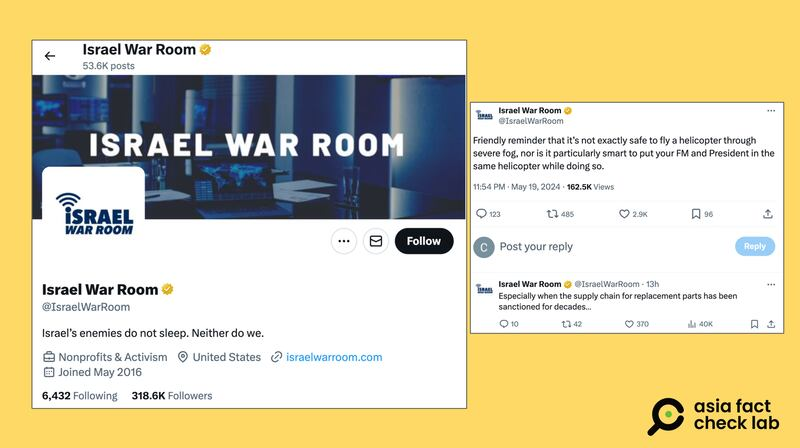

# Did Israel officially mock the death of Iran’s president?

## Verdict: False

By Zhuang Jing for Asia Fact Check Lab

2024.05.27

Taipei, Taiwan

## Following the death of the Iranian president in a helicopter crash on May 19, Chinese online users said that the Israeli government issued a statement mocking Iran, citing a post made by a pro-Israel non-profit organization on X as evidence.

## But the claim is false. There is no publicly available evidence linking the organization to the Israeli government.

The claim was [shared](https://m.weibo.cn/detail/5036099126953042) on Chinese social media platform Weibo on May 20, 2024.

“Israel uploaded a post mocking Iranian president’s helicopter accident #Iranian president killed,” the Chinese social media post reads in part.

It was shared alongside a screenshot of what appears to be a post from X, formerly known as Twitter.

The X post, uploaded by an account called “Israel War Room”, reads: “Friendly reminder that it’s not exactly safe to fly a helicopter through severe fog, nor is it particularly smart to put your FM and President in the same helicopter while doing so.”

Netizens on Weibo claimed that Israel issued a statement mocking the death of former Iranian President Ebrahim Raisi (left), with subsequent retweeters adding screenshots of the original source of the statement from a pro-Israel X account. (Screenshots/Weibo and Netease)

The claim began to circulate online after Iranian President Ebrahim Raisi was killed when his helicopter crashed in poor weather in mountains near the Azerbaijan border.

The charred wreckage of the helicopter, which had Raisi, Foreign Minister Hossein Amirabdollahian and six other passengers and crew on board, was found early on Monday, May 20, after an overnight search in blizzard conditions.

The Israel War Room's X post was also cited in other Chinese-language social media posts [here](https://m.weibo.cn/detail/5036072154957109), [here](https://v.douyin.com/i2cJo6Vf/) and [here](https://weibo.com/1647210043/Of8zHwnTQ?type=repost) that referred to it as an official statement released by the Israeli government.

A number of accounts affiliated with official Chinese media outlets have reposted the purported statement by Israel’s government mocking Iran. (Screenshots/Douyin and Weibo)

However, the claim is false.

## No official connection

A keyword search on X found the [original post](https://twitter.com/IsraelWarRoom/status/1792222354409660656) of Israel War Room on May 19, 2024.

Further keyword searches found the X account belongs to the [website](https://www.israelwarroom.com/) under the same name "Israel War Room" that describes itself as a "U.S. based non-profit that combats anti-Israel rhetoric and exposes misleading narratives about the Jewish state."

Israel War Room is described as a non-profit organization on its official X account. (Screenshot/X)

The U.S. fact-checking organization PolitiFact [describes](https://www.politifact.com/factchecks/2024/may/20/instagram-posts/x-account-posted-helicopter-emoji-after-news-of-th/) the Israel War Room as pro-Israel, while an [article](https://jewishjournal.com/community/371459/israel-war-room-discovers-how-to-riot-guide-and-pro-terror-propaganda-for-college-students/) by the U.S. weekly newspaper Jewish Journal simply refers to the organization as a social media account that tracks Israeli news on X and Instagram.

Neither article stated or suggested that the organization is affiliated with the Israeli government.

Separately, a search of the Israeli government's [website](https://www.gov.il/en/departments/govil-landing-page) did not reveal any ministries using the name "Israel War Room."

Keyword searches found no credible sources to show an official connection between the non-profit organization and the Israeli government.

## *Translated by Shen Ke. Edited by Shen Ke and Taejun Kang.*

*Asia Fact Check Lab (AFCL) was established to counter disinformation in today's complex media environment. We publish fact-checks, media-watches and in-depth reports that aim to sharpen and deepen our readers' understanding of current affairs and public issues. If you like our content, you can also follow us on*   [*Facebook*](https://www.facebook.com/asiafactchecklabcn)  *,*   [*Instagram*](https://www.instagram.com/asiafactchecklab/)   *and*   [*X*](https://twitter.com/AFCL_eng)  *.*

[Original Source](https://www.rfa.org/english/news/afcl/afcl-israel-mock-iran-05272024030133.html)