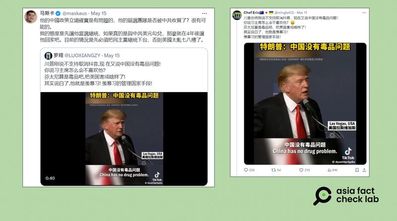

# Did Trump say that China has ‘no drug problem’?

## Verdict: Missing context

By Zhuang Jing for Asia Fact Check Lab

2024.05.30

Taipei, Taiwan

## A claim emerged in Chinese-language social media posts that former U.S. President Donald Trump stated in a recent speech that China had no drug problem citing a video as evidence.

## But the video has been edited to omit a crucial part of his speech in which he referenced an implied statement made by Chinese President Xi Jinping during an earlier meeting between them.

The claim was [shared](https://twitter.com/LUOXIANGZY/status/1790535917419004269) on the X social media platform on May 15, 2024.

“Trump just said China does not have a drug problem!” reads the post in part.

The claim was shared alongside a one-minute and 14-second video that shows what appears to be a public speech made by Trump.

“China has no drug problems. Because they have what’s called a quick trial,” said Trump, as seen in the video.

Chinese netizens have recently shared a clip of Donald Trump on X, accompanied by claims that the former president had declared “China has no drug problem” in a recent speech. (Screenshot/X)

But the claim is missing key context.

## Original video

A keyword search on Google found the clip was taken from a [speech](https://www.c-span.org/video/?521523-1/president-trump-remarks-las-vegas-campaign-event) Trump gave at a Las Vegas event in July 2022.

At the 12-minute and 50-second mark of the video, Trump states “China has no drug problem, no, China has no drug problem,” after emphasizing the effectiveness of “quick trials” and executions of drug dealers as a deterrent to narcotics trafficking in China.

However, the video shared by Chinese social media users has been edited to omit a part where Trump was citing Chinese President Xi Jinping.

At the video’s 13-minute and 54-second mark, Trump notes that Xi had mentioned to him in a previous conversation that China had no drug problem, citing death penalty measures as effective deterrents against trafficking.

This indicates that Trump’s conversation with Xi could have been the main source of Trump’s remarks.

A keyword search found such a conversation was cited by several international media outlets, as seen [here](https://www.newsweek.com/trump-urges-death-penalty-drug-dealers-china-has-no-drug-problem-1723134) and [here](https://www.washingtonpost.com/politics/2019/02/15/trumps-bewildering-national-emergency-press-conference-annotated/).

## Death penalty against drug trafficking

A claim that China’s use of the death penalty is an effective deterrent against drug trafficking has been disputed, with different analyses showing different results.

For instance, criminal drug activity in China, such as supply, consumption and abuse of drugs, had declined on a yearly basis, according to China’s report on anti-narcotics operations published in 2023, which listed a total of 1.12 million domestic drug users as of the end of 2022,

In contrast, an [article](https://m.thepaper.cn/newsDetail_forward_23566209) published in June 2023 citing these statistics said that drug prices continued to rise around the country and that the use of online drug trafficking had skyrocketed in recent years, particularly following the COVID-19 pandemic.

Official Chinese statistics cited in a 2017 [article](http://www.xinhuanet.com//english/2017-03/27/c_136161743.htm) by the state-run Xinhua News Agency showed that there were 2.51 million domestic drug users in 2016, following an annual increase of 6.8%.

## *Translated by Shen Ke. Edited by Shen Ke and Taejun Kang.*

*Asia Fact Check Lab (AFCL) was established to counter disinformation in today's complex media environment. We publish fact-checks, media-watches and in-depth reports that aim to sharpen and deepen our readers' understanding of current affairs and public issues. If you like our content, you can also follow us on*   [*Facebook*](https://www.facebook.com/asiafactchecklabcn)  *,*   [*Instagram*](https://www.instagram.com/asiafactchecklab/)   *and*   [*X*](https://twitter.com/AFCL_eng)  *.*

[Original Source](https://www.rfa.org/english/news/afcl/afcl-trump-china-drug-05302024032549.html)