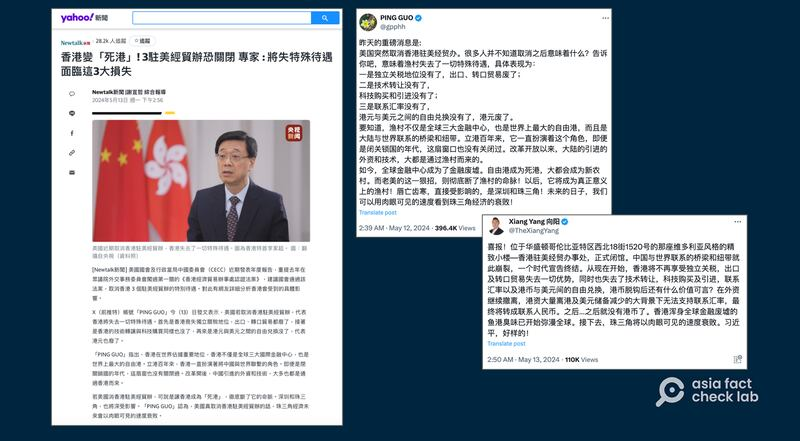
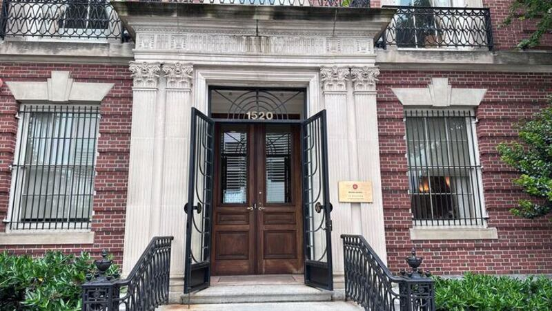

# Has the Hong Kong trade office in Washington been closed?

## Verdict: False

By Zhuang Jing and Rita Cheng for Asia Fact Check Lab

2024.06.05

Taipei and Washington

## A claim emerged in Chinese-language social media posts that the Hong Kong Economic and Trade Office, or HKETO, in Washington has been closed down.

## But the claim is false. U.S. lawmakers proposed a bill to close HKETO offices in the United States but it has not been passed. Keyword searches found no credible statements or reports to back the claim.

The claim was [shared](https://twitter.com/TheXiangYang/status/1789729998544515512) on X, formerly known as Twitter, on May 13, 2024.

“The Hong Kong Economic and Trade Office in the United States has officially closed its doors. The bridge and link between China and the world has collapsed, and an era has come to an end,” the post reads in part.

HKETOs promote Hong Kong’s trade outside the territory. There are 14 such offices across the world with three in the U.S.

Hong Kong has full autonomy in the conduct of its external commercial relations. The city’s Basic Law, which is often referred to as its constitution, provides that it shall be a separate customs territory and may, using the name “Hong Kong, China”, participate in relevant international organisations and international trade agreements, such as the World Trade Organization.

Similar claims have been shared on X [here](https://twitter.com/TheXiangYang/status/1789729998544515512) and [here](https://twitter.com/gpphh/status/1789364665891570103) as well as some media outlets as seen [here](https://archive.ph/snKhB).

Claims of the supposed closure of the HKETO office in Washington spread across social media (right) before being quoted in reports published by Taiwanese media (left). (Screenshots/Yahoo News and X)

However, the claim is false.

The U.S. House Committee on Foreign Affairs introduced [the HKETO Certification Act](https://www.congress.gov/bill/118th-congress/house-bill/1103/text) in November 2023 calling for the removal of privileges and the potential closure for all HKETO offices in the U.S.

But the bill has not been passed.

An AFCL journalist visited the HKETO branch in Washington and found it was open as normal.

AFCL staff visited the HKETO branch in Washington in mid May and found it was open as normal. (Rita Cheng/RFA)

Keyword searches found no credible statements or reports to back the claim.

## *Translated by Shen Ke. Edited by Shen Ke and Taejun Kang.*

*Asia Fact Check Lab (AFCL) was established to counter disinformation in today's complex media environment. We publish fact-checks, media-watches and in-depth reports that aim to sharpen and deepen our readers' understanding of current affairs and public issues. If you like our content, you can also follow us on*   [*Facebook*](https://www.facebook.com/asiafactchecklabcn)  *,*   [*Instagram*](https://www.instagram.com/asiafactchecklab/)   *and*   [*X*](https://twitter.com/AFCL_eng)  *.*

[Original Source](https://www.rfa.org/english/news/afcl/afcl-hk-trade-office-06052024025552.html)