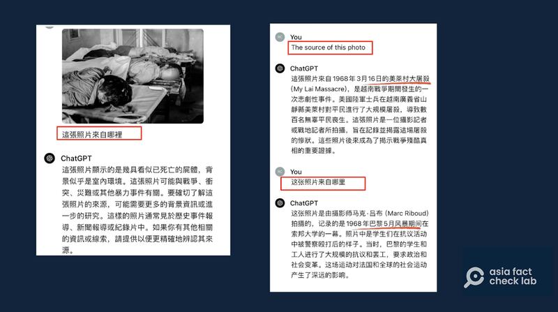

# Media Watch: ‘Little Pinks’ use AI in Tiananmen Square massacre debate

## But experts advise against using ChatGPT as a ‘fact-checking’ tool.

By Rita Cheng and Dong Zhe for Asia Fact Check Lab

2024.06.06

Washington and Taipei

*Disclaimer: Due to the graphic nature of the key image in this fact check, we have digitally blurred certain parts of the photos in the main text to avoid discomfort for some readers. These altered photos are labeled accordingly in their captions. The original, unedited versions of all photos are included at the end of the article for readers to view at their discretion.*

[Wu Renhua](https://u.osu.edu/mclc/2016/06/06/interview-with-wu-renhua-part-1/) didn't expect a nearly 35-year-old photo to become his most viewed [post](https://x.com/wurenhua/status/1795536359329042631) on X within 24 hours of uploading.

A black and white photo showing the bodies of three young adults lie sprawled on makeshift cots, each with visible head wounds. That’s what Wu posted.

Wu claimed that the photo was taken following the Chinese government crackdown on student protesters at Tiananmen Square in Beijing on June 4, 1989.

In light of the 35th anniversary of the bloody crackdown this week, Wu said he had decided, for the first time, to publish the photo, which he said was taken near his university around noon that day.

His post got more than 2.4 million views as of Thursday.

## ChatGPT as evidence?

It didn't take long for doubting voices to chime in. Swarms of jingoistic Chinese nationalist online users – known as "Little Pinks" – accused Wu of misrepresenting Vietnam War photos, [citing responses](https://x.com/zim95119104461/status/1795623954599796796) from the latest model of the AI tool ChatGPT as evidence of their claims.

Some even [created](https://perma.cc/5D39-H24P) a fake web page that placed Wu's photo alongside a genuine image from the Vietnam War to cast doubt on his claim.

China’s Communist Party has done its utmost to stymie any form of public discussion of the incident 35 years ago, ignoring domestic and international calls for justice.

Authorities have also worked tirelessly to scrub the affair from history books, online discussion and the media.

Netizens cited responses provided by ChatGPT (left) to claim that Wu Renhua’s photos of Tiananmen were fake. (Screenshots/X. Parts of these images have been digitally blurred due to their graphic nature.)

But [Li Wei-Ping](https://tfc-taiwan.org.tw/node/9551), a researcher at the University of Maryland's School of Journalism, said GhatGPT is not a reliable source since it is primarily driven by user conversation.

Li said the fact that ChatGPT produces different answers to identical questions shows that there has been an update to its database with user input.

“Especially considering that the vast majority of information in Simplified Chinese databases is heavily influenced by China’s censorship,” Li told AFCL. “Never use ChatGPT as your sole fact checking tool. Determining authenticity is not one of its uses.”

GhatGPT also warns on its website: “ChatGPT can make mistakes. Check important info.”

AFCL has previously [released](https://www.rfa.org/mandarin/shishi-hecha/hc-03062023153653.html) [reports](https://www.rfa.org/mandarin/shishi-hecha/hc-03162023145701.html) showing ChatGPT's unreliability on controversial questions.

Hints at the bottom of the webpage warn that ChatGPT may make mistakes. (Screenshot/ChatGPT)

## Different language, different answer

AFCL asked ChatGPT in different languages about the photo and it showed different results.

In traditional Chinese, which is used in Taiwan, Hong Kong and Macau, ChatGPT said that it didn’t know the answer and needed more information.

In simplified Chinese, which is used in mainland China, it answered that the photo was taken from days of protests and strikes that erupted across Paris in May 1968.

In English, it replied that the scene was taken from the My Lai Massacre committed by U.S. soldiers during the Vietnam War.

Hsu Chih-Chung, an associate professor at Taiwan’s National Cheng Kung University, who specializes in image processing and machine learning, explained that this inconsistency is due to differences in content found in the open-source information used by ChatGPT’s different language services, which were not always consistent.

ChatGPT responded inconsistently when asked the same question in different languages. (Screenshot/ChatGPT. Part of the image on the left has been digitally blurred due to its graphic nature.)

## Different time, different answer

ChatGPT’s responses varied even when asked the same question at different times in the same language.

On the morning of June 3, when asked in English where the picture came from, ChatGPT gave no response.

When directly asked if the image was taken during the 1989 student protests, the AI responded that it was.

Later that afternoon, when asked the same question in English, ChatGPT instead said the picture was from the 1976 Thammasat University massacre in Thailand.

When then asked if the image might have been taken at Tiananmen Square, ChatGPT confidently rejected the claim.

ChatGPT also gave different answers when asked the same question at different times. (Screenshots/ChatGPT)

## Different image search methods

National Cheng Kung University’s Hsu said the reason for ChatGPT’s differing responses is that its methods for checking images is still quite distinct from well-known search engines such as Google, which uses algorithms to compare a given image with many other images in its database.

Hsu noted that while ChatGPT can indeed search for pictures sent by users through comparison with other images on the internet, when doing so it still uses text as its basis of recognition.

In other words, it analyzes a digital image and then attempts to search for similar content based on what it thinks it sees in the image, instead of directly comparing the image with other pictures in the database, he said.

This has led some commentators to fear that private institutions or governmental organizations could “mis-educate” ChatGPT by creating large numbers of fake web pages used to export false or one-sided information.

Hsu agreed that the ability of a single user to arbitrarily train, influence and tailor responses from ChatGPT is dangerous, but added that such action cannot affect the machine’s general database.

## From Tiananmen? Not certain, but likely.

A reverse image search on Google shows that there is no previous record of the image in Google’s databases, which supports Wu’s assertion that this is the first time the image has been published.

A test using the AI detection tool [Hive](https://thehive.ai/) also estimated that the photo had only a 0.8% likelihood of having been produced by AI.

An AI detection tool concluded that the photo is unlikely to be synthesized. (Screenshot/Hive)

Apart from that, AFCL found, the scene captured in Wu's photo shares a high degree of similarity with a scene at the two-hour and 48-minute mark of [The Gate of Heavenly Peace,](https://youtu.be/5GhwuAR0Apc?feature=shared&t=10076) a documentary about the Tiananmen protests directed by Carma Hinton.

While the documentary does not specify where the image was taken, several key details in both frames match. These include the general positioning of the bodies, tears on the edges of the cots where the bodies lie, and a likely fire hydrant opening in the wall behind the deceased people.

Below is a screenshot comparison between the image posted by Wu (left) and the scene from The Gate of Heavenly Peace (right).

A screenshot comparison between the image posted by Wu (left) and the scene from The Gate of Heavenly Peace (right). Parts of these images have been digitally blurred due to their graphic nature.

However, there are key differences between the two images. In the documentary, all three bodies have red bandanas tied around their heads, and the body in the center has a license plate laid across its upper shoulder. These details are not present in Wu’s image.

Wu told AFCL that the two photos were taken at the same location.

He noted that many witnesses of the scene were still alive, several of whom had left comments under his post affirming they had personally seen the images captured in the photos on the day of the crackdown.

When asked about some of the internal discrepancies between his photo and the shot from the documentary, Wu reponded that it was likely caused by the difference in time between when the two photos were taken.

He explained that the license plate was taken from a military vehicle and was likely placed atop the body as evidence.

Wu then stated that both the license plate and the red bandanas may have been carried away by sympathetic onlookers who wished to salvage objects from the scene before government forces could carry away evidence of the crackdown.

The Gate of Heavenly Peace’s director Hinton has not responded to requests for comment as of press time.

AFCL failed to independently verify the photo.

## *Translated by Shen Ke. Edited by Shen Ke and Taejun Kang.*

*Asia Fact Check Lab (AFCL) was established to counter disinformation in today's complex media environment. We publish fact-checks, media-watches and in-depth reports that aim to sharpen and deepen our readers' understanding of current affairs and public issues. If you like our content, you can also follow us on*   [*Facebook*](https://www.facebook.com/asiafactchecklabcn)  *,*   [*Instagram*](https://www.instagram.com/asiafactchecklab/)   *and*   [*X*](https://twitter.com/AFCL_eng)  *.*

The below unedited images are graphic. Viewer discretion is advised.

[Original Source](https://www.rfa.org/english/news/afcl/afcl-tiananmen-ai-06062024034712.html)