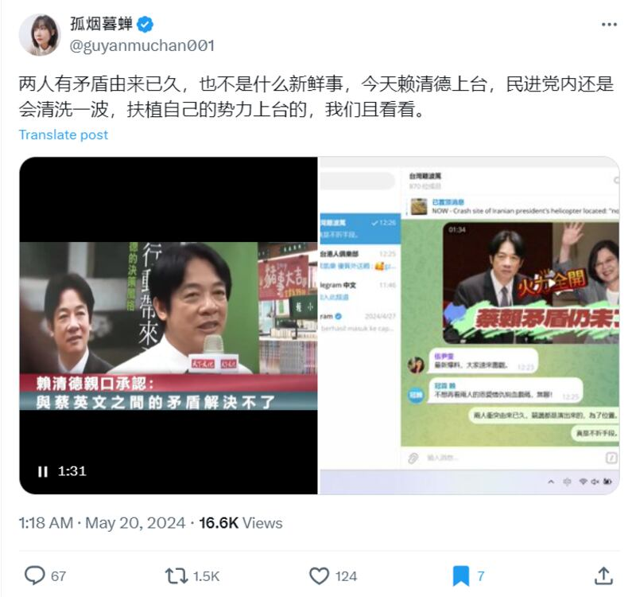
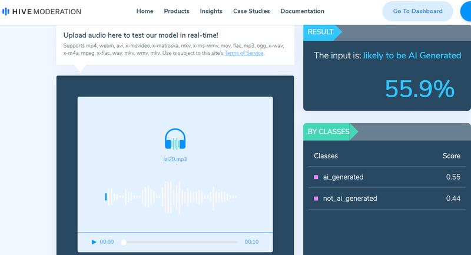

# Did Taiwan’s president complain about his predecessor in a leaked audio?

## Verdict: Lack of evidence

By Rita Cheng and Zhuang Jing for Asia Fact Check Lab

2024.06.11

Washington and Taipei

## Following the inauguration of Taiwanese President Lai Ching-te on May 20, a claim emerged that Lai complained about his predecessor, Tsai Ing-wen, in a leaked audio.

## But the audio is likely to be AI-generated, according to experts. Using an AI-analysis tool, AFCL also found signs of audio digitally manipulated.

A video with purported leaked audio was [shared](https://x.com/guyanmuchan001/status/1792424594927939899) on X, formerly known as Twitter, by a user named “Guyan Muchan”. AFCL has previously debunked claims shared by this user multiple times.

The one-minute and 33-second video has two parts.

In the first part, a male voice with a Taiwanese accent can be heard describing a “longstanding break” between Lai and Tsai, both high-ranking members of Taiwan’s Democratic Progressive Party, or DPP, saying that the two figures once almost came to blows over their differences.

At the 45-second mark, the purported voice of Lai can be heard, complaining about Tsai due to their purported disagreements.

Guyan Muchan claimed in a post on X that leaked audio showed new Taiwan President Lai Ching-te complaining about his predecessor, Tsai Ing-wen. (Screenshot/X)

But there is not enough evidence to show that the audio was a genuine recording of Lai.

## AI generated

AFCL used the open source AI detection tool [Hive](https://hivemoderation.com/ai-generated-content-detection) to analyze a 45-second purported recording of Lai, dividing it into four parts.

Three of the parts were judged to be more than 90% likely to have been generated by AI. The audio snippet from 11 to 20 seconds was judged to be 55.9% likely to have been produced by AI.

The AI detection tool Hive judged all four parts of the supposed audio clip of Lai to be likely generated by AI. (Screenshot/Hive)

## Experts analysis

[Chih-Chung Hsu](https://www.stat.ncku.edu.tw/index.php?option=module&lang=cht&task=pageinfo&id=708&index=13), an associate professor of statistics at Taiwan’s National Cheng Kung University specializing in deep learning and image processing, analyzed the purported leaked audio of Lai using an in-house audio-visual detection system.

This system measures AI likeness on a scale from 0 to 1. Hsu found that the voice on the audio measured 0.674, indicating a relatively low similarity to Lai’s voice.

Hsu added high-quality AI-generated audio and real voice typically score 0.85 or higher, but also warned that the low score could be due to the poor quality of the uploaded audio file.

Paul Liu, a Taiwanese information security expert, pointed out that the audio contained clipping, which should not be present in a secret recording.

The over-distortion suggested the microphone was extremely close to Lai, which Liu found unlikely given the sensitive subject matter.

He added that the flat pace and lack of irregular pauses and breaths resembled AI audio.

“I expected Lai’s voice to rise in pitch due to anger, rather than remain monotone given the emotional nature of the subject,” Liu said, adding that the absence of a definite time and place for the recording significantly lowered its credibility.

Taiwan’s Office of the President also said the audio is fake, citing analysis by the National Security Bureau.

## *Translated by Shen Ke. Edited by Shen Ke and Taejun Kang.*

[Original Source](https://www.rfa.org/english/news/afcl/afcl-lai-audio-06112024233916.html)