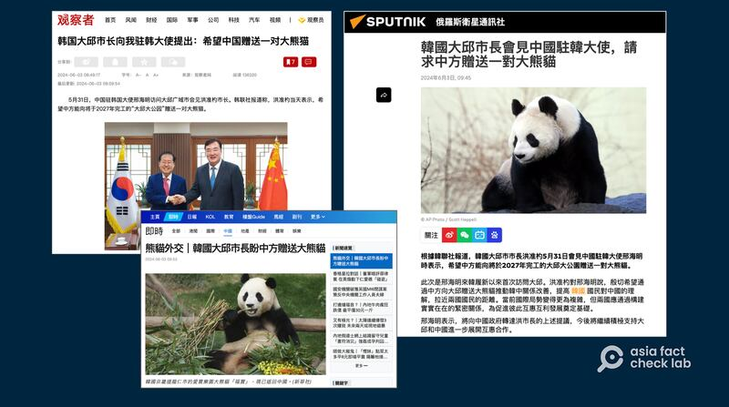
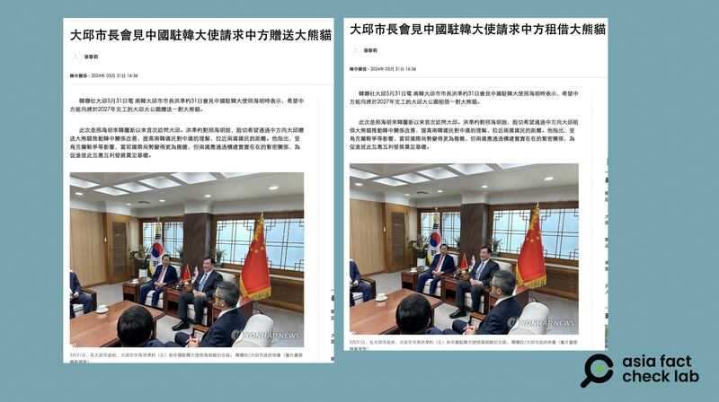

# Did a South Korean mayor ask China for giant pandas as a ‘gift’?

## Verdict: False

By Zhuang Jing for Asia Fact Check Lab

2024.06.13

Taipei, Taiwan

## A claim emerged in media posts that the mayor of the South Korean city of Daegu had asked China for giant pandas as a gift.

## But the claim is false. The mayor only requested that the pandas be leased. In 1982, China announced that it would no longer gift pandas to other countries due to the rare animals’ shrinking natural habitat and would only lease them.

The claim was shared on pro-Beijing media outlet [Guancha](https://archive.ph/9kR43#selection-333.2-333.118) on June 3, 2024.

“On May 31, Chinese Ambassador to South Korea Xing Haiming visited Daegu to meet with Mayor Hong Jun-pyo. Yonhap news agency reported that Hong expressed his hope that China would present a pair of giant pandas to the Daegu Great Park, which will be completed in 2027,” the report reads in part.

The claim was published by other media outlets, including Hong Kong's [Sing Tao Daily](https://std.stheadline.com/realtime/article/2002558/%E5%8D%B3%E6%99%82-%E4%B8%AD%E5%9C%8B-%E7%86%8A%E8%B2%93%E5%A4%96%E4%BA%A4%EF%B8%B1%E9%9F%93%E5%9C%8B%E5%A4%A7%E9%82%B1%E5%B8%82%E9%95%B7%E7%9B%BC%E4%B8%AD%E6%96%B9%E8%B4%88%E9%80%81%E5%A4%A7%E7%86%8A%E8%B2%93) and Russia's [Sputnik News](https://big5.sputniknews.cn/20240603/1059495907.html).

Pro-Beijing media outlets reported that Daegu’s mayor requested a pair of giant pandas from China. (Screenshots/Guancha, Sputnik and Sing Tao Daily)

The news quickly became the hottest topic on China’s Weibo social media platform. Netizens criticized South Korea's requests as “shameless” and “begging”.

News of the request soon sparked interest and critiques by Chinese netizens on Weibo. (Screenshot/Weibo)

But the claim is false.

## Source of the claim

Guancha cited a report published by South Korea’s Yonhap News Agency.

Keyword searches found that Yonhap did [publish](https://archive.ph/w27JK) a story on May 31, containing the phrase "gift giant pandas" in its headline.

However, as of June 3, Yonhap had [updated](https://cb.yna.co.kr/gate/big5/cn.yna.co.kr/view/ACK20240531003300881?section=china-relationship/index) the report and changed the phrase to "asked China to lease giant pandas".

The wording of Yonhap’s original report claiming that the mayor of Daegu had asked China to “gift” a pair of giant pandas (left) was later amended to the more accurate “lease” (right). (Screenshot/Yonhap News Agency)

A Daegu city official told AFCL that they had only asked China to lease a pair of pandas, adding that the term “gifting” was a mistake by Yonhap, which had since been corrected.

In 1982, China announced that due to the rapid loss of suitable habitat for giant pandas, it would stop gifting pandas to other countries and would only lease them.

## *Translated by Shen Ke. Edited by Shen Ke and Taejun Kang.*

*Asia Fact Check Lab (AFCL) was established to counter disinformation in today's complex media environmentL. We publish fact-checks, media-watches and in-depth reports that aim to sharpen and deepen our readers' understanding of current affairs and public issues. If you like our content, you can also follow us on*   [*Facebook*](https://www.facebook.com/asiafactchecklabcn)  *,*   [*Instagram*](https://www.instagram.com/asiafactchecklab/)   *and*   [*X*](https://twitter.com/AFCL_eng)  *.*

[Original Source](https://www.rfa.org/english/news/afcl/afcl-korea-china-panda-06132024232102.html)