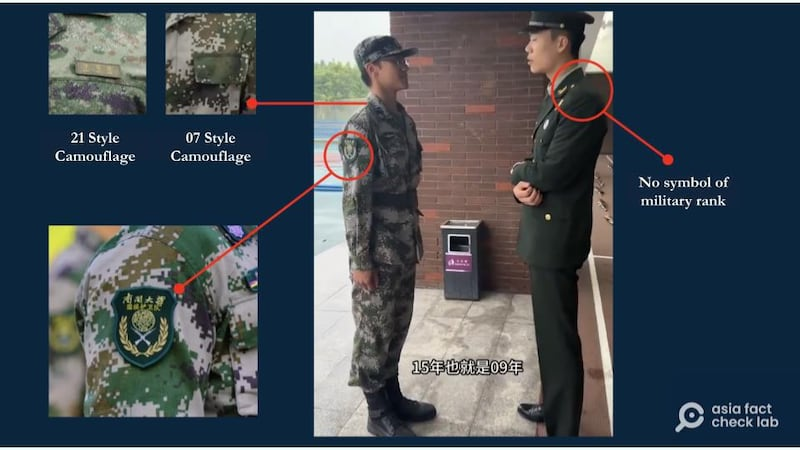

# Does the video show Taiwanese youth serving in the Chinese army?

## Verdict: False

By Dong Zhe for Asia Fact Check Lab

2024.06.17

Taipei, Taiwan

## A video of a young man wearing what appears to be a military uniform has been widely shared in Chinese-language social media posts that claim it shows a Taiwanese youth serving in China’s People’s Liberation Army, or the PLA.

## But the claim is false. The young man in the video is a member of a color guard unit at a Chinese university, not the PLA.

The claim was [shared](https://weibo.com/2343014623/5038426204668927) on the Weibo Chinese social media platform on May 26, 2024.

“A young man from Taiwan is a soldier on the mainland!” reads the post in part.

“Mainland” is a term often used to refer to China among Chinese speakers.

The claim was shared alongside a 31-second video that shows a young man wearing what appears to be a PLA camouflage uniform at training exercises.

The young man can be heard saying that he has a Taiwanese mother and a Chinese father and that he is from Taipei.

But the claim is false. The young man in the video is a member of a color guard unit at a Chinese university, not the PLA.

## University color guard

A reverse image search using screenshots from the video found the same video [published](https://www.sohu.com/a/781796352_121826638/?pvid=000115_3w_a&fbclid=IwZXh0bgNhZW0CMTAAAR0hKsvkzyGcGNT3NJqJSRmDF_XrkX5ELKuSev9x4P4AO10-nBOChfSCp0Q_aem_ASr9wknCGEiHqKk0kASMuFMJeUqMjccAFv74NN-2L5t6KpqP5WMIUchdBYQcSXzIHXHp2gvaw22MlLKOqvLSTero) on the Chinese news and video sharing site Sohu.

“On May 26, in Tianjin, retired military personnel met a student from Taiwan while training for a color guard unit at Nankai University,” the title of the Sohu video reads in part. The university is in the Chinese city of Tianjin.

A closer look at the video revealed that the armband of a young Taiwanese man matched that of the Nankai University color guard unit.

[The color guard](https://mp.weixin.qq.com/s/KcjHi49hBSAfv4cPWZ2Dcw) at Chinese universities is a "quasi-military student organization" with the job of conducting the daily flag raising and lowering ceremonies, as well as doing so on various holidays and commemorations.

It is not affiliated with the PLA.

[Joseph Wen](https://x.com/josephwen___), a part-time researcher at the Taiwan Institute of Strategic Modeling who created an [interactive map](https://umap.openstreetmap.fr/en/map/by_77487#5/32.732/101.997) detailing the PLA military facilities and bases across China, said the young man in the video was wearing the PLA's outdated Type 07 camouflage, but that the PLA now uses Type 21 camouflage for its uniforms.

A closer look at a screenshot of the video shared in false posts.

Wen also pointed out that the man standing in front of the young man is not wearing any symbols of rank, indicating that he has retired from the military.

## *Translated by Shen Ke. Edited by Shen Ke and Taejun Kang.*

*Asia Fact Check Lab (AFCL) was established to counter disinformation in today's complex media environment. We publish fact-checks, media-watches and in-depth reports that aim to sharpen and deepen our readers' understanding of current affairs and public issues. If you like our content, you can also follow us on*   [*Facebook*](https://www.facebook.com/asiafactchecklabcn)  *,*   [*Instagram*](https://www.instagram.com/asiafactchecklab/)   *and*   [*X*](https://twitter.com/AFCL_eng)  *.*

[Original Source](https://www.rfa.org/english/news/afcl/afcl-taiwan-youth-pla-06172024002055.html)