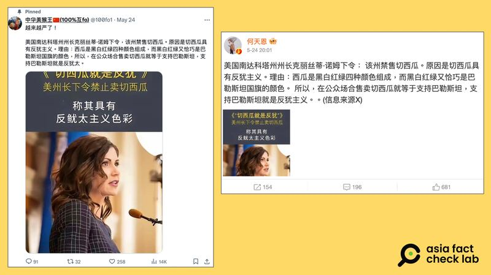

# Did South Dakota ban watermelon sales because it is antisemitic?

## Verdict: False

By Zhuang Jing for Asia Fact Check Lab

2024.06.19

Taipei, Taiwan

## A claim emerged in both English and Chinese-language social media posts that the U.S. state of South Dakota banned the sale of sliced watermelons because it is antisemitic.

## But the claim is false. Keyword searches found no official or credible reports to back the claim, which has been debunked by several international news organizations.

The claim was [shared](https://m.weibo.cn/detail/5037646826444075) on China's Weibo social media platform on May 24, 2024.

“South Dakota bans the sale of cut watermelons. The reason? because it’s antisemitic. Watermelons are black, white, red and green, which happen to be the colors of the Palestinian flag,” the post reads in part.

“Therefore, selling sliced watermelons in public is tantamount to supporting Palestine, and supporting Palestine is antisemitism,” it reads.

Over the past few months, watermelon has [become](https://www.pbs.org/newshour/world/how-watermelon-imagery-a-symbol-of-solidarity-with-palestinians-spread-around-the-world) a symbol of solidarity for Palestinians for its colors that match their flag, according to PBS Newshour.

The colors of sliced watermelon — with red pulp, green-white rind and black seeds — are the same as those of the Palestinian flag.

Similar claims have been shared on [Weibo](https://weibo.com/1659893422/OeoaHuiaL?type=repost) and [X](https://twitter.com/100fo1/status/1793893896281583808), formerly known as Twitter.

Chinese netizens on Weibo and X posted claimed that South Dakota ordered a state ban on the sale of cut watermelons because of perceived anti-Semitic overtones. (Screenshots/Weibo and X)

But the claim is false.

Keyword searches found no official or credible reports to back the claim.

The claim has been debunked by multiple international news organizations, including [USA Today](https://www.usatoday.com/story/news/factcheck/2024/05/17/kristi-noem-did-not-ban-sale-of-watermelon-slices/73721651007/) and [Reuters](https://www.reuters.com/fact-check/south-dakota-governor-kristi-noem-has-not-banned-sale-watermelon-slices-2024-05-20/).

Reuters cited Ian Fury, South Dakota Governor Kristi Noem’s chief of communications, as saying that there was “no truth” to the posts.

## *Translated by Shen Ke. Edited by Shen Ke and Taejun Kang.*

*Asia Fact Check Lab (AFCL) was established to counter disinformation in today's complex media environment. We publish fact-checks, media-watches and in-depth reports that aim to sharpen and deepen our readers' understanding of current affairs and public issues. If you like our content, you can also follow us on*   [*Facebook*](https://www.facebook.com/asiafactchecklabcn)  *,*   [*Instagram*](https://www.instagram.com/asiafactchecklab/)   *and*   [*X*](https://twitter.com/AFCL_eng)  *.*

[Original Source](https://www.rfa.org/english/news/afcl/afcl-watermenlon-ban-06192024002625.html)