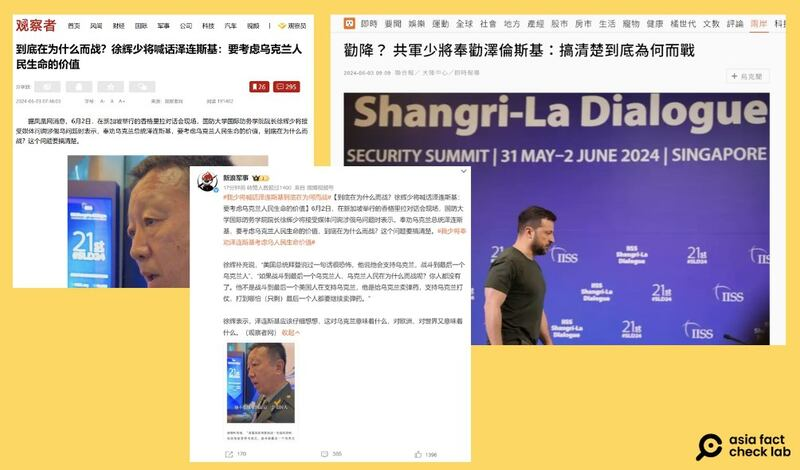
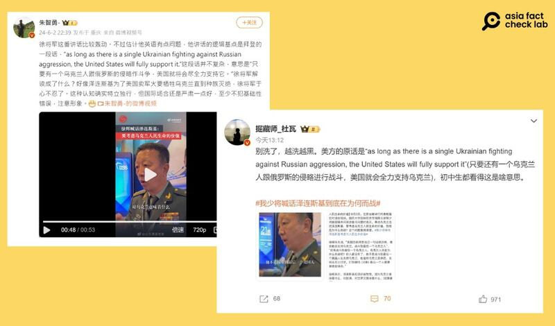

# Did Biden say US would help Ukraine fight to the last Ukrainian?

## Verdict: False

By Alan Lu for Asia Fact Check Lab

2024.06.24

Taipei, Taiwan

## A Chinese Major Xu Hui claimed in an interview on June 2 that U.S. President Joe Biden had said the U.S. “would help Ukraine fight to the last Ukrainian.”

## But the claim is false. Keyword searches found no official or credible reports to back the claim.

Xu's statement was made on the third day of the latest Shangri-La Dialogue held in Singapore from May 31 to June 2 and was later cited by Chinese media outlets such as [Guancha](https://archive.ph/SHFs3), [Sina Military](https://weibo.com/1499104401/OheTF6XdP?refer_flag=1001030103_) as well as Taiwan's [United Daily News](https://web.archive.org/web/20240604040217/https:/udn.com/news/story/7331/8005656).

“President Biden said something quite frightening. He said he would support Ukraine and fight until the last Ukrainian,” said Xu, as cited by Guacha. Xu did not give a source for the comment he attributed to Biiden.

“If they fight until the last Ukrainian, what are the Ukrainian people fighting for? If there are no people left, what’s the point? He’s not talking about fighting until the last American while supporting Ukraine. He’s selling ammunition to Ukraine, supporting them in the war, and continuing to sell ammunition even if only the last Ukrainian is left.”

Screenshots from Guancha, Sina and United Daily News

Several influential online users on X and Weibo later said that Xu “inaccurately translated” Biden’s statement, saying that Biden in fact said: “As long as there is a single Ukrainian fighting against Russian aggression, the United States will fully support it.”

But both claims are false.

Several influencers claimed Xu’s statement was inaccurate while themselves providing an unsourced quote of Biden that later proved false. (Screenshot/Weibo)

Keyword searches found no official or credible reports to show that Biden made such a remark.

A deputy spokesperson for the White House National Security Council told AFCL that Biden never made remarks claimed by either Xu or social media users.

AFCL found several pro-Beijing media outlets, including  [*The Paper*](https://m.thepaper.cn/newsDetail_forward_17652796) ,  [*China Daily*](https://china.chinadaily.com.cn/a/202403/10/WS65ed599ea3109f7860dd4c37.html) , and  [*Xinhua*](http://www.xinhuanet.com/2022-04/26/c_1128597073.htm) , had reported similar claims before Xu made his remarks.

These outlets cited an opinion piece from the magazine  [*American Conservative*](https://www.theamericanconservative.com/washington-will-fight-russia-to-the-last-ukrainian/)  titled "Washington Will Fight Russia to the Last Ukrainian."

“The allies are prepared to back the Zelensky government as long as it fights Moscow to the last Ukrainian – which has always been the West’s approach to Kyiv,” the article reads in part.

While the wording in this opinion piece is similar to the statement Xu attributed to Biden, it does not mention Biden making such a remark.

## *Translated by Shen Ke. Edited by Shen Ke and Taejun Kang.*

*Asia Fact Check Lab (AFCL) was established to counter disinformation in today’s complex media environment. We publish fact-checks, media-watches and in-depth reports that aim to sharpen and deepen our readers’ understanding of current affairs and public issues. If you like our content, you can also follow us on Facebook, Instagram and X.*

[Original Source](https://www.rfa.org/english/news/afcl/afcl-biden-ukraine-06242024001005.html)