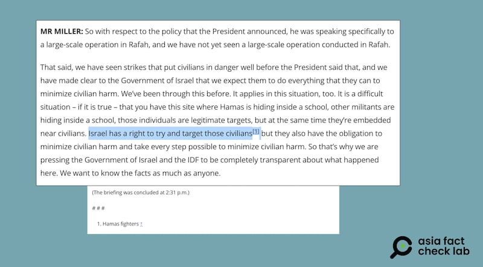

# Did a US State Department official say Israel has the right to attack civilians?

## Verdict: Misleading

By Zhuang Jing for Asia Fact Check Lab

2024.06.26

Taipei, Taiwan

## A claim emerged in social media posts that U.S. State Department spokesperson Matthew Miller stated at a June 6 press conference that Israel “has a right” to target civilians, citing a short clip as evidence.

## But the claim is misleading. Miller did mention such words, but it was later corrected by the State Department. The full context of the response makes it clear that Miller was referring to Hamas fighters when he mentioned civilians.

The claim was [shared](https://weibo.com/5108550554/OhVinoYTT) on the Weibo account of the Russian state-owned video news agency Ruptly on June 7.

“#US State Department said Israel has a right to attack civilians#,” the claim reads in part.

The post was shared alongside a 21-second clip that shows what appears to be Miller at a press briefing.

In the video, Miller can be heard saying: “Israel has a right to try and target those civilians but they also have the obligation to minimize civilian harm and take every step possible to minimize civilian harm.”

Several Weibo accounts reposted claims that a State Department spokesperson said Israel had the right to target civilians. (Screenshot/Weibo)

But the claim is misleading.

A keyword search found a full [transcript](https://www.state.gov/briefings/department-press-briefing-june-06-2024/#post-563929-footnote-1) of Miller's statement published on the website of the State Department on June 6.

“Israel has a right to try and target those civilians[1] but they also have the obligation to minimize civilian harm and take every step possible to minimize civilian harm,” the transcript reads in part.

Miller’s statement was made as part of a longer response to a question about a recent Israeli strike against a school purportedly housing Hamas fighters in Gaza that reportedly resulted in the deaths of 14 children.

A review of the full context of the response shows that Miller meant to refer to Hamas fighters when he said “target those civilians”.

The State Department noted in an annotation, indicated by the number 1 in the quote above, that Miller’s phrase “target those civilians” was specifically referring to “Hamas fighters”.

The State Department annotated the transcript of its June 6 press conference to indicate that Miller was referring to Hamas militant fighters and not civilians. (Screenshot/U.S. Department State Department website)

A State Department spokesperson told AFCL: “Our State Department spokesperson clearly meant to say “Hamas”, and it was officially noted in the briefing transcript.”

## *Translated by Shen Ke. Edited by Shen Ke and Taejun Kang.*

*Asia Fact Check Lab (AFCL) was established to counter disinformation in today’s complex media environment. We publish fact-checks, media-watches and in-depth reports that aim to sharpen and deepen our readers’ understanding of current affairs and public issues. If you like our content, you can also follow us on Facebook, Instagram and X.*

[Original Source](https://www.rfa.org/english/news/afcl/afcl-israel-civillians-06262024022418.html)