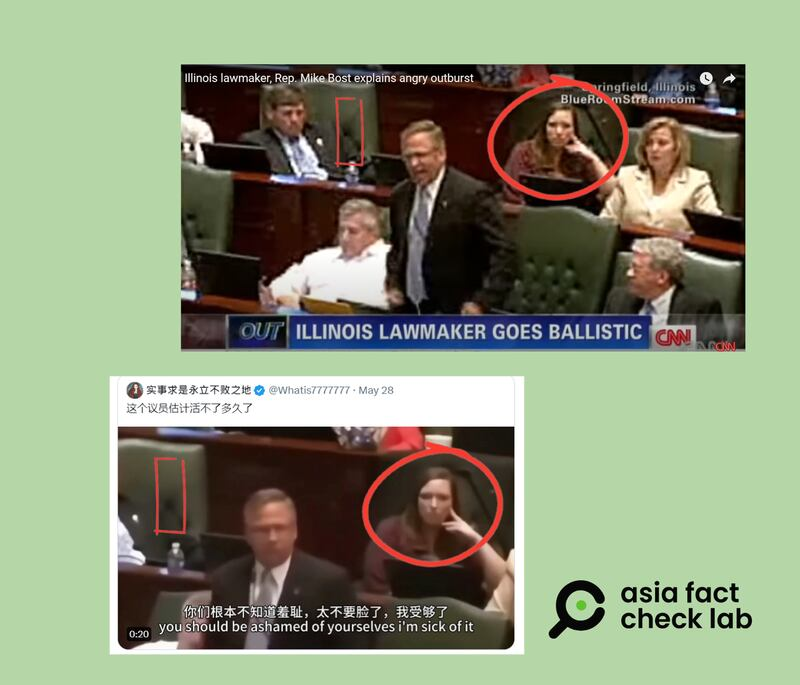

# Does the video show a US lawmaker outraged over the Antisemitism Awareness Act?

## Verdict: False

By Rita Cheng for Asia Fact Check Lab

2024.06.28

Taipei, Taiwan

## A video of an American legislator yelling in outrage emerged in social media posts that claim it shows the lawmaker was angry about the recent passage of the Antisemitism Awareness Act by the U.S. House of Representatives.

## But the claim is false. The video, taken from 2012 footage, shows the-Illinois House of Representatives member and current Illinois Republican congressman Mike Bost criticizing a reform plan for social security.

The video was [shared](https://archive.ph/KCiqV) on X by Chinese diplomat Zhang Heqing on June 8, 2024.

“It looks like he is angry,” Zhang said in the post.

The 44-second video shows a man dressed in a suit shouting in outrage at what appears to be a meeting of the U.S. House.

“The U.S. putting out this act about the Jews is a shameful disgrace,” a superimposed caption in Chinese reads.

Chinese diplomat Zhang Heqing circulated a video claiming that a U.S. legislator lost his temper and publicly went off on the recent Antisemitism Awareness Act passed by the House of Representatives. (Screenshot/X)

The House passed a bipartisan bill, Antisemitism Awareness Act, on May 1 to combat antisemitism as pro-Palestinian protests roil colleges across the U.S.

The bill would mandate that the Education Department adopt the broad definition of antisemitism used by the International Holocaust Remembrance Alliance, an intergovernmental group, to enforce anti-discrimination laws.

The group defines antisemitism as a “certain perception of Jews, which may be expressed as hatred toward Jews.”

It adds that “rhetorical and physical manifestations” of antisemitism include such things as calling for the killing or harming of Jews or holding Jews collectively responsible for actions taken by Israel.

The video had previously been shared by other Chinese influencers on social media platforms such as Douyin, Weibo and X.

Some online users commented that even “U.S. lawmakers have grown fed up with U.S. support of Israel and the Jewish community” citing the video.

But the claim is false.

## Old video

A reverse image search found the video [published](https://www.cbsnews.com/chicago/news/downstate-lawmaker-screams-throws-papers-over-pension-reform-bill/) in a report by the American broadcaster CBS on May 30, 2012.

“IL Rep. Mike Bost Is Furious Over Pension Reforms by Steve Lehocky on YouTube,” the caption of the video reads.

The report details the Democrat-led plan to overhaul the state pension system.

Both the figures and scene from the footage of Bost in 2012 (top) matches the recent footage Chinese netizens purportedly claim shows a legislator’s outburst over the Antisemitism Awareness Act. (Screenshots /CNN and X)

“A downstate lawmaker screamed, yelled and threw papers Tuesday, as he expressed frustration about the Democrat-led plan to overhaul the state pension system,” the report reads in part.

“One of those lawmakers is Rep. Mike Bost (R-Murphysboro), who launched into a tirade Tuesday as he complained about the amount of power Madigan wields.”

## Bost on the Antisemitism Awareness Act

Bost did not speak at all during the near hour long House deliberation on the Antisemitism Awareness Act [broadcast](https://www.c-span.org/video/?535288-2/house-session&start=15549&transcriptSpeaker=30359) by CSPAN on May 1.

The act eventually passed the House by a vote of 320 in favor, 91 against and 18 abstentions, with Bost officially [recorded](https://clerk.house.gov/Votes/2024172?BillNum=H.R.6090) as voting for the act.

While legislators from both parties openly opposed the bill, none of them expressed their disagreement in emotional language or exaggerated movements during the proceedings.

The act awaits approval by the Senate before it can be sent to the president to be signed into law.

## *Translated by Shen Ke. Edited by Shen Ke and Taejun Kang.*

## *Asia Fact Check Lab (AFCL) was established to counter disinformation in today’s complex media environment. We publish fact-checks, media-watches and in-depth reports that aim to sharpen and deepen our readers’ understanding of current affairs and public issues. If you like our content, you can also follow us on Facebook, Instagram and X.*

[Original Source](https://www.rfa.org/english/news/afcl/afcl-us-lawmaker-antisemitism-act-06282024003944.html)