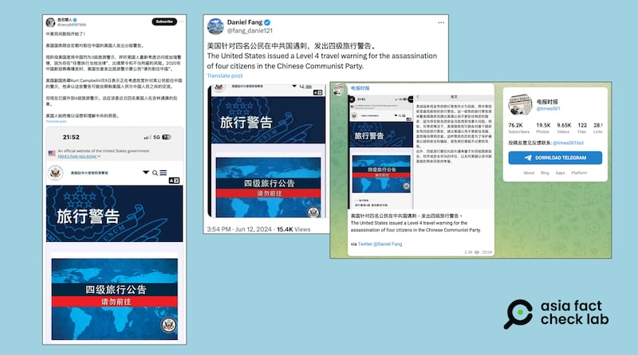
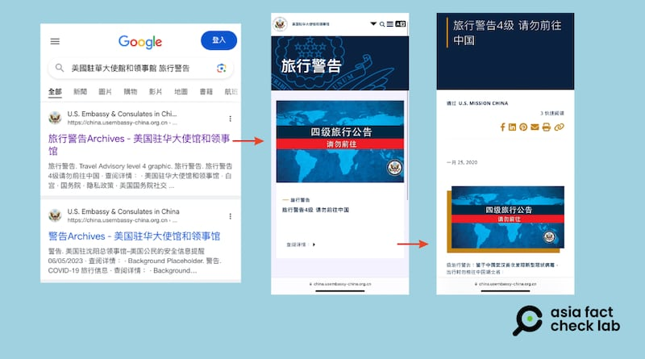

# Did US issue a new travel alert after attack on its citizens in China?

## Verdict: False

By Zhuang Jing for Asia Fact Check Lab

2024.07.02

Taipei, Taiwan

## Chinese-language posts have circulated a claim that the United States issued a level 4 travel alert, the highest level, to its citizens traveling to China after four Americans were attacked there in June.

## But the claim is false. The U.S. travel alert for China has remained at level 3, the second highest level, since April.

The claim was [shared](https://twitter.com/fang_danie121/status/1800798926616031506) on X, formerly known as Twitter, on June 12.

“The United States issued a Level 4 travel warning for the assassination of four citizens in the Chinese Communist Party,” the claim reads in part.

The claim was shared alongside a screenshot of what appears to be a travel warning issued by the U.S. Department of State.

Users on X and Telegram recently claimed that the U.S. issued a level four travel alert to China following an attack on U.S. citizens in Jilin. (Screenshots/X and Telegram)

The claim began to circulate online after four American teachers were assaulted by a man wielding a knife at a park in the Chinese city of Jilin on June 10.

All of the teachers survived the incident and Chinese authorities took the assailant into custody.

U.S. officials expressed concern over the incident, while the Chinese Foreign Ministry commented that the attack “will not affect the normal people-to-people exchanges between China and the US.”

The same screenshot with a similar claim was also shared on [X](https://twitter.com/fang_danie121/status/1800798926616031506) and [Telegram](https://t.me/s/times001?before=697369).

But the claim is false.

## U.S. travel advisory on China

The U.S. Department of State [issues](https://travel.state.gov/content/travel/en/traveladvisories/traveladvisories/china-travel-advisory.html) four levels of travel alerts to citizens, based on the varying levels of risk in different countries. These alerts range from level 1, advising to "exercise normal precautions," to level 4, warning "do not travel."

In April 2024, the U.S. travel advisory for China was updated to level 3, advising citizens to “reconsider travel.” This rating remains in effect.

The most recent revision of the U.S. travel advisory for China was on April 12, 2024, following the passage of new national security legislation in Hong Kong. Several English- and Chinese-language media outlets reported on this change at the time.

The advisory urges U.S. citizens to “reconsider travel” due to the potential for “arbitrary enforcement of local laws” and the “risk of wrongful detentions.”

## Old alert

Keyword searches found a screenshot of the U.S. travel advisory shared in social media posts in fact taken from the old alert [issued](https://china.usembassy-china.org.cn/zh/travel-alert-level-4-do-not-travel-to-hubei-zh/) on Jan. 25, 2020.

The purported screenshot of a recent advisory was actually an archived image of an unrelated travel alert to China issued following the outbreak of COVID in January 2020. (Screenshots /Google and U.S. State Department Archives)

The Chinese text seen in the screenshot shows that the alert was issued following the breakout of COVID-19 in the city of Wuhan and advised travelers not to enter Hubei province, of which Wuhan is capital.

## *Translated by Shen Ke. Edited by Shen Ke and Taejun Kang.*

*Asia Fact Check Lab (AFCL) was established to counter disinformation in today's complex media environment. We publish fact-checks, media-watches and in-depth reports that aim to sharpen and deepen our readers' understanding of current affairs and public issues. If you like our content, you can also follow us on*   [*Facebook*](https://www.facebook.com/asiafactchecklabcn)  *,*   [*Instagram*](https://www.instagram.com/asiafactchecklab/)   *and*   [*X*](https://twitter.com/AFCL_eng)  *.*

[Original Source](https://www.rfa.org/english/news/afcl/afcl-us-china-travel-advisory-07022024025617.html)