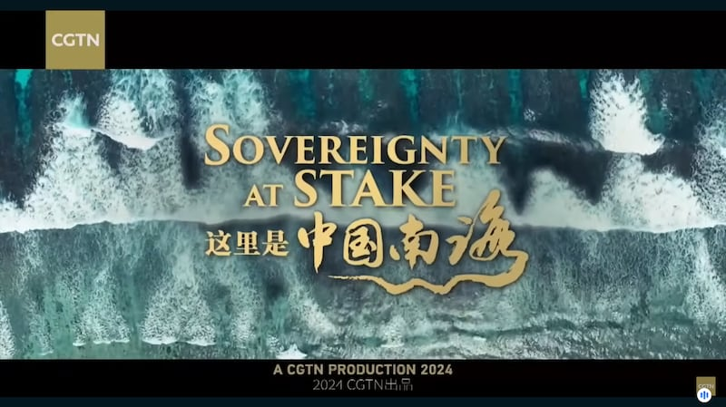
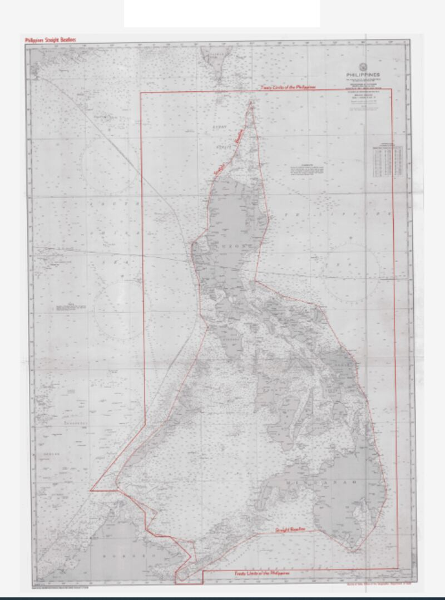
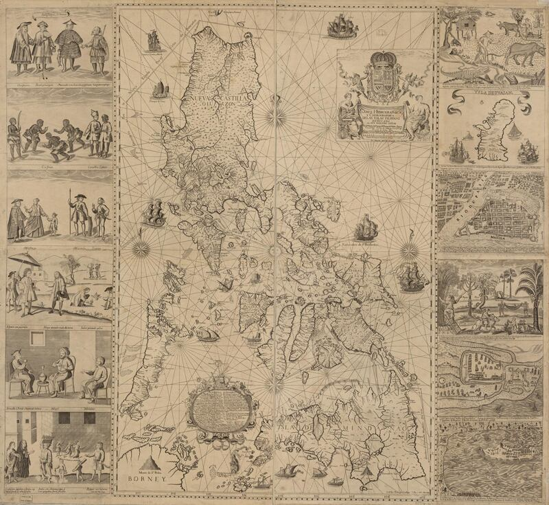
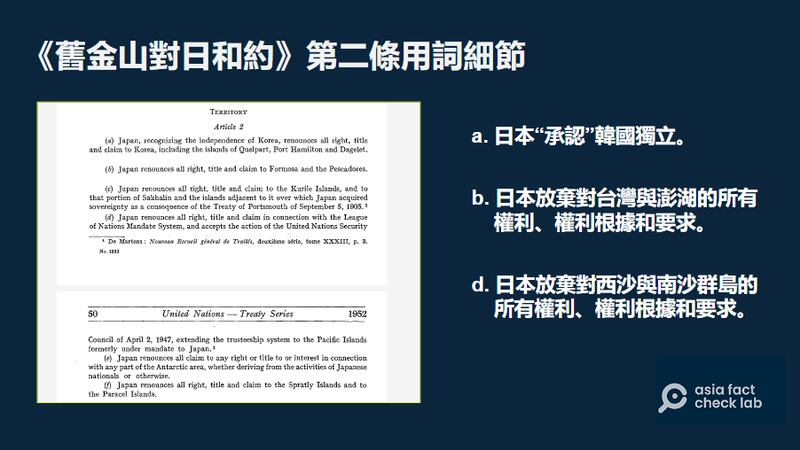

# Did a Chinese documentary prove China’s sovereignty over the South China Sea?

## It presents China’s claim to the region but is criticized for potentially misrepresenting key dispute aspects.

By Rita Cheng for Asia Fact Check Lab

2024.07.04

Washington

The complex web of territorial claims in the South China Sea has long been a source of tension between China and several of its Southeast Asian neighbors.

The area is strategically significant due to its rich natural resources, vital shipping lanes, and geopolitical implications. Efforts to resolve the disputes through international law, including the United Nations Convention on the Law of the Sea, have had limited success, and the region remains a flashpoint.

Recently, CGTN, the English-language news channel of China’s state-run China Central Television, or CCTV, broadcast a documentary addressing several facets of this complex issue, including the dispute between China and the Philippines.

Screenshot of CGTN documentary “Sovereignty at Stake: A documentary on the South China Sea”.

This program, titled “Sovereignty at Stake: A documentary on the South China Sea”, aims to present China’s historical claim to the region, but it has drawn criticism for potentially misrepresenting key aspects of the dispute.

Below is what AFCL found.

## 1. Was the South China Sea primarily navigated by China?

The documentary cited Wu Shicun, president of China’s National Institute for South China Sea Studies, as saying that excavated material from the sea are clear evidence that in antiquity “for a long time, it was primarily Chinese people who worked in, passed through and used the waters.”

But this is misleading.

"Common sense would tell you that the Chinese weren't the only ones living off the ocean," says [Li Woteng](https://search.books.com.tw/search/query/key/%E9%BB%8E%E8%9D%B8%E8%97%A4/adv_author/1/), a well-known ethnic Chinese expert on the South China Sea dispute who has written several books on the subject.

Li believes that people from what is now modern China were not the only ones who navigated through and fished in the South China Sea, nor even the main ones.

As evidence, he cited a passage from a work by the 18th century Vietnamese scholar Lê Quý Đôn recording Vietnamese fishermen at work near the Paracel Islands – a disputed archipelago in the South China Sea.

Li noted that the passage also recorded a meeting between Vietnamese and Chinese fishermen working together peaceably at the site.

He added the text demonstrates that Chinese fishermen were not the only ones working in the waterway and it was used by mariners from China and many other Asian countries in antiquity.

## International waterway

While the passage alone is not enough evidence to infer who entered the South China Sea first, Li believes that it was not China.

It is possible to claim that Chinese fishermen operating along the coastline of China’s southernmost Hainan Island in antiquity were “navigating” or “exploiting” the South China Sea, said Li.

However, Hainan is in the upper, northern tract of the sea, and it would be just as reasonable to infer that all surrounding countries in the region could make similar claims, Li added.

## Arabs, Southeast Asians traders

Li also highlighted that when discussing sea routes in the South China Sea, known as the Maritime Silk Road, it is important to focus on the voyages made across the open ocean.

One Chinese expedition crossed the isthmus of modern day south Thailand en route to a kingdom in present day India, Li explained, citing a passage from a nearly 2,000-year-old text written during China’s Han Dynasty, which is the oldest surviving record of a Chinese expedition sent through the South China Sea.

The Indian kingdom had previously sent tribute across the South China Sea to the Han rulers, and the Chinese expedition was meant to be a reciprocal diplomatic gesture of respect.

Li added that the Indian kingdom’s initial crossing of the sea is clear evidence that the Maritime Silk Road had already become a major route for East and South Asian societies.

Additionally, these records show that Chinese envoys traveled abroad on foreign ships.

In the following centuries, records note that vessels from Southeast Asia, India and Iran regularly arrived at southern Chinese ports after crossing the South China Sea.

On the other hand, there are only a few accounts before the Tang dynasty (618-907) of Chinese people traveling by sea, and most of these were monks on foreign ships.

Li mentioned that it was only around the Song dynasty (960-1279) that China began producing large numbers of merchant vessels capable of crossing the open ocean.

By this time, Arab and Southeast Asian merchants were already using the South China Sea extensively, creating the well-known maritime trade routes that later famous Chinese explorers, like Zheng He, would follow.

## 2. Did international treaties stipulate that several disputed archipelagos lie outside the territory of the Philippines?

Regarding the present-day dispute between China and the Philippines over the Second Thomas Shoal and Scarborough Shoal, Wu Shicun from the National Institute for South China Sea Studies, said in the documentary that the maritime western boundaries of the Philippines are delineated at 118 degrees east by a series of international treaties.

Wu told AFCL that the [1898 Treaty of Paris](https://avalon.law.yale.edu/19th_century/sp1898.asp), the [1900 Treaty of Washington](https://maint.loc.gov/law/help/us-treaties/bevans/b-es-ust000011-0623.pdf) and [a border delineation](https://www.state.gov/wp-content/uploads/2019/11/LIS-33.pdf) signed between the United States and Great Britain in 1930 were among the international treaties he was referring to during the program.

He added that both disputed shoals lie west of this boundary and therefore do not belong to the Philippines.

This is partly true.

The 1898 Treaty of Paris was signed between the U.S. and Spain following the end of the Spanish-American War in 1898.

The treaty ceded the entirety of the then Spanish controlled Philippines to the U.S. and delineated the eastern range of islands to be handed over as lying between a longitude of 118 degrees east to 127 degrees east.

The later treaty between the U.S. and Britain delineating maritime borders between the then U.S.-controlled Philippines and British- controlled Borneo also marked an approximate longitude of 118 degrees east as the westernmost boundary of the Philippines.

The U.S. State Department has historical records detailing the baseline of the Philippines maritime boundaries. (Screenshot/U.S. Department of State, LIS No. 33 - Philippines Straight Baselines )

However, Li Woteng noted that a clause in the 1900 Treaty of Washington – a followup agreement between the U.S. and Spain which addressed certain unresolved issues in the Treaty of Paris – further stipulated that Spain relinquished all claims to “any and all islands lying outside the lines” noted in the 1898 Treaty of Paris.

Li referred to this as a “pocket” treaty that was meant to ensure that any and all islands belonging to the Philippines during the Spanish colonial era would be handed over to the U.S., regardless of whether they were within the boundaries stipulated by the 1898 Treaty of Paris.

This clause was not mentioned by Wu. If the shoals were considered part of the Philippines during the Spanish colonial era, they may have been transferred to U.S. control along with the Philippines.

## 3. Does China possess more convincing historical evidence than the Philippines?

The documentary criticized the Philippines for using a 200-year-old “unofficial map” from the Spanish colonial era as evidence of its sovereignty over Scarborough Shoal since ancient times. It instead pointed to a 300-year-old Chinese fishermen’s navigation manual as more convincing evidence.

However, this lacks historical context.

While it claims the Chinese fishermen’s navigation manual is “strong evidence” that the disputed islands have been Chinese territory since ancient times, the manual was never officially commissioned by any Chinese government.

In contrast, the so-called unofficial map of the Philippines was created by the Spanish polymath missionary Murillo Velarde at the request of the then governor-general of the Philippines, Valdez Tamon, following an order from the King of Spain in 1733 to draw the first complete scientific map of the Spanish territory.

The map remained the standard chart of the Philippines for a long time after its completion. A digitized version of the map is [available](https://tile.loc.gov/image-services/iiif/service:gmd:gmd8:g8060:g8060:ct003137/full/pct:12.5/0/default.jpg) on the U.S. Library of Congress website.

Velarde’s map of the Philippines (Screenshot/U.S. Library of Congress website)

Li, an ethnic Chinese expert on the South China Sea, stated that even if China doesn’t recognize the map drawn by Velarde as evidence of Philippine rule over Scarborough Shoal, it at least proves that the Philippines was aware of the shoal at that time.

Expeditions organized by Spain to investigate and survey the island in 1792 and 1800 could also be regarded as evidence of “effective dominion” under international law, Li added.

## 4. Were China’s claims to the South China Sea unchallenged by the international community?

The documentary noted that an administrative map released by the Republic of China in 1948 that includes several currently disputed islands in the South China Sea within China’s maritime borders went unchallenged by other countries at the time.

The Republic of China, or simply China, was a sovereign state based on mainland China from 1912 to 1949 prior to the government’s relocation to Taiwan, where it continues to be based today.

But this is partly true. While no country directly challenged the map at the time, several countries had already made claims to many of the islands included in the map.

In a 1996 [paper](https://www.durham.ac.uk/media/durham-university/research-/research-centres/ibru-centre-for-borders-research/maps-and-databases/publications-database/Maritime-Briefings-(Vol.-2-no.-1).pdf) by American scholar Daniel Dzurek, focusing on the issue of sovereignty over the Spratly Islands, it was noted that both Japan and France had sent several missions around the islands. France, in particular, claimed sovereignty over several islands in the region – claims that were later [disputed](https://www.roc-taiwan.org/jpna/post/438.html) by China.

Li believes that the most likely reason no country challenged China’s claims at the time was that nobody knew about them.

While the maps were all published in Chinese-language newspapers, they were not published prominently.

Even if other countries noticed the announcement at the time, they were probably unclear about its significance, Li explained.

“[The Republic of China] did not declare what the eleven-dash line means, and China to this day has not explicitly stated the exact meaning of the nine-dash line,” said Li.

The nine-dash line, referred to as the eleven-dash line by Taiwan, is a set of delineations on various maps that accompanied the claims of China and Taiwan in the South China Sea.

While countries such as Vietnam and the Philippines did not officially dispute China’s claimed sovereign area in the South China Sea as outlined in the map, they have declared sovereignty over particular islands and archipelagos in the region.

For instance, in 1950 the Philippines began to assert its claim to sovereignty over the Spratly Islands, and in 1956, it explicitly claimed sovereignty over them. Additionally, at the 1951 San Francisco Conference, post-independence Vietnam (represented by the Bao Dai regime) also put forward its claim of sovereignty over the Xisha and Spratly Islands.

Therefore, Li believes it is clear that the documentary’s emphasis on the fact that “no countries have objections to the eleven-dash line” is not sufficient evidence to prove there were no disputes over the islands and sea areas.

## 5. Did the U.S. smear China and attempt to build a military base on the Spratly Islands?

Herman Tiu-Laurel, president of the Asian Century Philippines Strategic Studies Institute, said in the documentary that the purpose of the [U.S. Myoushuu Project](https://gordianknot.stanford.edu/projects) – a Stanford University research project – was to discredit China's international reputation and establish a joint military base of operations in the Spratly Islands, as part of a first line of island chain bases surrounding China.

But this claim lacks evidence.

While the U.S. and the Philippines [announced](https://time.com/6268379/philippines-us-military-bases-china/) U.S. military access to four training sites in the Philippines as part of an expansion in bilateral military cooperation in 2023, the Spratly Islands are not included among these sites.

Project Myoushuu is designed to research Chinese tactics used in the South China Sea and document Chinese encroachment in the area.

It is part of the broader [Gordian Knot Center](https://gordianknot.stanford.edu/) at Stanford University, a research center specializing in national security innovation established under the auspices of the U.S. Office of Naval Research.

Project Myoushuu is a Stanford research project focused on documenting Chinese encroachment into the South China Sea. (Screenshot/Gordian Knot Center Website)

AFCL has previously [debunked](https://www.rfa.org/mandarin/shishi-hecha/hc-08182023142909.html) similar claims about U.S. plans to build military bases in the South China Sea.

## 6. Did international treaties following World War II delegate which country held sovereignty over the South China Sea?

The documentary also claimed that following World War II, the Allies’ decision not to contest China’s control over various islands in the South China Sea was at least a tacit admission of China’s territorial claims over the area.

This claim is highly contestable, with the key point of contention being the wording of the [Treaty of Peace with Japan](https://treaties.un.org/doc/publication/unts/volume%20136/volume-136-i-1832-english.pdf), also known as the Treaty of San Francisco, signed in 1951.

Neither the government of the Republic of China nor the People’s Republic of China were signatories to the treaty.

In the second article of the treaty, Japan renounced any claims to its former imperial territories held before the war, including the Spratly Islands and the Paracel Islands.

The original wording of the Treaty of Peace with Japan did not specify what countries hold sovereignty over the Spratly Islands or the Paracel Islands. (Screenshot/U.N. website)

However, the treaty itself did not specify or affirm which countries would exercise sovereignty over these territories.

## *Translated by Shen Ke. Edited by Shen Ke and Taejun Kang.*

*Asia Fact Check Lab (AFCL) was established to counter disinformation in today's complex media environment. We publish fact-checks, media-watches and in-depth reports that aim to sharpen and deepen our readers' understanding of current affairs and public issues. If you like our content, you can also follow us on*   [*Facebook*](https://www.facebook.com/asiafactchecklabcn)  *,*   [*Instagram*](https://www.instagram.com/asiafactchecklab/)   *and*   [*X*](https://twitter.com/AFCL_eng)  *.*

[Original Source](https://www.rfa.org/english/news/afcl/afcl-cctv-south-china-sea-07042024025123.html)