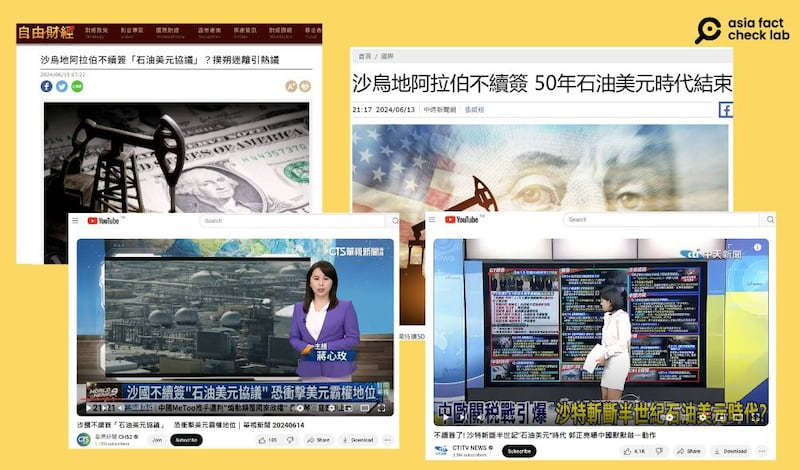
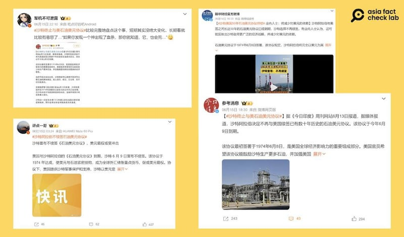

# Did a deal between Saudi Arabia and US to sell oil in dollars expire?

## Verdict: False

By Alan Lu for Asia Fact Check Lab

2024.07.08

Taipei, Taiwan

## A claim emerged in Chinese-language social media posts in June that Saudi Arabia terminated a 50-year formal agreement with the United States to conduct oil transactions in U.S. dollars, under a deal called the “petrodollar agreement.”

## But the claims are false. No known formal deal stipulating that Saudi Arabia must sell oil in U.S. dollars exists. While not formally bound by agreement, Saudi Arabia has in practice conducted all its oil deals over the past several decades entirely in U.S. dollars.

The claims were [shared](https://weibo.com/5703136759/Oj2fj4BEF?refer_flag=1001030103_) on Weibo, a popular Chinese social media platform, on June 15, 2024.

“The Petrodollar Agreement between the United States and Saudi Arabia expired and Saudi Arabia announced on June 9 that it would not renew it. The agreement, reached in 1974, closely linked the U.S. dollar to oil,” the claim reads in part.

Several Weibo influencers and media outlets claimed that Saudi Arabia had decided not to renew an agreement formally requiring all the country’s oil transactions to be conducted in U.S. dollars. (Screenshots/Weibo)

Similar claims have been shared on social media [here](https://weibo.com/1226106902/Ojdg2iGpk?refer_flag=1001030103_) and [here](https://weibo.com/2356166212/Oj9CebEZ2?refer_flag=1001030103_) as well as some Chinese and Taiwanese media outlets [here](https://weibo.com/2375086267/Oj8aFlISJ?refer_flag=1001030103_) and [here](https://ec.ltn.com.tw/article/breakingnews/4704903).

Taiwanese media outlets used such claims to state that the Saudi Arabia-U.S. oil agreement would quickly cease to be effective. (Screenshots/Liberty Times, China Times and YouTube)

But the claims are false. No known formal deal stipulating that Saudi Arabia must sell oil in U.S. dollars exists.

## No formal deal

Chinese social media users cited a joint commission for economic cooperation, the United States-Saudi Arabian Joint Commission on Economic Cooperation, as evidence that there is a formal agreement between the two countries to sell oil in dollars.

The commission was formed in June 1974 and expired on June 9, 2024.

But an official at the Government Accountability Office, the U.S. government's highest auditing body, said the commission did not contain any formal agreement on oil trade in U.S. dollars between the U.S. and Saudi Arabia, citing a government [report](https://www.gao.gov/products/id-79-7) published in March 1979.

The official added that there are no other documents on using U.S. dollars in oil trade between the two countries.

Separately, the American Institute of Economic Research [noted](https://www.aier.org/article/sense-and-nonsense-on-petrodollars/) in a report that the use of U.S. dollars in oil trade had never been dictated by a formal treaty.

## Informal agreement

But the U.S. and Saudi Arabia made an "informal" agreement in 1974 to trade oil in U.S. dollars – a secret deal [revealed](https://www.bloomberg.com/news/features/2016-05-30/the-untold-story-behind-saudi-arabia-s-41-year-u-s-debt-secret?sref=TuLYJzYL) by Bloomberg in May 2016.

In exchange for agreeing to invest billions of dollars in earnings from these oil sales into U.S. Treasury bonds, Saudi Arabia received large amounts of U.S. military aid and equipment, Bloomberg reported.

An [academic paper](https://www.jstor.org/stable/48750200?seq=6) on U.S. oil hegemony also pointed out that this unofficial agreement between the two countries allowed the dollar to become the standard international oil reserve currency, placing the U.S. in an extremely powerful position as nations continued to rely more and more on oil in the decades following the deal.

## Non-dollar oil transactions

Even though there is no formal agreement requiring Saudi Arabia to sell oil in U.S. dollars, and it has shown a willingness to sell oil [in other currencies](https://oilprice.com/Energy/Crude-Oil/Gold-And-A-New-Crude-Benchmark-A-New-Dawn-For-The-Petroyuan.html), in practice, it still sells oil exclusively in dollars.

[Public records](https://oec.world/en/profile/bilateral-product/crude-petroleum/reporter/sau) of oil exports show that all of Saudi Arabia's oil transactions up to the present day have used U.S. dollars as the base currency, with no recorded instances of other currencies being used for any transactions.

However, there has been speculation that Saudi Arabia would begin oil trades in other currencies.

Paul Donovan, chief economist of Global Wealth Management at global financial firm UBS, [said](https://www.ubs.com/global/en/wealth-management/insights/chief-investment-office/market-insights/paul-donovan/2024/dangers-of-confirming-your-beliefs.html), for instance, that non-dollar currencies had always been used in oil trades and that Saudi itself indicated in 2023 it would be "happy to conduct" such transactions.

Similarly, the Wall Street Journal [reported](https://www.wsj.com/finance/currencies/the-dominant-dollar-faces-a-backlash-in-the-oil-market-0f151e28) in 2023 that 20% of the world's total oil trade that year was not denominated in dollars and that Saudi Arabia had "recently taken steps laying the groundwork for trade that sidesteps the dollar."

## *Translated by Shen Ke. Edited by Shen Ke and Taejun Kang.*

*Asia Fact Check Lab (AFCL) was established to counter disinformation in today's complex media environment. We publish fact-checks, media-watches and in-depth reports that aim to sharpen and deepen our readers' understanding of current affairs and public issues. If you like our content, you can also follow us on*   [*Facebook*](https://www.facebook.com/asiafactchecklabcn)  *,*   [*Instagram*](https://www.instagram.com/asiafactchecklab/)   *and*   [*X*](https://twitter.com/AFCL_eng)  *.*

[Original Source](https://www.rfa.org/english/news/afcl/afcl-us-saudi-oil-deal-07082024043619.html)