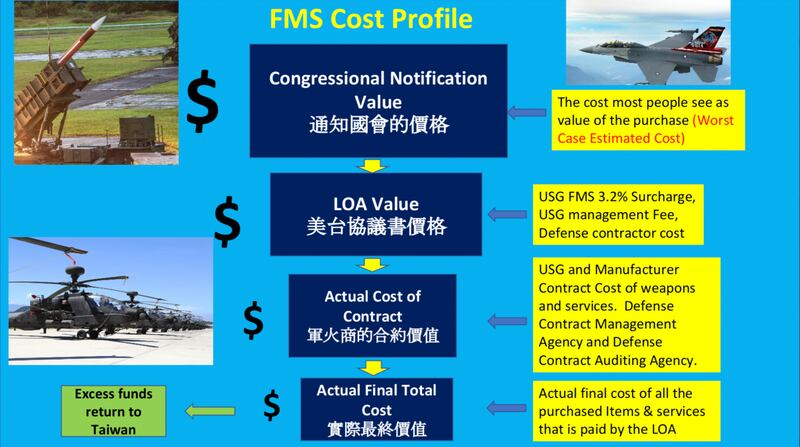

# Media Watch: proposed US drone sales to Taiwan spark rumors on price, quality

## The claim that drones in the deal are ‘useless and pricey’ has emerged in social media and media outlets.

By Zhuang Jing for Asia Fact Check Lab

2024.07.10

Taipei, Taiwan

The U.S. Defense Security Cooperation Agency shook the halls of Congress on June 18 with news of a possible arms deal with Taiwan valued at US$360 million. This deal includes more than 1,000 units of two types of suicide drones, including the Switchblade 300.

Criticism of the deal came swiftly from several prominent Taiwanese figures. Julian Kuo, formerly a legislator and now a political commentator, [voiced](https://www.youtube.com/watch?v=dzAwVsZdhm0) serious concerns, suggesting that the Switchblade 300, which he claims were previously "cracked by Russia during the Russo-Ukrainian war," were being sold to Taiwan at an inflated price – five times higher than the market rate. According to Kuo, other nations have shunned this model for the same reasons.

Echoing Kuo's skepticism, Shuai Hua-Ming, another well-known political commentator, bluntly [labeled](https://www.youtube.com/watch?v=1pPdRUOMpTM) the drone "trash." Further adding to the critical chorus, retired Taiwanese General Li Cheng-chieh [lamented](https://ynews.page.link/RwSzo) the treatment by the U.S. of Taiwan, using the Taiwanese dialect term "plate" to describe Taiwan as easily deceived and exploited.

These remarks quickly found their way into Chinese media. Outlets like [Phoenix](https://i.ifeng.com/c/8aeJinPf6JP) and [Tencent](https://new.qq.com/rain/a/20240620A02GRH00), along with several influential Chinese social media users, spread the commentators' doubts widely, intensifying the scrutiny and debate over the proposed arms sale.

Several Taiwanese political commentators stated that the recent batch of U.S. arm sales to the country were both expensive and useless, with Chinese media outlets soon repeating the claims. (Screenshots/Youtube, Weibo and Phoenix)

But AFCL found that this criticism is not supported by sufficient evidence.

## Taiwan in ‘critical need’ of drones

Taiwan is in critical need of thousands of such drones in order to hold off the People's Liberation Army's airborne and amphibious invasion forces that would be supported by thousands of their loitering drones, said [Richard Fisher](https://globaltaiwan.org/member/richard-fisher/), an expert on China's military at the International Assessment and Strategy Center.

Confronting the PLA with a variety of drones to complicate their defensive requirements was a good strategy for Taiwan; the Switchblades 300 may get through when others do not, he added.

While Taiwan could theoretically arm itself by buying thousands of cheap Chinese-made drones as weapons for a fraction of the cost, the software of these weapons could very well be controlled by the PLA, Fisher told AFCL.

## Different situation in Taiwan

There have been reports with mixed views on the effectiveness of the Switchblade 300 used by Ukraine, many noting that Russia’s ability to inhibit the drone’s navigation system has led Ukraine to gradually reduce its use of them.

But Tony Hu, a former U.S. Department of Defense official, believes that the situation in Taiwan and Ukraine is different, adding that the use of the Switchblade 300 is more suitable for Taiwan’s environment.

This is because the drones would first be deployed over water in the event of any invasion of Taiwan, said Hu.

Unlike in Ukraine, PLA troops would not have room to hide or buildings in which to take cover in such circumstances, Hu added.

In response to criticism of the proposed sale, Taiwan's Ministry of National Defense [said](https://www.mnd.gov.tw/Publish.aspx?p=83126&title=%e5%9c%8b%e9%98%b2%e6%b6%88%e6%81%af&SelectStyle=%e6%96%b0%e8%81%9e%e7%a8%bf) in a press release on June 24 that the drones were important tools in waging asymmetric warfare, and the two models procured by Taiwan were employed by the U.S. military's active service.

## Are the drones overpriced?

The price of the Switchblade 300 is debatable, with different sources citing different numbers.

But Hu believes that such numbers are “meaningless” because Taiwan is purchasing not only the drones but also the training and spare parts needed to use them.

Hu noted that the actual sales price would be determined only after talks between the U.S. and Taiwan, adding that some of the political commentators’ statements were “nonsense” made by people without any actual experience in arm sales.

Below is a basic outline of the different stages of cost evaluation in U.S. Foreign Military Sales.

A basic outline of the different stages of cost evaluation in U.S. Foreign Military Sales (Photo provided by Tony Hu)

A U.S. State Department official told AFCL that the U.S. government works closely with its foreign partners, including Taiwan, to tailor foreign military sales to their specific needs.

Because these weapons are new to Taiwan, the sale involves not only the requirements for the armament system itself, but also the associated components and services that Taiwan needs to successfully introduce and maintain the system, the official added.

## Orders for the  Switchblade 300

The claim that other nations have shunned the Switchblade 300 is also false.

France and one more U.S. ally placed orders for the Switchblade 300 in 2023, with systems scheduled to be delivered by July 2024, the Switchblade's manufacturing company, AeroVironment, said in [a press release](https://www.avinc.com/resources/press-releases/view/aerovironment-awarded-64.6-million-contract-by-u.s-army-for-switchblade-300-loitering-missile-systems). The military outlet Army Recognition also [reported](https://armyrecognition.com/news/army-news/army-news-2023/aerovironment-from-us-to-procure-switchblade-300-loitering-missile-to-france-and-allied-nations) the orders.

## *Translated by Shen Ke. Edited by Shen Ke and Taejun Kang.*

*Asia Fact Check Lab (AFCL) was established to counter disinformation in today's complex media environment. We publish fact-checks, media-watches and in-depth reports that aim to sharpen and deepen our readers' understanding of current affairs and public issues. If you like our content, you can also follow us on*   [*Facebook*](https://www.facebook.com/asiafactchecklabcn)  *,*   [*Instagram*](https://www.instagram.com/asiafactchecklab/)   *and*   [*X*](https://twitter.com/AFCL_eng)  *.*

[Original Source](https://www.rfa.org/english/news/afcl/afcl-us-taiwan-drones-07102024000954.html)