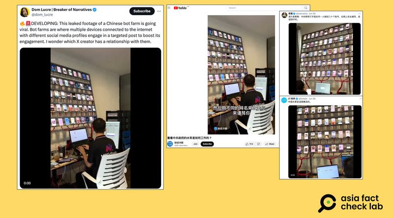
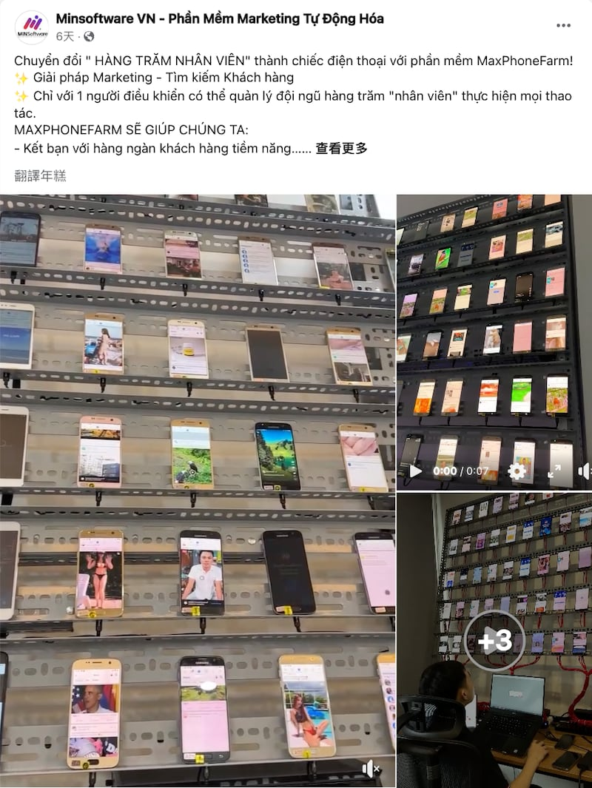

# Does the video of men show official Chinese cyber army at work?

## Verdict: False

By Zhuang Jing for Asia Fact Check Lab

2024.07.15

Taipei, Taiwan

## A video of several men sitting in front of a large number of mobile phones has been repeatedly shared in Chinese-language social media posts that claim it shows the Chinese Communist Party’s cyber army.

## But the claim is false. The video shows a Vietnamese marketing company, which was posted on the company’s Facebook page.

The claim was shared on X, formerly known as Twitter, on June 30, 2024.

“Please take a look at this: How dozens of accounts are controlled by one person of the Chinese Communist Party’s cyber army thugs to attack and abuse, create rumors and intimidate people on the internet,” reads the claim.

It was shared along with a 24-second video that shows several men sitting in front of a large number of mobile phones.

China employs a variety of deceptive and coercive methods as it attempts to influence the international information environment, seeking to maximize the reach of biased or false pro-China content, such as sponsoring online influencers or harassing individual content producers, the U.S. Department of State said in a [report](https://www.state.gov/gec-special-report-how-the-peoples-republic-of-china-seeks-to-reshape-the-global-information-environment/) in September 2023.

There have also been media reports about China operating a so-called [internet water army](https://www.washingtonpost.com/technology/2023/12/11/china-hacking-hawaii-pacific-taiwan-conflict/), a group of users who are paid to post online comments with vested interest on Chinese language websites, or the " [50 cent army](https://gking.harvard.edu/files/gking/files/50c.pdf?m=1463587807&version=meter+at+0&module=meterLinks&pgtype=article&contentId=&mediaId=&referrer=&priority=true&action=click&contentCollection=meter-links-click)," a group of state-backed internet commenters who create and promote positive narratives about China.

The video was also shared on [X](https://x.com/dom_lucre/status/1807109826360889500) and [YouTube](https://www.youtube.com/watch?v=NkbLIPLTcE4) with similar claims such as it is a "leaked footage of a Chinese bot farm".

Social media influencers posted a video purportedly showing paid pro-Beijing internet commentators at work. (Screenshots/X and YouTube)

But the video in fact shows a Vietnamese marketing company, which was posted on the company’s Facebook page.

## Original video

At the video’s 11-second mark, the logo “MINSoftware” can be seen.

Keyword searches found it is the name of a [Vietnamese software company](https://minsoftware.vn/) that [says](https://minsoftware.vn/) it provides digital marketing solutions that help manage social media fan pages as a means for companies to save on advertising and personnel expenses.

A man can also be heard in the video speaking Vietnamese, not a Chinese language.

Further searches found the video matches one of three videos the company [published](https://www.facebook.com/61550567098549/videos/pcb.122183939732018903/1112164803182003) on Facebook in June to demonstrate its services.

The purported leaked footage was actually a promotional video for the Vietnamese marketing company MIN Software (Screenshot/Facebook)

The company later issued a [statement](https://www.facebook.com/photo?fbid=122184891362018903&set=pcb.122184891410018903) to note that the video was misused to spread false information about a certain religion, without mentioning China.

MINSoftware did not respond to requests for comment as of press time.

## *Translated by Shen Ke. Edited by Shen Ke and Taejun Kang.*

*Asia Fact Check Lab (AFCL) was established to counter disinformation in today's complex media environment. We publish fact-checks, media-watches and in-depth reports that aim to sharpen and deepen our readers' understanding of current affairs and public issues. If you like our content, you can also follow us on*   [*Facebook*](https://www.facebook.com/asiafactchecklabcn)  *,*   [*Instagram*](https://www.instagram.com/asiafactchecklab/)   *and*   [*X*](https://twitter.com/AFCL_eng)  *.*

[Original Source](https://www.rfa.org/english/news/afcl/afcl-chinese-cyber-army-07152024232638.html)