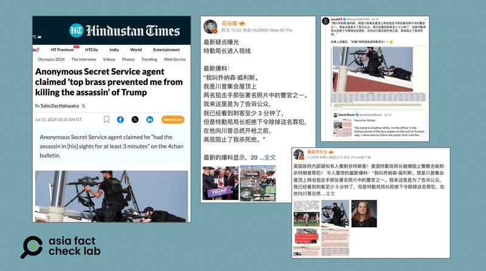

# Is a US Secret Service officer ‘Jonathan Willis’ responsible for Trump shooting?

## Verdict: False

By Zhuang Jing for Asia Fact Check Lab

2024.07.18

Taipei, Taiwan

## A claim emerged in Chinese-language social media posts that a member of the U.S. Secret Service named “Jonathan Willis” is responsible for letting a 20-year old gunman shoot at former U.S. President Donald Trump on July 13 by “missing an opportunity to stop him”.

## But the claim is false. A Secret Service spokesperson told AFCL there is no such employee working for the organization. Investigations into the gunman who attempted to assassinate Trump are still going on.

The claim was [shared](https://m.weibo.cn/detail/5056420919644898) on China's Weibo social media platform on July 15, 2024.

The Weibo post cited a purported member of the U.S. Secret Service as saying: “My name is Jonathan Willis … I’m here to tell the public that I spotted the gunman at least 3 minutes before, but the head of the Secret Service refused to order the removal of him. I was stopped from killing him.”

Claims by an anonymous internet user set off a round of conspiracy theories following the attempted assassination of U.S. presidential candidate Donald Trump on July 13. (Screenshots/Hindustan Times, Weibo and X)

Calls from Republicans mounted on Wednesday for the head of the Secret Service, Kimberly Cheatle, to be replaced in the wake of the failure to prevent Donald Trump being shot last weekend, as fresh reports emerged that the gunman had aroused suspicions a considerable time before he took aim at the former president from a rooftop.

Trump suffered an injury to his right ear. One rally-goer was killed and two were injured. The 20-year-old gunman was shot dead by security officers.

But the claim about Jonathan Willis, which has been also shared on other platforms such as [X](https://twitter.com/Jacob43817149/status/1812602173278085451) and [Netease](https://www.163.com/dy/article/J745QNJT0511816V.html), is false.

## Secret Service response

Secret Service spokesperson Nate Herring told AFCL: “This claim is categorically false. There is no U.S. Secret Service employee by that name.”

The claim has been debunked by other fact-checking organizations, including the [Associated Press](https://apnews.com/article/fact-check-trump-shooting-secret-service-334166850448) and [FactCheck.org](http://factcheck.org).

The AP cited a Secret Service spokesperson as saying that the organization’s operational guidelines allows high-point snipers to remove any security threats found in the field on their own initiative.

Once a threat is detected, a sniper can decide to act without having to ask for instructions or wait for orders, the spokesperson added.

The FBI said in a [statement](https://www.fbi.gov/news/press-releases/update-on-the-fbi-investigation-of-the-attempted-assassination-of-former-president-donald-trump), the gunman who attempted to assassinate Trump was a 20-year-old man named Thomas Matthew Crooks. Authorities are investigating his motives for the crime.

## 4chan rumors

Keyword searches found the “Jonathan Willis” claim first appeared on the online forum “4chan”.

4chan is a completely anonymous, anything-goes forum similar to Reddit in layout and function. Unlike Reddit, users on 4chan never need to create an account or choose a username, not even a pseudonym. This anonymity allows participants to say and do virtually anything with minimal accountability.

4chan has been [called](https://tfc-taiwan.org.tw/articles/4637) a "cradle of conspiracy theories" by the Taiwan FactCheck Center. The site is known for generating several notorious theories, including QAnon.

## *Translated by Shen Ke. Edited by Shen Ke and Taejun Kang.*

*Asia Fact Check Lab (AFCL) was established to counter disinformation in today's complex media environment. We publish fact-checks, media-watches and in-depth reports that aim to sharpen and deepen our readers' understanding of current affairs and public issues. If you like our content, you can also follow us on*   [*Facebook*](https://www.facebook.com/asiafactchecklabcn)  *,*   [*Instagram*](https://www.instagram.com/asiafactchecklab/)   *and*   [*X*](https://twitter.com/AFCL_eng)  *.*

[Original Source](https://www.rfa.org/english/news/afcl/afcl-trump-rally-shooting-07182024031903.html)