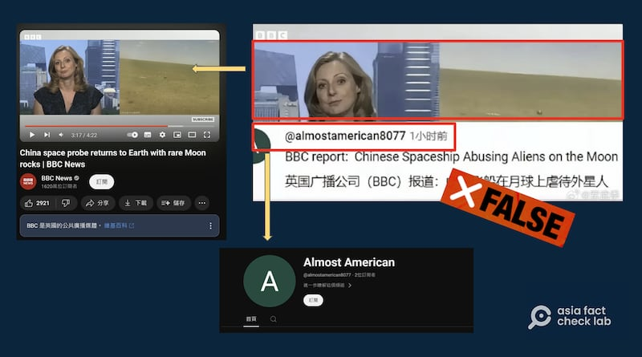

# Did the BBC report that China abused aliens on the moon?

## Verdict: False

By Dong Zhe for Asia Fact Check Lab

2024.07.21

Taipei, Taiwan

## Several Chinese social media users have shared what appears to be a BBC news report alongside a claim that the BBC reported China’s spaceship “abused aliens” on the moon.

## But the claim is false. The screenshot shared on social media has been digitally altered. Keyword searches found no credible reports to back the claim.

The claim was [shared](https://archive.ph/zVM5a) on China's Weibo social media platform on June 30.

“BBC said the Chinese spaceship abused aliens on the moon,” reads the claim.

The claim was shared alongside a screenshot of what appears to be a BBC report.

“BBC report: Chinese Spaceship Abusing Aliens on the Moon,” text in English superimposed on the screenshot reads.

The claim started spreading online after China’s robotic lunar mission, Chang’e 6, returned to Earth on June 25. It became the first lunar mission to collect samples from the far side of the moon.

The same screenshot with similar claims were shared on Weibo [here](https://archive.ph/qnCr1) and [here](https://weibo.com/2178514797/OkUF2quc8) as well as on X, formerly known as Twitter, [here](https://www.ghostarchive.org/archive/Kxdxw) and [here](https://ghostarchive.org/archive/FK524).

Several Chinese influencers claimed that the BBC had deliberately released a ridiculous report about the Chang’e lunar mission. (Screenshots /X and Weibo)

But the claim is false.

## The BBC report

A reverse image search of the screenshot found the matching scene included in [this BBC report](https://www.youtube.com/watch?v=BE0__sdPCH8) on June 25, titled "China space probe returns to Earth with rare Moon rocks."

A close look at the four-minute and 22-second report found no parts that back the claim.

The original BBC report was unrelated to aliens. (Screenshot /BBC official YouTube channel)

Keyword searches also found no credible reports that show the BBC reported China’s spaceship “abusing aliens” on the moon.

## *Translated by Shen Ke. Edited by Shen Ke and Taejun Kang.*

*Asia Fact Check Lab (AFCL) was established to counter disinformation in today's complex media environment. We publish fact-checks, media-watches and in-depth reports that aim to sharpen and deepen our readers' understanding of current affairs and public issues. If you like our content, you can also follow us on*   [*Facebook*](https://www.facebook.com/asiafactchecklabcn)  *,*   [*Instagram*](https://www.instagram.com/asiafactchecklab/)   *and*   [*X*](https://twitter.com/AFCL_eng)  *.*

[Original Source](https://www.rfa.org/english/news/afcl/afcl-china-alien-abuse-07212024225756.html)