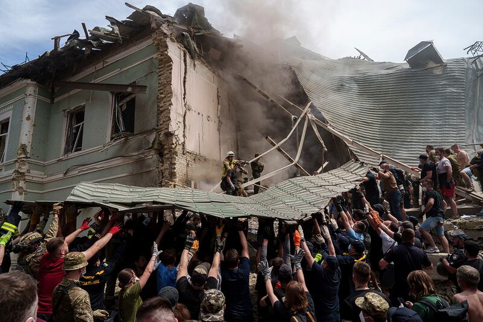
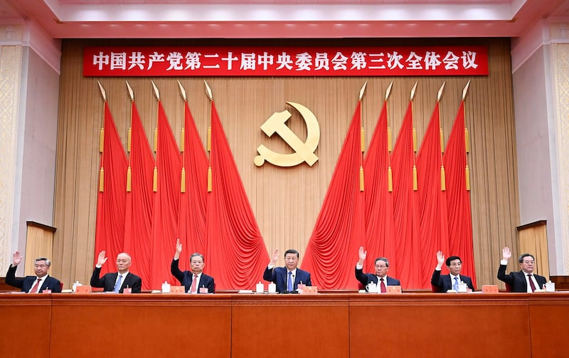
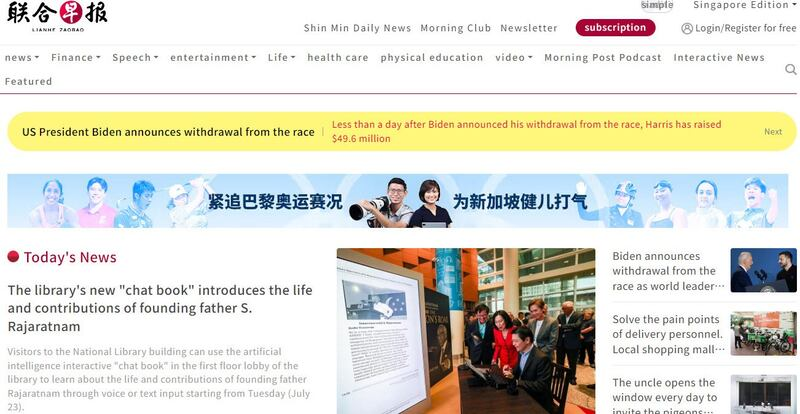
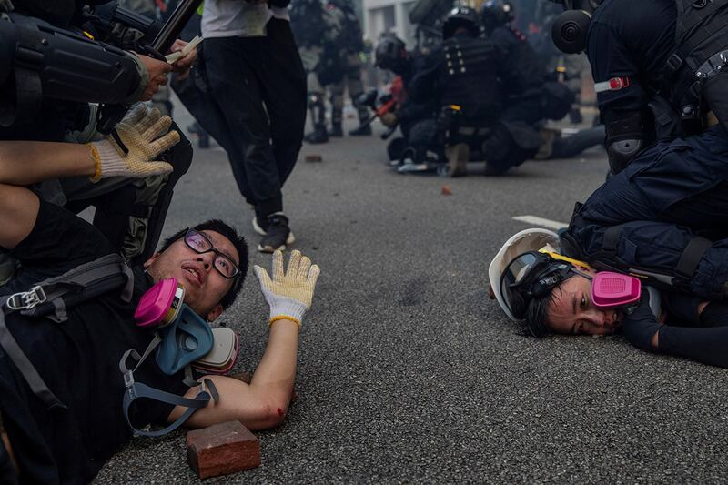

# Singapore media regime whack-a-mole with Chinese misinformation (Part I)

## Beijing’s talking points get laundered through China-friendly media coverage and immigrant websites.

By Dong Zhe and Zhuang Jing for Asia Fact Check Lab

2024.07.23

## *Radio Free Asia's Asia Fact Check Lab has produced a series of investigative reports on China's media influence on Chinese diaspora communities in Asia-Pacific countries, including Malaysia and New Zealand. The following the first part of a two-part report on Singapore：*

Shortly after Russia invaded Ukraine in February 2022, viewers of Channel 8, a Mandarin-language TV channel in Singapore, heard vivid details of the conflict from anchor Zhang Haijie, who told them Kyiv had “crossed Putin’s line,” was “poking the bear,” and had “awakened the sleeping tiger.”

If the report and a video commentary explaining that Putin’s invasion was a justified response to NATO’s expansion and Ukraine’s provocations sounds familiar, it’s because they were parroting Russian talking points, as echoed by Chinese media.

The commentary was soon quietly pulled, citing copyright issues, but not before it generated heated debate – not just about Ukraine, but about the degree of Chinese propaganda influence in the tightly run Southeast Asian city-state.

“Channel 8 cited copyright issues, but that’s just an excuse” Ja Ian Chong, political science associate professor at the National University of Singapore, told Radio Free Asia’s Asia Fact Check Lab (AFCL).

“Most likely the government didn’t want the segment to be in circulation,” he said.

The flood of Russian-via-Chinese disinformation alarmed the Singapore government, to the extent that then Prime Minister Lee Hsien Loong [reiterated Singapore's position](https://www.8world.com/singapore/ndr-2022-full-chinese-speech-1895061) condemning Russia's invasion of Ukraine at the [2022 National Day Rally](https://www.pmo.gov.sg/Newsroom/National-Day-Rally-2022-English). "

"We must actively guard against hostile foreign influence operations, regardless of where they originate," said Lee, who warned people to be vigilant about information on social media.

Emergency services workers clear debris at a children’s hospital hit by Russian missiles, in Kyiv, Ukraine, July 8, 2024. (Evgeniy Maloletka/AP)

In stepping in to remove Chinese and Russian propaganda from public discussion, Singapore underscored its challenge of keeping a delicate East-West balance, with an ethnically diverse population at home in a complicated global geopolitical situation.

Singapore’s policy of staying equidistant between the U.S. and China superpowers is facing ever greater stress at a time of high tension. For more than a decade, China has been ramping up its external propaganda targeting Singapore’s ethnic Chinese majority.

Singapore is ranked 129th of 180 in the 2023 media freedom [index](https://rsf.org/en/country/singapore) of Reporters Without Borders, which calls the city-state "an example of what not to be in regard to freedom of the press." But even Singapore, with its tough press controls, is facing unprecedented challenges from Chinese influence operations.

## Wooing readers in China

Under President Xi Jinping, China is trying to win over overseas Chinese communities with his notion of a “Chinese Dream” of national rejuvenation.

Singapore, a country where over 70% of the population is of Chinese heritage, is clearly a target. And local Mandarin-language media have abetted Beijing’s campaign through selective coverage of China, analysts say.

Singapore ranked third highest out of 82 countries In the  [2022 China Index](https://china-index.io/country/Singapore), a measure of China's influence around the world, published by Taiwan's Doublethink Lab.

Beijing has been leveraging  [*Lianhe Zaobao*](https://www.zaobao.com.sg/news/china) and other Singapore government media outlets to cultivate a better image of China abroad, the China Index says.

Although an Ipsos [survey](https://www.rfa.org/mandarin/shishi-hecha/singapore/media.html) of Singaporeans of Chinese descent commissioned by AFCL and conducted at the end of 2023 found only 22 percent of Chinese Singaporeans turn to the *Lianhe Zaobao* as a primary news source, the paper remains influential among portions of the ethnic Chinese population.

"*Lianhe Zaobao* is perceived as state media or the People's Action Party's mouthpiece," said Chong, referring to the ruling party in Singapore. "Readers find it authoritative to an extent and are more willing to believe its narratives."

Chinese President Xi Jinping, center, and other members of the Politburo Standing Committee attend the third plenary session of the 20th Communist Party of China Central Committee held from July 15 to 18 in Beijing. (Xie Huanchi/Xinhua via AP)

In 2019, a [report](https://jamestown.org/program/a-preliminary-survey-of-ccp-influence-operations-in-singapore/) by the Jamestown Foundation, a Washington, D.C.-based think tank, pointed out that the website of *Lianhe Zaobao*, the largest Mandarin newspaper in Singapore, attracts a readership of five million from China daily.

Rising reliance on the Chinese market has raised concerns over censorship and self-censorship. [Critics](https://www.washingtonpost.com/world/interactive/2023/singapore-china-news-influence-lianhe-zaobao/) point to *Lianhe Zaobao's* coverage of sensitive issues like repression in Hng Kong and the restive western region of Xinjiang, where China's internment of ethnic Uyghurs in re-education camps has been described as genocide.

*Lianhe Zaobao*'s reporters were invited by the Chinese government to visit Xinjiang in 2019, a trip arranged by the State Council Information Office of China. They published reports that were quite positive, aligning with the Chinese narrative of scenic beauty and happy locals.

One published a commentary that echoed China’s rebuttals to critics.

“Some journalists suspect that people they see in Xinjiang’s camps are carefully selected by the police or local governments for foreign press. If that is actually the case, this large troupe of amateur actors deserves an Oscar,” the reporter wrote. The essay was shared and praised as an “objective article” on Chinese social media.

## Cold shoulder to Hong Kong protests

Searches on *Lianhe Zaobao*'s China website for "reeducation camps" or "Xinjiang reeducation camps" produce zero results. After searching *Lianhe Zaobao*'s international and Singapore sites, the same keywords returned results, but nothing relating to human rights issues in Xinjiang.

The Ipsos survey of Singaporeans of Chinese, asking how they would describe the treatment of Uyghurs in Xinjiang, 56.2% of *Lianhe Zaobao* readers said that they were unsure or unable to comment – the highest percentage amongst all respondents.

Of respondents who said they get their news from Western media, such as CNN and BBC, 42% said they believed that the treatment of Uyghur people in Xinjiang amounts to political oppression.But only 32.1% of *Lianhe Zaobao* readers agreed with that characterization. The survey had a sampling error of 3.1%.

*Lianhe Zaobao,* "especially its opinion column, tends to be pro-Beijing because their target audience is the Chinese market," independent Singapore media worker Terry Xu told AFCL.

A scholar who researches China's influence, Jaw-Nian Huang of National Chengchi University in Taiwan, says Beijing can exert its influence on a paper like the *Lianhe Zaobao* through distribution and advertising.

Singapore’s Lianhe Zaobao news website. (RFA)

"*Lianhe Zaobao* is testing limited distribution in China for, for example, major cities or hotels. The newspaper wants its website to be accessible in China and not banned," he told AFCL.

Singapore media also give only slight coverage to pro-democracy protests in Hong Kong, which were crushed and resulted in Beijing’s imposition of draconian national security laws.

The cold shoulder to Hong Kong protests is not entirely the result of Chinese propaganda tactics, said Xiaohui Wang, a former Singaporean media worker. Singapore has very strict laws regarding protests and "scenes of unrest" are not welcome, prompting local media to turn away from topics like Hong Kong or anniversaries of the 1989 Tiananmen protests and killings.

AFCL sought comment on the newspaper's approach to China coverage. Goh Sin Teck, editor-in-chief of *Lianhe Zaobao*, promised a written response, but did not provide it before publication of this report. In July 2023, in a critical report by the Washington Post, Goh was quoted as saying ""Indeed, we may not be dancing to the West's tune when we report on certain topics. But to categorize us as a pro-CCP media because of this seems to be overly rash and arbitrary."

## RELATED STORIES

[ [Singapore’s Chinese immigrant lifestyle websites push Beijing’s positions (Part II)Opens in new window](2024-07-25_Singapore’s Chinese immigrant lifestyle websites push Beijing’s positions (Part II).md) ]

[ [To the Chinese diaspora in New Zealand, China mutes critics and feeds talking pointsOpens in new window](https://www.rfa.org/english/news/china/newzealand-influence-newspapers-08192023072548.html) ]

[ [A look at how Beijing influences Chinese media, diaspora in MalaysiaOpens in new window](2023-07-19_A look at how Beijing influences Chinese media, diaspora in Malaysia.md) ]

[ [No, Southeast Asians do not now prefer China over the USOpens in new window](https://www.rfa.org/english/commentaries/asean-usa-china-04202024093133.html) ]

[ [China’s information warfare and media influence spawn confusion in ThailandOpens in new window](https://www.rfa.org/english/news/china/thailand-infowars-05132021072939.html) ]

## Soft spots in a tight media control system?

At a ceremony marking the centennial of the newspaper in 2023, Prime Minister Lee urged *Lianhe Zaobao* to "not be used by others to put out views that are detrimental to Singapore's interests or are not aligned with our national sentiment."

"Some say that *Zaobao* supports China's position, while others say that *Zaobao* leans towards the United States. As a responsible Singaporean paper, *Zaobao* must do all it can to avoid being influenced by others, and to uphold its credibility," said Lee.

The two major conglomerates that monopolize Singapore media, *Lianhe Zaobao* owner SPH Media and MediaCorp, are affiliated with the government. MediaCorp is owned by Temasek Holdings, which is wholly owned by the Singapore Ministry of Finance. SPH Media is a private company, but its directors are appointed by the government.

“Singapore’s media is fundamentally under the control of the Singaporean government. On major issues, the media will stand with Singapore’s national policies and directives,” said Huang of National Chengchi University. Chinese economic and cultural influence have some influence on Mandarin media, he added.

The Ipsos survey found that 5.3% of Singaporeans get their news from Chinese media outlets, while 25.1% turned to Western media outlets.

Anti-government protesters are detained during skirmishes with police in Hong Kong, Sept. 29, 2019. (Susana Vera/Reuters)

On the surface, it looks like Singapore has created an impenetrable media ecosystem. However, the decline of traditional media and the rise of social media have given Chinese government-controlled information the opportunity to permeate Singaporean society.

Even with its controls, the Singapore government has to play whack-a-mole with misinformation.

“During the Russo-Ukrainian War, pro-Beijing narratives permeated society. The Singaporean government had to clarify, once again, and urge the public to embrace Singapore’s position,” said Jiaming Lee, a Singaporean journalist.

The AFCL-commissioned Ipsos survey of Chinese Singaporeans asked who they believe is responsible for the Russo-Ukrainian War. The survey found 55.8% of respondents cited Russia, 20.8% blamed the U.S., 16.8% pointed to NATO, and 21.7% were not sure.

## *Editor's note： Xiaohui Wang, the former Singaporean media worker, and Jiaming Lee, the Singaporean journalist, are pseudonyms used to allow them to speak freely on a sensitive topic.*

## *Editing by Paul Eckert.*

[Original Source](https://www.rfa.org/english/news/afcl/singapore-china-propaganda-media-influence-07222024170026.html)