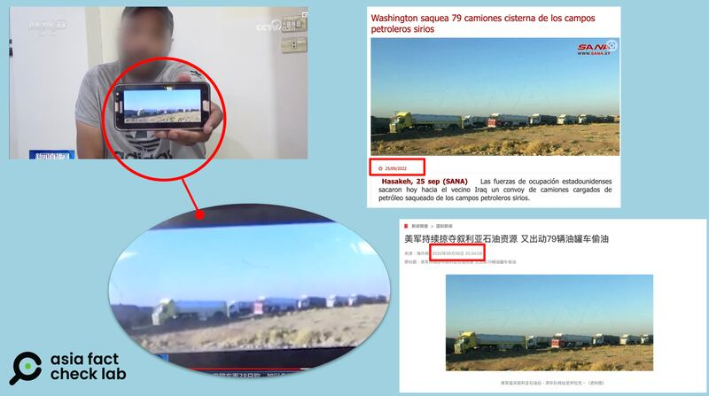
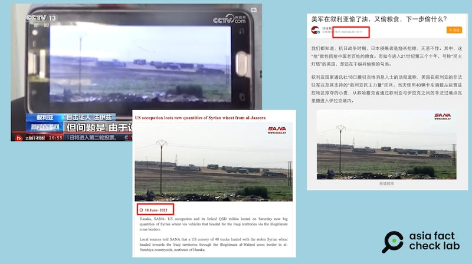
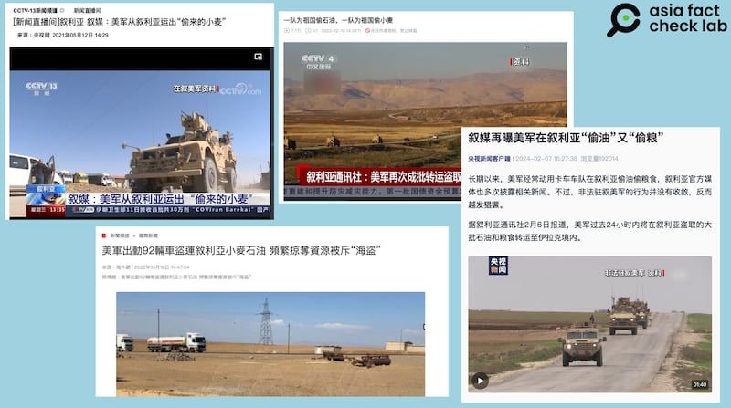

# Did ‘exclusive’ photos show the US stealing Syrian wheat since May?

## Verdict: False

By Dong Zhe for Asia Fact Check Lab

2024.07.24

Taipei, Taiwan

## Two photos of trucks were shared in a Chinese-language media report alongside a claim that they show a U.S. military convoy “stealing” wheat from Syria since May, citing an “eyewitness”.

## But both photos have been shared online since early 2022 with similar but different contexts.

The photos were [shared](https://tv.cctv.com/2024/06/29/VIDEfU7ZUBl25LHyQQNMBoJs240629.shtml?spm=C53156045404.PKXC0xLPAnP9.0.0) in a report by China's state-run broadcaster CCTV on June 29, 2024.

“Since the harvest season began in May, I have been able to see them almost every day, with vehicles departing daily from Tal Alou, which is more than ten kilometers away from Al-Yaarubiyah,” CCTV cited an “eyewitness” as saying in its report.

The “eyewitness” presented two “exclusive” photos as evidence, both showing what appears to be trucks, taken from a distance, claiming that they showed the U.S. trucks “stealing” Syrian wheat.

Tal Alou is in Hasaka of northeast Syria near Iraw, while Al-Yaarubiyah is a town in Syria’s al-Hasakah Governorate.

A purportedly recent photo shown as evidence by an “eyewitness” interviewed in a CCTV report on the U.S. transporting wheat from Syria first appeared in September 2022, including in a report by CCTV itself. (Screenshots/CCTV, SANA and CCTV.com)

The report trended on social media and, in a response to a question about the trucks, Chinese foreign ministry spokesperson Mao Ning [criticized](https://www.fmprc.gov.cn/web/fyrbt_673021/jzhsl_673025/202407/t20240703_11446517.shtml) the U.S. on July 3 for "stealing resources … under the banner of fighting terrorism" and for "causing a humanitarian crisis" in Syria.

The pro-democracy Syrian Democratic Forces, or SDF, coalition government controls a region of northern Syria that [produces](https://www.reuters.com/article/world/syrian-kurdish-authorities-to-stop-wheat-going-to-government-territory-idUSKCN1TD1KI/) up to 70% of the country's wheat.

Kurdish groups in the coalition have [denied](https://www.kurdistan24.net/en/story/30513-Syrian-Kurds-deny-stealing-oil-and-wheat) the claims by the Bashar government in Damascus that its harvest and transportation of the wheat was theft.

Despite these disputes, the SDF recently began to distribute the first batches of wheat to areas controlled by the Bashar government as part of a [deal](https://syrianobserver.com/syrian-actors/more-than-2500-tons-sdf-supplying-wheat-to-regime-in-hassakeh.html) under which the SDF will sell 500,000 tons of the grain at 36 cents per kilogram.

But the claim about the photos is false.

## Old photos

A reverse image search on Google found both photos had been circulating online since as early as 2022.

AFCL found the first photo published in a [report](https://sana-syria.org/es/?p=254302) by the Syrian Arab News Agency, or SANA, in September 2022 about a convoy of 79 U.S. trucks carrying stolen oil from Syria to Iraq.

No mention of wheat was made in that report, and the location of the incident was given as Syria’s southeastern province of Deir ez-Zor.

CCTV published the same photo in an [article on the same topic](https://archive.ph/UvyAq) on Sept. 26, 2022.

The second photo also appeared in separate reports published by [SANA](https://archive.ph/A3MGz) and Chinese official outlets such as [The Global Times](https://mil.sina.cn/gjjq/2022-06-20/detail-imizirau9570315.d.html) in June 2022, both of which made similar claims about the U.S. looting wheat and shipping it to Iraq.

The second purportedly exclusive photo shown by the interviewee in the CCTV programme also appeared in reports from 2022. (Screenshots/CCTV, SANA and Globe)

AFCL was not able to independently verify details of the two photos.

CCTV has [published](https://tv.cctv.com/2021/05/12/VIDEhKYalqhfY8AW2lV2NS3H210512.shtml) a [series](https://big5.cctv.com/gate/big5/news.cctv.com/2022/10/18/ARTIfbTgnMBc6qQYLIyM4cvR221018.shtml) of [articles](https://www.bilibili.com/video/BV1C94y1A7rY/) making similar [claims](https://content-static.cctvnews.cctv.com/snow-book/index.html?item_id=9144138652003322858) about the U.S. stealing Syrian wheat or oil over the past four years, but AFCL found they lacked sufficient evidence. For instance, all reports only cite SANA, which quoted anonymous informants as the sole source for the news.

CCTV previously published several similar reports which accused the U.S. of stealing natural resources from Syria. (Screenshots/CCTV and CCTV.com)

Neither the U.S. National Security Council nor the SDF responded to requests for comment as of press time.

## *Translated by Shen Ke. Edited by Shen Ke and Taejun Kang.*

## *Asia Fact Check Lab (AFCL) was established to counter disinformation in today’s complex media environment. We publish fact-checks, media-watches and in-depth reports that aim to sharpen and deepen our readers’ understanding of current affairs and public issues. If you like our content, you can also follow us on [Facebook](https：//www.facebook.com/asiafactchecklabcn), [Instagram](https：//www.instagram.com/asiafactchecklab/) and [X](https：//twitter.com/AFCL_eng).*

[Original Source](https://www.rfa.org/english/news/afcl/afcl-america-stealing-syrian-wheat-07242024030443.html)