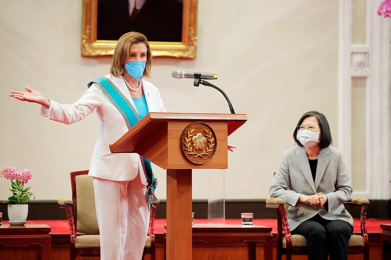
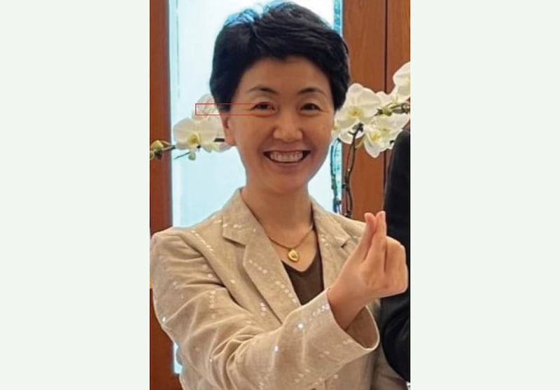
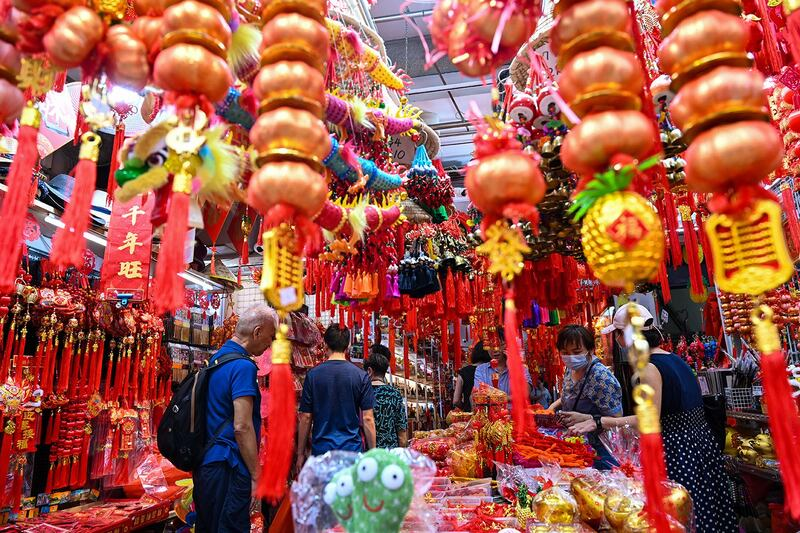
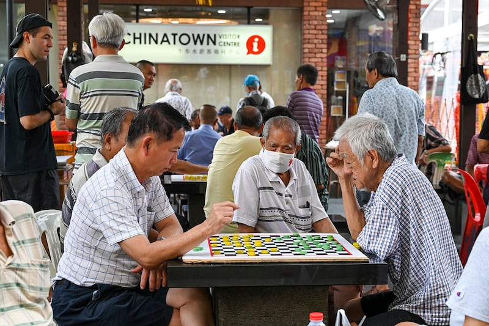
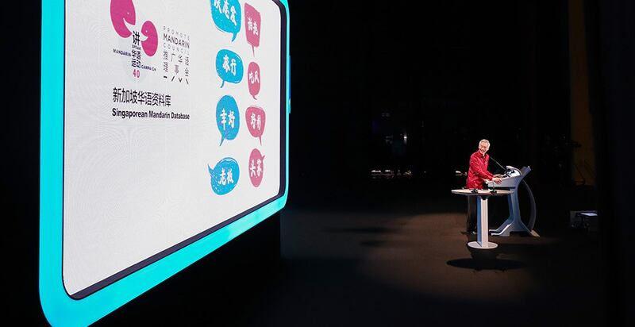

# Singapore’s Chinese immigrant lifestyle websites push Beijing’s positions (Part II)

## ‘New media’ and social platforms manage to slip through a tight media control system.

By Dong Zhe and Zhuang Jing for Asia Fact Check Lab

2024.07.25

## *Radio Free Asia's Asia Fact Check Lab has produced a series of investigative reports on China's media influence on Chinese diaspora communities in Asia-Pacific countries, including Malaysia and New Zealand. The following the second part of a two-part report on Singapore：*

Government policies limit China’s direct influence on Singapore’s media, but the efforts to combat Chinese misinformation and propaganda also have to contend with “new media” that have arisen to serve the rising population of immigrants from China.

On its website, *Singapore Eye* calls itself a Chinese media platform for "sharing lifestyle information" on issues like visas, real estate and education. *Vaster News, SG Writings*, and *SG Coconut* are similar media outlets serving recent immigrants from China.

In a sharp break from their lifestyle coverage, in August 2022 the outlets all issued scathing [reports](https://www.yan.sg/zauidhbengbiere/), [op-eds](http://vasternews.com/index/view/4851.html) and [videos](https://www.tiktok.com/@sgcoconut/video/7131260249146707201) denouncing the U.S. House Speaker Nancy [Pelosi's](https://www.rfa.org/english/news/china/pelosi-meets-taiwan-president-08032022053147.html) "sneak visit" to Taiwan, the self-governing island claimed by China. In similar [language](http://vasternews.com/index/view/4851.html), they declared that the visit would destabilize security in the region.

U.S. House Speaker Nancy Pelosi speaks during a meeting with Taiwan President Tsai Ing-wen, right, in Taipei, on Aug. 3, 2022. (Taiwan Presidential Office via AP)

Days later, the Chinese Ambassador to Singapore, Sun Haiyan, held a reception for the owners of those and several new media outlets. Described by Sun as a “pleasant exchange,” the gathering was actually a lecture by the ambassador driving home Beijing’s view on the Taiwan question, according to a source familiar with the event who requested anonymity to discuss a sensitive issue.

The Chinese Embassy in Singapore then issued a press release citing the new media owners as agreeing that Pelosi’s Taiwan visit was a “dangerous political provocation” to which the Chinese government “responded calmly and counteracted effectively.”

Ignoring the large-scale military drills and encirclement exercises China [conducted](https://www.rfa.org/english/news/china/pelosi-meets-taiwan-president-08032022053147.html) around Taiwan after the Pelosi trip, the embassy message went on to say that the "Singapore government and society believe firmly in the One-China principle and oppose any activities relating to the Taiwan Independence Movement."

AFCL emailed the owners of the five largest Singapore media outlets serving Chinese immigrants to seek comments on the event, but none responded.

A local scholar familiar with Chinese affairs said there was a high degree of performance behind the clumsy injection of Chinese political talking points in lifestyle publications.

"*Singapore Eye* and similar media outlets target new immigrants. As such, they are not as influential as *Zaobao* and mainly exist for propaganda within China, for the people of China to see," said the academic, referring to the most popular Chinese-language newspaper in Singapore, *Lianhe Zaobao.* The scholar requested anonymity to discuss sensitive matters.

An Ipsos poll commissioned by AFCL and conducted at the end of 2023 asked Singaporean Chinese what position Singapore should take amid high tensions between the U.S. and China. Results showed that 87.7% chose to “stay neutral,” while 6.6% selected “support China,” and 5.7% chose “support the U.S.”

Prof. Ja Ian Chong of National Singapore University said the neutral choice reflects a public that follows the Singapore government, which has not taken a stand, a pragmatism that believes the nation can derive benefits from both superpowers, and a mix of skepticism about China’s intentions and concern about retaliation from China.

## Social media shares

The AFCL-Ipsos poll showed that 74.65% of respondents use social media to get news, while 28% turned to the websites of news outlets, television, radio, and print newspapers. The online survey of people of Chinese heritage living in Singapore, between the ages of 18 and 65 was conducted at the end of last year and received a total of 1,000 valid responses, with a sampling error of 3.1%.

Chong said he has seen misleading content about U.S. policy on Taiwan from Chinese officials on their Singapore embassy’s Facebook page.

"The embassy's Facebook page itself doesn't have many viewers, but the powerful thing is that people will take screenshots and share them in private chats, and then a lot of people will see them," he told AFCL.

Nicholas Fang, the managing director of Singapore market research firm Black Dot Research, said Chinese videos or messages are shared on Chinese platforms like WeChat and Weixin. They are spread from private chat groups and are widely disseminated by group members, he said.

Sun Haiyan, China’s ambassador to Singapore, seen in this undated photo, lectured media outlet owners on Beijing’s stance regarding Taiwan in August 2022. (U.S. State Department)

To gauge the effectiveness of China’s media influence operations, AFCL interviewed residents of Singapore’s Chinatown, a place popular with immigrants and older Chinese Singaporeans.

Under a shed hung with large red lanterns, and among dozens of elders gathered to play chess and chat, Datong Lan weighed in on Taiwan and China–U.S. relations. He spoke a mix of English and Mandarin.

"Taiwan is just America's lackey. Look how miserable Ukraine is. They should learn their lesson: You think America will help you? They're just selling you old weapons,” he told AFCL. Lan, 70 was born in Singapore, speaks English as his first language, and shuns Singaporean traditional media in favor of what he calls “independent media on YouTube" for his news.

"The conflict between Israel–Hamas and the Russo-Ukrainian conflict, are all caused by the United States,” he said. "Xinjiang? There is nothing wrong with Xinjiang. That's all Western political propaganda," he added, referring to the region of China’s far west that is home to persecuted ethnic Uyghurs.

Decorative ornaments and greeting banners are displayed at a street stall ahead of Lunar New Year in Singapore’s Chinatown on Jan. 26, 2024. (Roslan Rahman/AFP)

Sitting nearby, a 77-year-old man introduced himself as "Deng, the Deng from Deng Xiaoping," drawing a smile from Lan that evaporated once Deng discussed China.

"Taiwan should rely on the United States, relying on China would be the end. Singapore doesn't need to rely on China either," Deng said. He criticized the lack of freedom in China, expressing his preference for the open societies of Taiwan and the United States, and his hope that China would learn from Taiwan.

## Fact-checking and legal measures

Research company head Fang said his firm began to notice a lot of false information circulating in Singaporean society around 2018, with many people forwarding misinformation about national security and health issues.

The consultancy started fact-checking at the beginning of 2019, aiming to encourage people to research and verify online information before sharing it. During the COVID-19 pandemic, a social welfare organization called Montfort Care launched the "Seniors E-Generation" project, encouraging seniors to be aware of financial scams, and misleading articles, photos, or videos shared by friends on social media.

The Singapore government established a fact-checking website called "Factually,” but the site only checks issues related to government policies, departments, and political figures, and has not attracted much public attention, Fang said.

On the legal front, the Singapore government has enacted the Protection from Online Falsehoods and Manipulation Act 2019 (POFMA) and the passage of the Foreign Interference Countermeasures Act (FICA) in 2021.

FICA was invoked for the first [time](https://www.todayonline.com/singapore/philip-chan-designated-politically-significant-person-fica-2370101) in February, designating Philip Chan Man Ping, a Hong Kong-born, naturalized Singaporean real estate investor, as a "Politically Significant Person."

The designation requires Chan to declare his foreign affiliations and make annual disclosures to the authorities of political donations of $10,000 Singapore dollars (US$7,435) or more that he has received.

## RELATED STORIES

[ [Singapore media regime whack-a-mole with Chinese misinformation (Part I)Opens in new window](2024-07-23_Singapore media regime whack-a-mole with Chinese misinformation (Part I).md) ]

[ [Historian. Activist. Spy?Opens in new window](https://rfa.org/english/special-reports/china-accused-spy-shujun-wang/index.html) ]

[ [Podcast: Master of Deceit, Episode 1 - The Secret Life of Mr. WangOpens in new window](https://www.rfa.org/english/news/china/china-spying-united-states-wang-shujun-07192024122352.html) ]

[ [To the Chinese diaspora in New Zealand, China mutes critics and feeds talking pointsOpens in new window](https://www.rfa.org/english/news/china/newzealand-influence-newspapers-08192023072548.html) ]

[ [A look at how Beijing influences Chinese media, diaspora in MalaysiaOpens in new window](2023-07-19_A look at how Beijing influences Chinese media, diaspora in Malaysia.md) ]

Men play checkers game in Singapore’s Chinatown on Jan. 26, 2024. (Roslan Rahman/AFP)

Free press advocacy group Reporters Without Borders has called FICA a "legal [monstrosity](https://rsf.org/en/singapore-s-foreign-interference-bill-legal-monstrosity-totalitarian-leanings) with totalitarian leanings as it would enable the government to designate any independent media outlet as a foreign agent and to censor its content.

But when announcing the designation, Singapore’s Ministry of Home Affairs said it was “in the public interest” to designate Chan as his activities “are directed towards a political end in Singapore.”

In March 2023, Chan attended the annual Chinese National People's Congress in Beijing as one of 30 overseas Chinese representatives. He also wrote dozens of columns in the *Lianhe Zaobao* and organized meetings to criticize Hong Kong protests.

He told the Chinese Headline New Media in a March 2023 interview that spreading China's views and responses to Western criticism "cannot solely rely on the official messages conveyed by Chinese diplomats in public," according to a Straits Times [profile](https://www.straitstimes.com/singapore/who-is-mr-philip-chan-the-man-against-whom-s-pore-has-invoked-its-foreign-interference-law).

“We should put more effort in mobilizing righteous individuals overseas who dare to speak up for justice, to get them to join the ranks of spreading truths and exposing the hypocrisy of fake news from the West,” Chan said.

## Elephant in the room

An AFCL written request to the Singapore government for comment and further details on Chan’s case received a reply that contained only links to previously released statements about the case.

Chong and other experts say the measures show recognition of the problem, but have not been effective in dealing with disinformation attacks originating from China.

Singapore Prime Minister Lee Hsien Loong gives his National Day speech in 2022. (Singapore Prime Minister’s Office)

The Singapore government is “possibly signaling that they are against their citizens engaging in propaganda for the Chinese, but we aren’t entirely sure which actions by Chan are explicitly prohibited,” said Chong, who noted that the court statements do not state which country had allegedly influenced Chan.

“Prime Minister Lee never names China directly in his statements. He avoids naming China,” said Chong.

But Lee gave a key speech after the start of the Russian invasion of Ukraine, warning about on foreign influence in Mandarin – making it clear that the target audience is Singapore’s Chinese community, he noted.

“I believe this demonstrates the Singapore government’s fear of China.”

## *Editor's note： Datong Lan and Mr. Deng are pseudonyms used to allow them to speak freely on a sensitive topic.*

## *Edited by Paul Eckert.*

[Original Source](https://www.rfa.org/english/news/afcl/afcl-singapore-china-propaganda-media-influence-07222024170626.html)