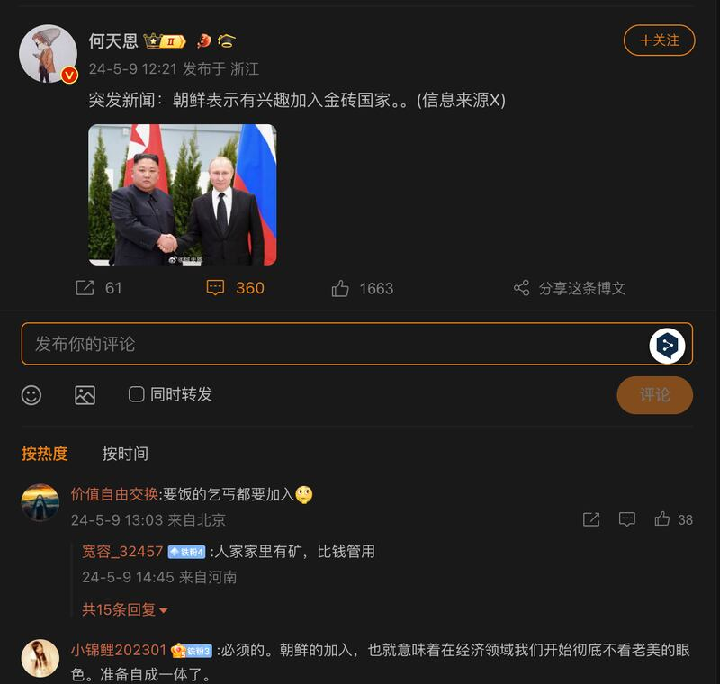

# Is North Korea planning to join BRICS?

## Verdict: Lack of evidence

By Dukin Han for RFA Korean

2024.07.29

Washington

## A claim began to circulate online in early 2024 that North Korea was seeking to join BRICS.

## But the claim lacks evidence. An official from one BRICS member state told AFCL that the North had never formally expressed any intent to join the alliance and there had been no internal discussion of such a matter.

The claim was [shared](https://weibo.com/1861477054/OdsWC46xt) on Weibo, a popular Chinese social media platform, on May 9, 2024.

“North Korea has expressed interest in joining BRICS,” the claim reads.

The claim was shared alongside a photo of North Korean leader Kim Jong Un and the Russian President Vladimir Putin shaking hands, while posing for the photo.

Several purported ‘breaking news’ posts on the Chinese internet claimed that North Korea had expressed an interest in joining BRICS. (Screenshot/Weibo)

The same claim was shared on other social media platforms, including Telegram and [X](https://x.com/BRICSinfo/status/1788417224870334654?t=86CR8JhYmv6yMqOXWhcQVg&s=19) – formerly known as Twitter – as well as some media reports.

Crypto News, an internet outlet focusing on cryptocurrency, published an article on May 11 suggesting that North Korea was attracted to BRICS because such a strategic alliance would offer a way for the tightly sanctioned country to relieve some of the economic pressures it is facing.

BRICS is an intergovernmental organization comprising Brazil, Russia, India, China, South Africa, Iran, Egypt, Ethiopia, and the United Arab Emirates.

But the claim lacks evidence.

## ‘No internal discussion’

AFCL contacted the U.S. embassies of five longtime BRICS member states - namely Brazil, Russia, India, China, and South Africa - but only the South African embassy responded as of press time, commenting that there had been no internal discussion within the organization of such a matter.

Keyword searches found no official or credible reports to back the claim.

Separate keyword searches on North Korea’s official media outlets also found no information regarding its intention to join the BRICS.

## Unrelated photo

A google reverse image search found the photo of Kim and Putin shaking hands published by Reuters on April 26 and it has nothing to do with the North’s intention to join the BRICS.

“North Korean leader Kim Jong Un shakes hands with Russian President Vladimir Putin in Vladivostok, Russia in this undated photo released on April 25, 2019 by North Korea's Central News Agency,” the caption of the photo reads.

## *Edited by Shen Ke and Taejun Kang.*

*Asia Fact Check Lab (AFCL) was established to counter disinformation in today's complex media environment. We publish fact-checks, media-watches and in-depth reports that aim to sharpen and deepen our readers' understanding of current affairs and public issues. If you like our content, you can also follow us on*   [*Facebook*](https://www.facebook.com/asiafactchecklabcn)  *,*   [*Instagram*](https://www.instagram.com/asiafactchecklab/)   *and*   [*X*](https://twitter.com/AFCL_eng)  *.*

[Original Source](https://www.rfa.org/english/news/afcl/afcl-north-korea-brics-07292024025818.html)