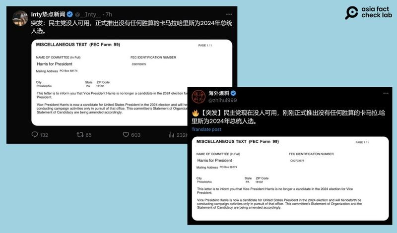
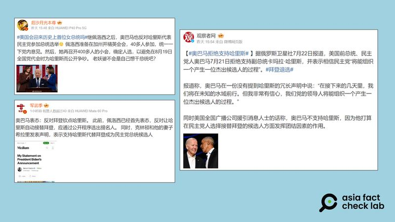
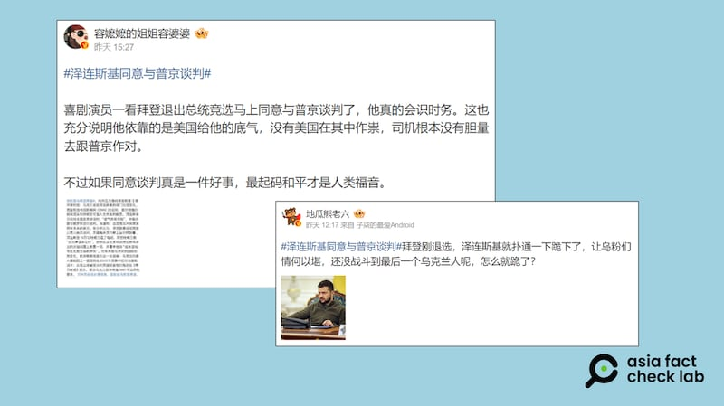

# Media Watch: Rumors abound in Chinese following Biden’s withdrawal

## From Zelenski to Putin, the news of Biden’s withdrawal sparked rumors involving world leaders.

By Zhuang Jing and Alan Lu for Asia Fact Check Lab

2024.07.29

Taipei, Taiwan

U.S. President Joe Biden announced on July 21 that he would not run for president in the 2024 election and expressed his support for Vice President Kamala Harris as the Democratic Party’s nominee.

News of Biden’s withdrawal quickly spread across major Chinese social media platforms. However, AFCL identified several false or misleading claims within the public discourse.

Here is what AFCL found.

## Has the Democratic Party officially endorsed Harris’ presidential candidacy?

Several social media [news](https://x.com/__Inty__/status/1815136786496225702) [outlets](https://x.com/zhihui999/status/1815137413855146054) claimed on X, formerly known as Twitter, that the Democratic Party had already "officially" endorsed Harris as the presidential nominee.

The rumors were shared alongside a screenshot of a form asking the Federal Election Commission, or FEC, to note that Harris would be conducting campaign activities as a presidential candidate, not as a vice presidential candidate.

But this is false. The candidate will not be formally nominated [until the Democratic National Convention](https://demconvention.com/faqs/), or DNC, beginning on Aug. 19.

Harris [needs to obtain](https://www.reuters.com/world/us/dnc-chair-says-party-will-deliver-presidential-nominee-by-aug-7-2024-07-22/) a majority vote from the nearly 4,000 Democratic Party representatives attending the DNC in order to secure the candidacy.

Biden’s withdrawal from the race was immediately followed by rumors that Vice President Harris had been officially nominated as the Democratic Party's presidential candidate. (Screenshots/X)

The screenshot shows an FEC [statement](https://docquery.fec.gov/cgi-bin/forms/C00703975/1805325/), which was filed to change the name of the presidential candidate on the attached committee. This change was necessary to continue using the related campaign funds following Biden's withdrawal from the presidential race.

It is not proof that Harris has already been officially confirmed as the Democratic nominee.

The FEC told AFCL that the statement is not evidence of an official nomination as presidential candidate by the Democratic Party.

## Does Obama oppose Harris as a nominee?

Chinese-speaking online users on [Weibo](https://m.weibo.cn/detail/5058964108877217) claimed on July 22 that former U.S. President Barack Obama opposed Harris's nomination since he didn't officially endorse her after Biden's announcement.

Obama issued a statement hours after Biden’s announcement, without mentioning or endorsing Harris or other potential candidates, while supporting an open Democratic primary process.

Netizens claim that Obama’s lack of official endorsement for Harris is an expression of opposition. (Screenshot/Weibo)

But this is false. Obama later endorsed Harris to be the Democratic nominee for president.

“We called to say Michelle and I couldn’t be prouder to endorse you and to do everything we can to get you through this election and into the Oval Office,” the former president told Harris during a phone call, a video of which was posted on social media on July 26.

## Did Zelensky agree to talks with Putin immediately after Biden announced his withdrawal?

A Weibo influencer [claimed](https://m.weibo.cn/detail/5058958929431930) that Ukrainian President Volodymyr Zelenskyy began to negotiate peace talks with Russian leader Vladimir Putin immediately after hearing news of Biden's withdrawal. A picture of a CNN article translated into Chinese was attached as evidence of the claim.

This is misleading.

Keyword searches found the CNN article cited by the Weibo user [published](https://edition.cnn.com/2024/07/20/europe/ukraine-zelensky-uncertainty-russia-negotiations-intl/index.html) on July 20, a day before Biden announced his withdrawal.

An influencer claimed that Zelensky agreed to negotiate with Russia as soon as Biden announced his withdrawal. (Screenshot/Weibo)

The article did not mention any impending negotiations between Zelensky and Putin. Instead, it analyzed a statement by Zelensky suggesting that Russia send a delegation to the next international peace summit regarding the war.

Experts interviewed by CNN noted that the comment could be read as a signal that Ukraine is willing to discuss a peace settlement.

## *Translated by Shen Ke. Edited by Shen Ke and Taejun Kang.*

*Asia Fact Check Lab (AFCL) was established to counter disinformation in today's complex media environment. We publish fact-checks, media-watches and in-depth reports that aim to sharpen and deepen our readers' understanding of current affairs and public issues. If you like our content, you can also follow us on*   [*Facebook*](https://www.facebook.com/asiafactchecklabcn)  *,*   [*Instagram*](https://www.instagram.com/asiafactchecklab/)   *and*   [*X*](https://twitter.com/AFCL_eng)  *.*

[Original Source](https://www.rfa.org/english/news/afcl/afcl-biden-president-withdrawal-07292024222735.html)