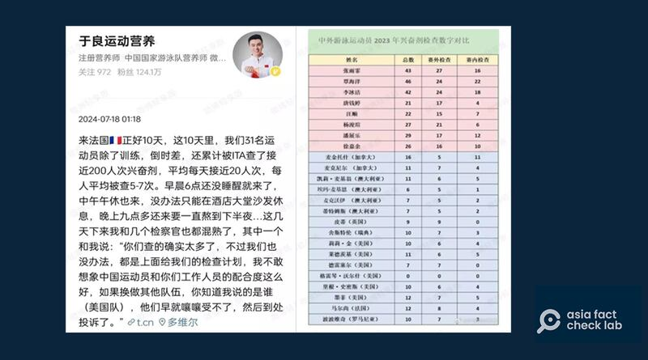

# Did a US swimmer dodge drug tests for the Paris Olympics?

## Verdict: False

By Rita Cheng for Asia Fact Check Lab

2024.07.31

Washington

## A nutritionist for China’s national swim team claimed that Chinese players have been “unfairly treated” in the leadup to the 2024 Paris Olympics with frequent anti-doping tests, while American swimmer Gretchen Walsh had not had to take any such tests.

## But the claim is false. Walsh underwent several anti-doping tests in both 2023 and 2024. The number of tests varies for each athlete since the World Anti-Doping Agency prioritizes testing top performers at high profile international competitions under a practice it terms “target testing”.

The claim was shared by Yu Liang, a nutritionist for China’s national swim team, on Wiebo on July 19, 2024.

“Chinese swimmers had been unfairly tested at a disproportionate rate in the leadup to the 2024 Paris Olympic,” his now-deleted post reads in part.

His post included a spreadsheet showing that Chinese swimmer Zhang Yufei underwent 43 doping tests in 2023 while American swimmer Gretchen Walsh had not been tested at all.

Yu Liang, a nutritionist for the Chinese national swim team, wrote that the team had tested at a disproportionate rate in the leadup to the 2024 Paris Olympic. (Screenshot/Sina Weibo)

While Yu had removed his [original post](https://archive.ph/xus4x), Chinese media outlets such as [Guancha](https://archive.ph/XSKjY) cited him in reports claiming the United States used underhanded tactics in preparation for the Olympics.

A former Chinese diver, Gao Min, also [claimed](https://www.guancha.cn/sports/2024_07_29_743083.shtml) that frequent drug testing against China's swim team interfered with its performance.

Chinese netizens and media outlets claim that Chinese and American athletes are being treated differently for doping tests in the lead up to the Olympics. (Screenshots)

But the claim is false.

## Tests on Walsh

The Aquatics Integrity Unit, a branch of the World Aquatics responsible for anti-doping testing, told AFCL that Walsh had been tested nine times in 2023 and nine times in 2024 following [standards](https://www.wada-ama.org/sites/default/files/2022-12/isti_2023_w_annex_k_final_clean.pdf) enforced by the World Anti-Doping Agency, or WADA.

[Records](https://www.usada.org/news/athlete-test-history/) kept by the United States Anti-Doping Center also show such tests had been conducted.

These 18 tests do not account for any additional tests that Walsh, a collegiate athlete, may have been tested under the National Collegiate Athletic Association system in the US, although the association has not disclosed the exact number of tests Walsh has undergone through their organization.

Official records of drug tests per Olympic national team in 2024, as per the World Aquatics Federation. (Screenshot/World Aquatics)

## Better performance, more tests

The World Aquatics commissioned the International Testing Agency, or ITA, [to conduct drug tests](https://www.worldaquatics.com/news/4065344/world-aquatics-comprehensive-rigorous-anti-doping-testing-programme-paris-2024-olympic-games) for teams participating in this year's Olympics.

According to ITA statistics, the 31 members of the Chinese swim team were tested an average of 21 times each, totaling more than 600 tests. In contrast, the 46 swimmers on the U.S. swim team were tested a total of 276 times, which averages to about 6 tests per swimmer.

In section 4.5 of WADA's most recent doping test [standards](https://www.wada-ama.org/sites/default/files/2022-12/isti_2023_w_annex_k_final_clean.pdf), the organization states that it prioritizes testing top-performing athletes in high-profile international competitions through a practice called "target testing."

Zhang Yufei, who [won](https://people.cctv.com/2024/04/10/ARTIbXmmi5ibUccecm4OvI7H240409.shtml) 23 gold medals in 59 events in 2023, was tested 43 times due to her outstanding performance. In contrast, Gretchen Walsh participated in fewer international events and [won](https://www.teamusa.com/profiles/gretchen-walsh) only three medals – one gold, one silver, and one bronze – throughout the year.

## *Translated by Shen Ke. Edited by Shen Ke and Taejun Kang.*

*Asia Fact Check Lab (AFCL) was established to counter disinformation in today's complex media environment. We publish fact-checks, media-watches and in-depth reports that aim to sharpen and deepen our readers' understanding of current affairs and public issues. If you like our content, you can also follow us on*   [*Facebook*](https://www.facebook.com/asiafactchecklabcn)  *,*   [*Instagram*](https://www.instagram.com/asiafactchecklab/)   *and*   [*X*](https://twitter.com/AFCL_eng)  *.*

[Original Source](https://www.rfa.org/english/news/afcl/afcl-paris-olympics-dopping-test-07312024035103.html)