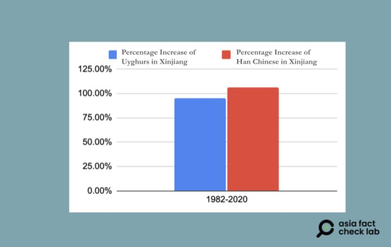
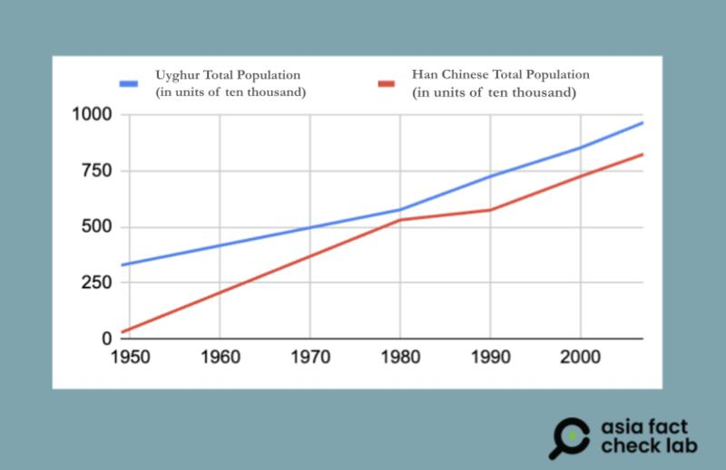

# Is the growth rate of Uyghurs in Xinjiang higher than that of the Han?

## Verdict: False

By Shen Ke for Asia Fact Check Lab

2024.08.01

Taipei, Taiwan

## Chinese officials claimed that the Uyghur population in China’s autonomous territory Xinjiang increased at a “significantly higher rate” than the Han population since the first national census in 1953.

## But the claim is false. Multiple official sources reviewed by AFCL show that the Han Chinese population growth rate in Xinjiang outstripped Uyghurs both over the decades since 1953 and most recently between 2010 and 2020.

Chinese Foreign Ministry spokesperson Mao Ning [said](https://archive.ph/q3USJ) on July 1 that China's census data showed that the Uyghur population in Xinjiang had grown from "3.6076 million to 11.6243 million" between 1953 to 2020, adding that the growth rate for the Uyghur population was "significantly higher" than the increase of the Han population in the region.

Mao made the remarks in response to a question from a journalist from Japan's public broadcaster NHK regarding the International Religious Freedom Report released in June by the U.S. State Department that [criticized](https://www.state.gov/reports/2023-report-on-international-religious-freedom/china/xinjiang/) the Chinese government for continuing "genocidal practices" in Xinjiang.

Xinjiang, officially the Xinjiang Uygur Autonomous Region, is an autonomous region in northwest China at the crossroads of Central Asia and East Asia.

The Uyghurs are an ethnic Turkic people originating from, and culturally affiliated with, the general region of Central Asia and the broader Muslim world. They are recognized as the titular nationality of Xinjiang.

The Han Chinese, or the Han people, are an East Asian ethnic group native to Greater China. They represent more than 90% of the population of mainland China.

There have been disputes in Xinjiang between Uyghurs and Han Chinese over cultural, religious, and political issues.

Many Uyghurs claim that the Chinese government has engaged in systematic discrimination and ethnic repression in Xinjiang, while Beijing claims that the region needs strict oversight following several attacks carried out by Uyghers who it terms terrorists and extremists.

In 2009, for instance, rioting in Xinjiang’s capital, Ürümqi, broke out as mostly Uyghur demonstrators protested against state-incentivized Han Chinese migration to the region and widespread economic and cultural discrimination.

But Mao’s claim about the Uyghur population growth is false.

## Chinse official census

A review of China’s official census figures cited by Mao shows that the rate of growth of the Han Chinese community in Xinjiang exceeded that of the Uyghers.

Chinese census data is based on the number of “permanent residents” of an area, defined as both people born there and long-term migrants settled in a given province or region for more than six months who may or may not decide to settle there permanently.

Although China conducted seven national censuses from 1953 to 2020, AFCL could only find detailed data on the Uyghur and Han populations in Xinjiang from the third census in 1982 to the seventh in 2020.

Over the 38 years between the third and seventh censuses, Xinjiang’s Uyghur population increased from 5,955,900 to 11,624,300 with a net growth rate of 95.17%. During the same period, the Han population in the region grew from 5,286,500 to 10,920,100, resulting in a net growth rate of 106.57%.

The population growth of Han Chinese in Xinjiang between 1982 and 2020 was greater than that for Xinjiang’s Uyghurs. (Data from China National Census Reports, Graphics by AFCL)

A closer look at the population changes between individual census years reveals that Uyghur growth rates significantly exceeded those of the Han Chinese in the 1980s and slightly in the 2000s. However, during the 1990s, the Han population increased at more than double the rate of the Uyghurs and also significantly outpaced them in the 2010s.

When asked to clarify Mao’s remarks, a representative from China’s Ministry of Foreign Affairs declined to answer directly, referring the AFCL to the Chinese Embassy in the United States.

The embassy has not responded to AFCL’s inquiries as of this writing.

## Trends in official statistics

In order to obtain data on demographic changes within Xinjiang in the years before 1982, AFCL consulted the book [1949-2009: A Report on the Development of Ethnic Minorities in Xinjiang](https://isbnsearch.org/isbn/9787228128259), a monograph published by the Xinjiang People's Publishing House in 2009.

Written by Wu Fuhuan, the former president of the Xinjiang Academy of Social Sciences and a leading expert on Xinjiang history, the book has been recommended by official [publications](https://m.fx361.com/news/2010/0216/17335846.html) such as Studies on the History of the Chinese Communist Party.

The report contains year-by-year statistics on the population growth for ethnic groups within Xinjiang from 1949 to 2007, citing the Xinjiang Statistical Yearbook as its source of demographic data.

The report’s findings summarized in the below chart show a Han growth rate significantly higher than that of the Uyghers between 1949 and 2009.

Separate official statistics released by Xinjiang show Han Chinese and Uyghurs in Xinjiang between 1949 and 2007. (Data from 1949-2009: A Report on the Development of Ethnic Minorities in Xinjiang, Image by AFCL)

The report shows that between 1949 and 2007, the Uyghur population in Xinjiang nearly tripled, growing from 3,291,100 to 9,650,600. In contrast, the Han population increased over 28-fold during the same period, rising from 291,000 to 8,239,300.

## Academic study

The shift in Xinjiang’s ethnic demographics has also been a focus of academic study, such as a 2013 paper by Agnieszka Joniak-Lüthi, a professor at the University of Freiburg in Germany.

Joniak-Lüth explained how several waves of Han migrants were brought to Xinjiang following various historical events in the decades following the establishment of the People’s Republic of China in 1949.

She noted that in 1949, Han Chinese made up just over 6% of Xinjiang’s total population, while Uyghurs comprised nearly 75%.

But in the 1950s, China established the state-owned Xinjiang Production and Construction Corps, recruiting large numbers of Han migrant workers, especially from the People’s Liberation Army.

This internal migration was further fueled by nationwide famine in the early 1960s, which brought another influx of Han refugees from eastern China to Xinjiang.

Additionally, during the Cultural Revolution from the mid-1960s to mid-1970s, hundreds of thousands of young Han intellectuals were sent to live and work in Xinjiang.

Han growth rates in Xinjiang saw a noticeable decline in the decade following major Chinese economic reforms in the late 1970s and early 1980s. However, they once again significantly outpaced Uyghur growth rates in the 1990s.

Joniak-Lüthi described post-1980s Han migration to Xinjiang as being “driven by the search for economic profit,” largely organized by individuals and mostly voluntary.

She also noted that due to these waves of Han migrants, Uyghurs likely became a minority in Xinjiang by the mid-2000s.

While China’s official statistics currently show the Uyghur population in Xinjiang as larger than the Han population, some scholars suggest that the actual number of official Han residents is considerably higher, as many Han attempt to delay registering their households in the region for a considerable time after migrating there.

Meanwhile, China's state-run outlets such as [The Global Times](https://archive.ph/LOy96), [China News](https://archive.ph/g8aX0) and [Tianshan Network](https://archive.ph/cXwVe) reported that the Han population in Xinjiang grew by 24.86% over the previous decade, while the Uyghur population increased by only 16.2%, following the release of data for China's seventh national census in 2021.

Census data used in this fact check was taken from the following sources:

1. Date for 1953 and 1964: [1949-2009: A Report of the Development of Ethnic Minorities in Xinjiang](https://isbnsearch.org/isbn/9787228128259)
2. Data on the Uyghurs from 1982 to 2020 - [Xinjiang Population Dynamics and Data](http://english.scio.gov.cn/whitepapers/2021-09/26/content_77775276.htm)
3. Data on Han Chinese for 1982 - Third National Population Census, Volume IV: Population of Various Ethnic Groups
4. Data on Han Chinese for 1990 and 2000 - [Bulletin on the Fifth Population Census in Xinjiang](https://archive.ph/EKEhw)
5. Data on Han Chinese for 2010 and 2020 - [Bulletin on the Seventh National Population Census in Xinjiang](https://archive.ph/CyXts#selection-111.0-111.19)

## *Edited by Taejun Kang.*

*Asia Fact Check Lab (AFCL) was established to counter disinformation in today's complex media environment. We publish fact-checks, media-watches and in-depth reports that aim to sharpen and deepen our readers' understanding of current affairs and public issues. If you like our content, you can also follow us on*   [*Facebook*](https://www.facebook.com/asiafactchecklabcn)  *,*   [*Instagram*](https://www.instagram.com/asiafactchecklab/)   *and*   [*X*](https://twitter.com/AFCL_eng)  *.*

[Original Source](https://www.rfa.org/english/news/afcl/afcl-uyghur-xinjiang-population-08012024221825.html)