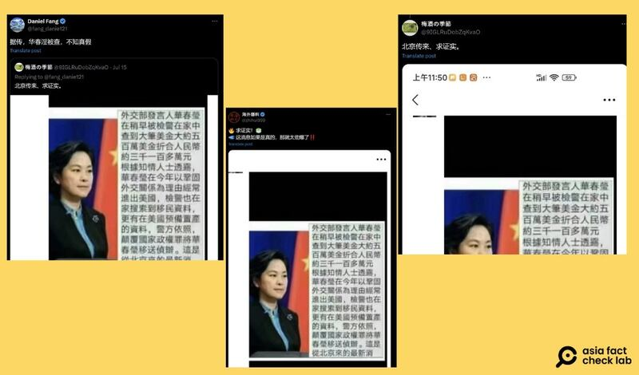
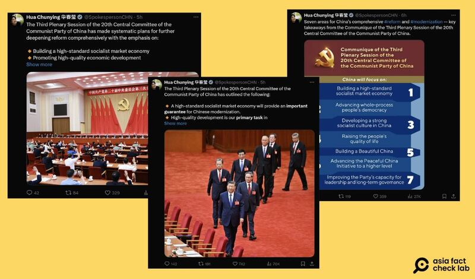
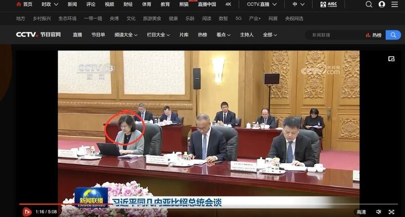

# Was a Chinese foreign ministry official detained for subversion?

## Verdict: False

By Alan Lu for Asia Fact Check Lab

2024.08.05

Taipei, Taiwan

## A claim emerged in Chinese-language social media posts that China had detained a vice foreign minister, Hua Chunying, in July over charges of subversion.

## But the claim is false. Hua has continued public activities, including on social media following her alleged detention. Keyword searches found no credible reports about Hua’s arrest. The same claim has circulated online since as early as 2018.

The claim was [shared](https://x.com/zhihui999/status/1813055608888652210) on X, formerly known as Twitter, on July 15, 2024.

“Ministry of Foreign Affairs spokesperson Hua Chunying was detained by police earlier over charges of subversion,” the claim reads in part.

“The police found about five million U.S. dollars, which is equivalent to about 31 million Chinese yuan at her house,” it reads further.

The claim was shared alongside an image of Hua with Chinese text attached on the right side.

Screenshot of the claim shared on X.

The same claim and image were shared on X [here](https://x.com/9IGLRuDobZqKvaO/status/1812749165031743707) and [here](https://x.com/fang_danie121/status/1812766248033460601).

But the claim is false.

## Old claim

The claim addresses Hua as Ministry of Foreign Affairs spokesperson, but Hua was promoted to vice minister on May 27, 2024.

A combined keyword search and reverse image search found similar claims circulated online as early as February 2018.

The approximate conversion rate of 6.3% aligns with the exchange rate between dollars and yuan in February 2018, rather than the current exchange rate of around 7.2%, which would result in approximately 36 million yuan – which could indicate that the text was written in 2018, not in 2024.

## Recent activities

The last time Hua's name was [mentioned](https://www.mfa.gov.cn/web/wjb_673085/zygy_673101/hcy1/) by the foreign ministry was on May 21, when she [received](https://www.mfa.gov.cn/web//wjb_673085/zzjg_673183/ldmzs_673663/xwlb_673665/202405/t20240521_11308493.shtml) a delegation of visiting young scholars from several Latin American think tanks.

Hua’s official X account has remained active since her supposed detainment on July 15, with 15 posts published in the week following the appearance of the latest rumors.

Hua’s official X account continued to post in the days following the rumors of her purported detention. (Screenshots/X)

Hua also [appeared](https://tv.cctv.com/2024/07/10/VIDEuAXKtKw0c6w25s0xxEwT240710.shtml) in China Central Television footage of a meeting between President Xi Jinping and the president of Guinea-Bissau, Umaro Sissoco Embalo, on July 10, only five days before the rumors emerged.

Hua was shown in footage of a meeting between Xi and the president of Guinea-Bissau on July 10 released by China Central Television. (Screenshot/CCTV)

Keyword searches found no official or credible reports about Hua’s arrest.

## *Translated by Shen Ke. Edited by Shen Ke and Taejun Kang.*

*Asia Fact Check Lab (AFCL) was established to counter disinformation in today's complex media environment. We publish fact-checks, media-watches and in-depth reports that aim to sharpen and deepen our readers' understanding of current affairs and public issues. If you like our content, you can also follow us on*   [*Facebook*](https://www.facebook.com/asiafactchecklabcn)  *,*   [*Instagram*](https://www.instagram.com/asiafactchecklab/)   *and*   [*X*](https://twitter.com/AFCL_eng)  *.*

[Original Source](https://www.rfa.org/english/news/afcl/afcl-hua-chunying-detained-08052024005358.html)