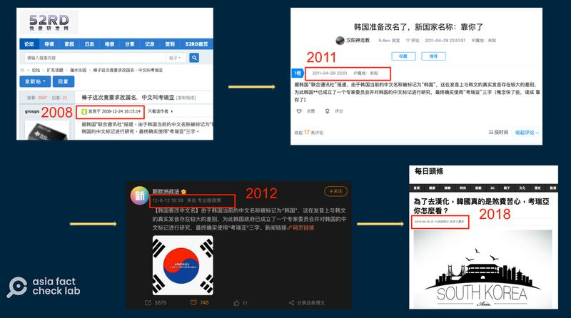

# Did a South Korean legislator propose changing the country’s name?

## Verdict: False

By Dong Zhe for Asia Fact Check Lab

2024.08.08

Taipei, Taiwan

## A claim has been repeatedly shared in Chinese-language social media posts that a South Korean politician proposed changing the country’s name to a transliteration of the English word “Korea”.

## But the claim is false. No such proposal has been made. The claim has circulated online since as early as 2008.

The claim was [shared](https://archive.ph/Ria3c#selection-2331.0-2331.136) on a Taiwanese online news website, SET News, on July 19, 2024.

“Lee Sang-hoon, a member of South Korea’s National Assembly, proposed a bill for the name change, saying at the beginning of 2024 that the new name ‘Korea’ expresses the identity and characteristics of Korea in a concise and clear way,” SET News reported, citing social media posts.

“The South Korean government did not immediately accept this proposal, but it has not rejected it either, and is still in the process of planning and evaluation.”

Claims that Korea was going to change its official name to an English transliteration became a trending topic on Weibo. (Screenshots/X and Weibo)

But the claim is false.

Keyword searches found the claim about a South Korean proposal to change the country's name first [appeared](http://bbs.52rd.com/Thread-146269-1-1.html) on a Chinese online forum in 2008 and cited South Korea's Yonhap News Agency as the source.

## RELATED RFA CONTENT

## ## (Cue to 40:22)

Similar claims circulated online in [2011](https://www.xcar.com.cn/bbs/viewthread.php?tid=14532102&page=1), [2012](https://weibo.com/1888494957/ywZCtpUEB) and [2018](https://kknews.cc/zh-tw/history/lqnnyjb.html).

Similar rumors about the supposed name change have appeared repeatedly since 2008 across a range of internet forums. (Screenshots/Weibo, xcar, F2RD and Meiri Toutiao)

But a keyword search found no report about a change in the name of the country published by the Yonhap News Agency.

Additionally, there is [no lawmaker](https://www.assembly.go.kr/portal/cnts/cntsCont/dataA.do?cntsDivCd=NAAS&menuNo=600137) in South Korea with the name Lee Sang-hoon.

A search on South Korea's National Assembly website found two lawmakers who have similar names – Lee Sang-sik and Lee Sang-hui – but neither had [ever proposed](https://likms.assembly.go.kr/bill/BillSearchResult.do) a bill to change the name of the country.

## *Translated by Shen Ke. Edited by Shen Ke and Taejun Kang.*

*Asia Fact Check Lab (AFCL) was established to counter disinformation in today's complex media environment. We publish fact-checks, media-watches and in-depth reports that aim to sharpen and deepen our readers' understanding of current affairs and public issues. If you like our content, you can also follow us on*   [*Facebook*](https://www.facebook.com/asiafactchecklabcn)  *,*   [*Instagram*](https://www.instagram.com/asiafactchecklab/)   *and*   [*X*](https://twitter.com/AFCL_eng)  *.*

[Original Source](https://www.rfa.org/english/news/afcl/afcl-south-korea-name-change-08082024005626.html)