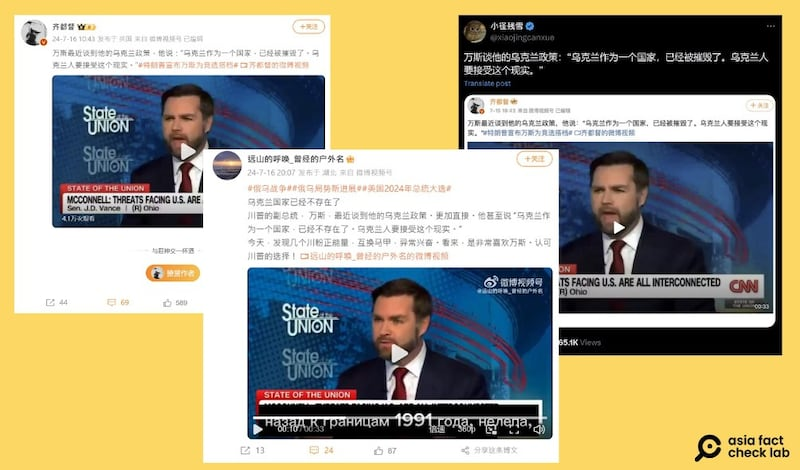

# Did JD Vance say Ukrainians must ‘accept’ their country’s destruction?

## Verdict: Missing context

By Alan Lu for Asia Fact Check Lab

2024.08.09

Taipei, Taiwan

## A claim emerged in Chinese-language social media posts that Republican vice presidential candidate J.D. Vance said during a 2023 CNN interview that Ukraine as a country had been destroyed and Ukrainians have to accept that reality.

## But the claim is missing key context by misrepresenting Vance’s remarks. While Vance said during the interview that Ukraine has been devastated by the war, he did not say Ukrainians had to accept that as reality.

The claim was [shared](https://x.com/xiaojingcanxue/status/1816526495906750669) on X, formerly known as Twitter, on July 26, 2024.

“Vance on his Ukrainian policy, ‘Ukraine as a country has been destroyed. Ukrainians have to accept this reality’,” read the claim.

It was shared alongside a screenshot of what appears to be Vance’s media interview. The logo of CNN can be seen in the screenshot.

Several social media accounts have recently taken statements Vance made about Ukraine in a CNN interview out of context, citing video from Vance’s interview. (Screenshots/X and Weibo)

James David “JD” Vance is an American politician, author, and Marine veteran who has served since 2023 as the junior United States senator from Ohio. A member of the Republican Party, he is its nominee for vice president in the 2024 U.S. presidential election.

Just after Russia invaded Ukraine in February 2022, Vance, then a candidate for U.S. Senate, [said](https://www.businessinsider.com/gop-candidate-jd-vance-i-dont-care-what-happens-ukraine-2022-2): "I've got to be honest with you, I don't really care what happens to Ukraine one way or another."

Since then, Vance has been hammering home his views on Ukraine, seizing on it as one of his signature foreign policy issues. His isolationist position is known to differentiate him from more conventional Republicans.

But the claim about Vance’s remarks during the CNN interview is misleading.

## CNN interview

A reverse image search of the screenshot found it was taken from Vance's [interview](https://www.youtube.com/watch?v=fXTSQYw3J44) with CNN in December 2023.

The clip was edited from an 11-minute CNN interview aired in December 2023.

A review of the 11-minute interview shows that while Vance said that Ukraine has been devastated by the war, he did not say that the Ukrainians had to “accept that as reality.”

## Full context

Vance’s remarks were in response to a CNN host’s question about the Republican Party’s position on the Russia-Ukraine war.

Vance said that the war was likely to end through negotiations, rather than a Ukrainian victory and the reclaiming of territory lost in the initial stages of the war.

Following this remark, Vance stated that the U.S. shouldn’t provide a “blank check” to Ukraine.

## *Translated by Shen Ke. Edited by Shen Ke and Taejun Kang.*

*Asia Fact Check Lab (AFCL) was established to counter disinformation in today's complex media environment. We publish fact-checks, media-watches and in-depth reports that aim to sharpen and deepen our readers' understanding of current affairs and public issues. If you like our content, you can also follow us on*   [*Facebook*](https://www.facebook.com/asiafactchecklabcn)  *,*   [*Instagram*](https://www.instagram.com/asiafactchecklab/)   *and*   [*X*](https://twitter.com/AFCL_eng)  *.*

[Original Source](https://www.rfa.org/english/news/afcl/afcl-jd-vance-ukraine-08092024010317.html)