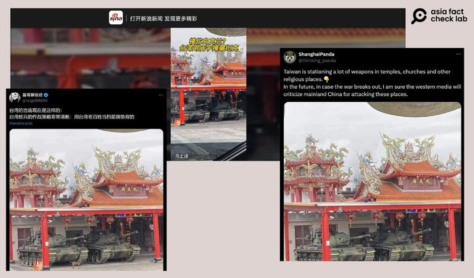
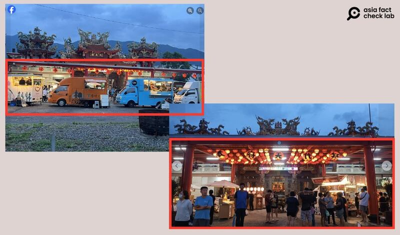

# Is Taiwan’s military storing tanks in temples?

## Verdict: False

By Alan Lu for Asia Fact Check Lab

2024.08.12

Taipei, Taiwan

## A photo of two tanks stationed at a temple has been shared in social media posts in July alongside a claim that it shows the Taiwanese government is “now using religious facilities to store weapons.”

## But the claim is false. The photo was taken in 2022. Workers at the temple seen in the photo told AFCL that the Taiwanese military temporarily used the site for exercises at that time.

The claim was [shared](https://x.com/thinking_panda/status/1815598788675051856) on X, formerly known as Twitter, on July 23, 2024.

“Taiwan is stationing a lot of weapons in temples, churches and other religious places,” reads the claim.

It was shared alongside a photo of two tanks stationed at what appears to be a temple.

Chinese social media influencers recently circulated a photo of a tank purportedly stored at a Taiwanese temple. (Screenshot/Weibo)

The same photo was shared [here](https://x.com/leige88888/status/1815351248805126203) on X on July 22 with a similar claim that reads: "Taiwan's temples now look like this."

But the claim is false.

## Old photo

A reverse image search on Google found the identical photo [published](https://www.ettoday.net/news/20220527/2260540.htm) here by the Taiwanese media outlet ETtoday in 2022.

According to the report, and the sign seen in the photo, it shows the Chihpen-Dai-Tien-Fu Temple [located](https://www.google.com/maps/place/%E7%9F%A5%E6%9C%AC%E4%BB%A3%E5%A4%A9%E5%BA%9C/@22.7058122,121.0561935,15z/data=!4m2!3m1!1s0x0:0x63b95377745c0128?sa=X&ved=1t:2428&ictx=111) in Taiwan's Taitung County.

The report noted that the photo had been taken from a Facebook post with a humorous comment accompanying it.

Taiwan’s Ministry of National Defense told AFCL that the photo was taken during a 2022 drill where military equipment was placed in front of the temple.

Separately, workers at the temple said that the photo had been uploaded years ago when the Taiwanese military temporarily used the site for exercises.

## The temple in July 2024

Through keyword searches, AFCL found several photos [posted](https://www.facebook.com/photo/?fbid=1939626566480146&set=pcb.1939626633146806) on July 27 by visitors that show the temple and its surrounding area.

No tanks or weapons can be seen in these photos.

Recent Facebook photos uploaded by visitors to the temple showed no visible military equipment. (Screenshot/Facebook)

Instead, tourists and food trucks can be seen in the area where the tanks were previously parked.

## *Translated by Shen Ke. Edited by Shen Ke and Taejun Kang.*

*Asia Fact Check Lab (AFCL) was established to counter disinformation in today's complex media environment. We publish fact-checks, media-watches and in-depth reports that aim to sharpen and deepen our readers' understanding of current affairs and public issues. If you like our content, you can also follow us on*   [*Facebook*](https://www.facebook.com/asiafactchecklabcn)  *,*   [*Instagram*](https://www.instagram.com/asiafactchecklab/)   *and*   [*X*](https://twitter.com/AFCL_eng)  *.*

[Original Source](https://www.rfa.org/english/news/afcl/afcl-taiwan-tank-temple-08122024031014.html)