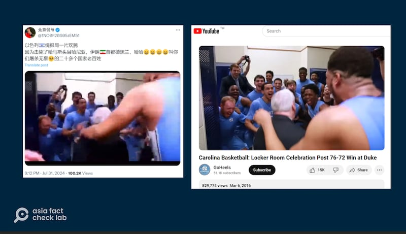

# Does a video show Israeli intelligence reaction to Haniyeh’s death?

## Verdict: False

By Zhuang Jing for Asia Fact Check Lab

2024.08.14

Taipei, Taiwan

## A video of a man in a suit dancing has been shared in Chinese-language social media posts with a claim that it shows the Israeli intelligence agency’s reaction to the death of Ismail Haniyeh, a political leader in the Palestinian militant organization Hamas.

## But the claim is false. The video in fact shows the men’s basketball team of the University of North Carolina following a victory over their archrival Duke University in March 2016.

The claim was [shared](https://twitter.com/1NO0F20S05zEM51/status/1818635933232566407) on X, formerly known as Twitter, on July 31, 2024.

“Israeli Intelligence is in a state of euphoria because of the killing of Hamas leader Haniyeh,” the claim reads in part.

It was shared alongside a seven-second clip that shows a man in a suit dancing excitedly while entering a room before walking towards a group of men dressed in blue gym suits in what appears to be a locker room.

Haniyeh, a political leader within the Palestinian militant organization Hamas, was assassinated in Tehran on July 31.

While Israel is widely suspected of orchestrating the attack, it has not officially commented on the death as of press time.

The same video with similar claims was shared on X [here](https://twitter.com/israellim5/status/1818683882872750443) and [here](https://x.com/xczyuan/status/1818637276580032730).

But the claim is false.

Keyword searches found a longer version of the video [posted](https://www.youtube.com/watch?v=MYMlI0AYHwI) on YouTube on March 6, 2016.

The clip shows a locker room celebration of the men’s team of the University of North Carolina after it held on to beat Duke University on March 5, 2016, and lock up the top seed in the ACC men’s basketball tournament.

The caption of the two-minute and one-second video reads: “This locker room celebration has been a long time coming for the Tar Heels as the team gets its first win at Duke since 2012. The win also secured the regular season ACC championship for the squad.”

The clip shared on China’s Weibo social media platform was taken from about 35 seconds into the original video.

Chinese influencers on X posted a short video with a caption saying that the Israeli intelligence agency celebrated Haniyeh’s death (left). However, the footage was taken from a celebration video shot by an American men's basketball team in 2016 (right). (Screenshots/ X and YouTube)

Separately, social media users also claimed that the Israeli intelligence agency responded to Haniyeh's death, citing a [post](https://twitter.com/MOSSADil/status/1818485606231818468) by "Mossad Commentary" on X on July 31, 2024.

“He was killed in the shower like the dog he is,” the post reads.

But the X account “Mossad Commentary” is not the official account of the Israeli agency.

The posts attached a screenshot of a [post](https://twitter.com/MOSSADil/status/1818485606231818468) from an X account named Mossad Commentary as evidence of the claim.

Chinese social media influencers claimed that an Israeli secret service organization had commented on the death of Haniyeh in a post on X. (Screenshots/Weibo and NetEase)

The account has previously spread misinformation regarding the Israel-Hamas conflict, as reported by the [BBC](https://monitoring.bbc.co.uk/product/c204ogm0), [Associated Press](https://apnews.com/article/fact-check-israel-roadside-bomb-world-central-kitchen-096413602260) and [Euronews](https://www.euronews.com/my-europe/2023/11/07/israel-hamas-war-fake-mossad-account-creates-online-confusion).

## *Translated by Shen Ke. Edited by Shen Ke and Taejun Kang.*

*Asia Fact Check Lab (AFCL) was established to counter disinformation in today's complex media environment. We publish fact-checks, media-watches and in-depth reports that aim to sharpen and deepen our readers' understanding of current affairs and public issues. If you like our content, you can also follow us on*   [*Facebook*](https://www.facebook.com/asiafactchecklabcn)  *,*   [*Instagram*](https://www.instagram.com/asiafactchecklab/)   *and*   [*X*](https://twitter.com/AFCL_eng)  *.*

[Original Source](https://www.rfa.org/english/news/afcl/afcl-israel-intelligence-haniyeh-08142024035026.html)