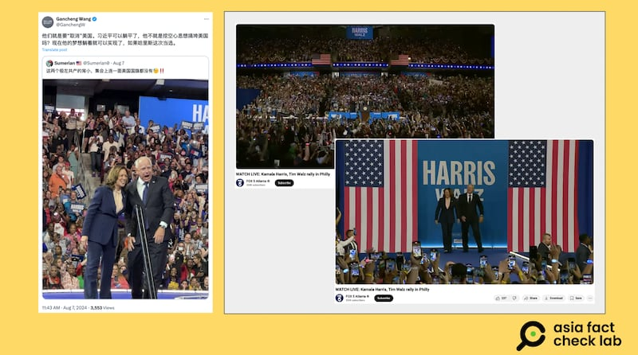
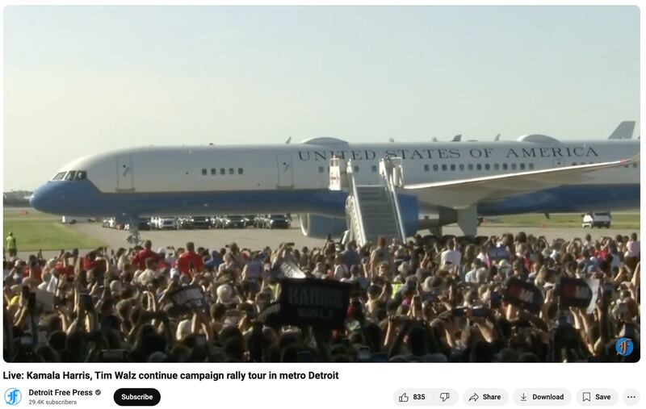

# Was there no American flag hoisted at the Harris and Walz rally?

## Verdict: False

By Zhuang Jing for Asia Fact Check Lab

2024.08.20

Taipei, Taiwan

## A photo of U.S. Vice President Kamala Harris and Minnesota Governor Tim Walz has been repeatedly shared in Chinese-language posts purporting to show that there was no American flag hoisted at their rally in early August.

## But the claim is false. A review of live footage of the rally shows that there were at least two American flags flying at the event.

The claim was [shared](https://x.com/GanchengW/status/1821029482234274196) on X, formerly known as Twitter, on Aug. 7, 2024.

“These two extreme left-wing communists didn’t even have an American flag at the rally,” reads the claim.

It was shared alongside a photo that shows Harris and Walz standing in front of a crowd.

The claim began to circulate online after Walz was announced on Aug. 6 as Democratic nominee Harris’ running mate for the 2024 U.S. presidential election.

A photo of Harris and Waltz shared by Chinese influencers claimed that there was not even a single American flag at a rally (left). However, images taken by various news outlets show flags at the event (right). (Screenshots/X and YouTube)

But the claim is false. A reverse image search shows that the photo was taken at the duo’s initial campaign event in Pennsylvania on Aug. 6.

A separate search found a video clip that recorded the event [published](https://www.youtube.com/watch?v=deAOPOXjncc) on YouTube by Fox News.

A review of the video shows that there are at least two American flags hoisted at the event.

## Airport claim

Two photos of Harris and Walz getting off a plane were [shared](https://m.weibo.cn/detail/5066101866105706) by Chinese-speaking users on Weibo alongside a claim that they were digitally altered to add to the crowd, but in fact no one showed up to greet the duo.

Chinese social media users claimed that no one came to greet Harris and Walz as they arrived in Detroit for a campaign event, stating that the crowd in the image was AI-generated. (Screenshot/Weibo)

But the claim is false. A google reverse image search found the photos were taken at the duo’s rally in Detroit on Aug. 7.

A separate search found the footage of the event published on YouTube by [PBS](https://www.youtube.com/watch?v=AvVbLW6Xfbc), [Detroit Free Press](https://www.youtube.com/watch?v=j9DdAsQkghk) and [FOX News](https://www.foxnews.com/video/6360312188112).

A review of those videos shows that the crowd were genuine.

Footage taken by several U.S. news outlets shows a large crowd of supporters greeting Harris on her arrival in Detroit. (Screenshot/Detroit Free Press YouTube Channel)

Similar claims were debunked by other fact-checking organizations including [Reuters](https://www.reuters.com/fact-check/photo-harris-walz-rally-michigan-was-not-ai-generated-2024-08-12/).

## *Translated by Shen Ke. Edited by Shen Ke and Taejun Kang.*

*Asia Fact Check Lab (AFCL) was established to counter disinformation in today's complex media environment. We publish fact-checks, media-watches and in-depth reports that aim to sharpen and deepen our readers' understanding of current affairs and public issues. If you like our content, you can also follow us on*   [*Facebook*](https://www.facebook.com/asiafactchecklabcn)  *,*   [*Instagram*](https://www.instagram.com/asiafactchecklab/)   *and*   [*X*](https://twitter.com/AFCL_eng)  *.*

[Original Source](https://www.rfa.org/english/news/afcl/afcl-harris-rally-american-flag-08202024035024.html)