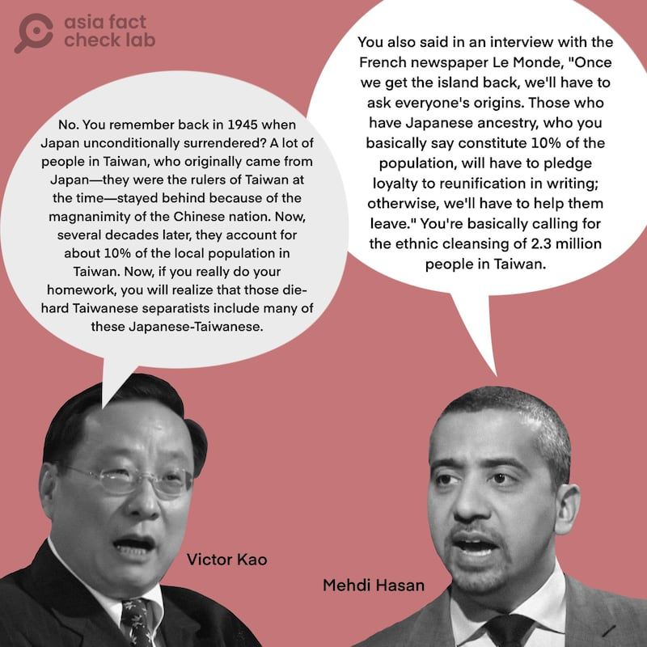
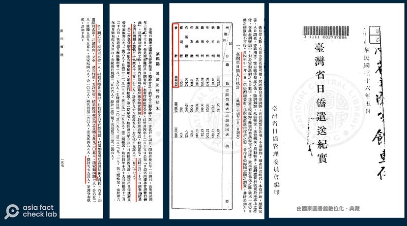

# Are 10% of Taiwan’s population ethnic Japanese?

## Verdict: Lack of evidence

By Dong Zhe for Asia Fact Check Lab

2024.08.23

Taipei, Taiwan

## A claim emerged in media reports that 10% of Taiwan’s population are descendants of Japanese people.

## But the claim lacks evidence. Official data and statistics do not show such a high number of ethnic Japanese in Taiwan.

Victor Gao Zhikai – vice president of the Beijing-based think tank Center for China and Globalization and former official English interpreter of the late Chinese premier Deng Xiaoping – appeared in an [interview](https://www.youtube.com/watch?v=kmYdpHtOv_E) with Al Jazeera on Aug. 10.

At around the eight-minute mark of the interview, Gao claimed that 10% of Taiwanese are of Japanese descent, without providing sources.

Such a figure would equal about 2.3 million people out of Taiwan’s population of more than 23 million.

Gao claimed that 10% of Taiwan’s population is ethnic Japanese. (Photo/AFCL)

In response to AFCL’s queries, Gao said on Aug. 14 that the data for his statement came from three visits to Taiwan before the outbreak of COVID-19 when he talked to members of various Taiwanese political parties and people in the business sector.

Gao added that he believed a significant number of Japanese stayed in Taiwan after World War II through concealing their identity and living under assumed names, citing Taiwan’s “detailed household registration system” initiated after 1945.

But Gao’s claim still lacks evidence.

## Official figures

Official figures from a census of Taiwan conducted by the Japanese government in 1945 before the war ended shows that the number of Japanese in Taiwan stood at 323,269, according to a Taiwan government [report](https://taiwanebook.ncl.edu.tw/zh-tw/book/NCL-002822626/reader) compiled in 1947.

Separately, figures taken from a household registration survey by the Republic of China in 1946 shows that the number was 328,332.

The report also shows that between March 1946 and May 1947, a total of 323,246 Japanese people were repatriated from Taiwan to Japan.

Exceptions were made for 205 Japanese nationals along with 447 of their family members – totaling 652 people – who remained in Taiwan. Additionally, 55 Ryukyuans, or Okinawans, and 48 of their family members, totaling 103 people, also remained. In total, 755 Japanese individuals were allowed to remain.

An official government report details the number of Japanese repatriated from Taiwan in the 1940s. (Screenshot/Taiwan eBook)

A separate [report](https://sgp.ncl.edu.tw/hypage.cgi?HYPAGE=search/merge_pdf.hpg&sysid=00000023&jid=00373101&dt=48100201&pages=321-608&cdno=SGP001) that shows Taiwan's household census data in 1956 also shows 1,233 "Taiwanese of foreign ethnicities" were in the island, without specifying where they came from.

An official at Taiwan’s Ministry of Interior told AFCL that currently the island only tracks and keeps the number of Japanese expatriates.

## Population growth rate

Based on official statistics cited above, it can be estimated that about 1,000 Japanese people remained in Taiwan after 1945.

AFCL used the following formula widely used by population ecologists to calculate the population growth rate:

* Final Population = Initial Population x (1+Annual Growth Rate) ^ Number of Years

To reach the 2.3 million mark, the Japanese-Taiwanese population would need to grow at an average rate of approximately 10.5%.

However, [statistics](https://www.ris.gov.tw/app/portal/346) from Taiwan's Ministry of the Interior indicate that annual population growth rates have averaged between 2% and 3%, with a peak of 4.998% in 1969.

Using the ministry’s numbers in calculations, AFCL estimates that the current population of ethnic Japanese in Taiwan ranges from several thousand to tens of thousands, with a maximum of about 40,000 people – far short of two million.

## *Translated by Shen Ke. Edited by Shen Ke and Taejun Kang.*

*Asia Fact Check Lab (AFCL) was established to counter disinformation in today's complex media environment. We publish fact-checks, media-watches and in-depth reports that aim to sharpen and deepen our readers' understanding of current affairs and public issues. If you like our content, you can also follow us on*   [*Facebook*](https://www.facebook.com/asiafactchecklabcn)  *,*   [*Instagram*](https://www.instagram.com/asiafactchecklab/)   *and*   [*X*](https://twitter.com/AFCL_eng)  *.*

[Original Source](https://www.rfa.org/english/news/afcl/afcl-ethnic-japanese-taiwan-08232024040332.html)