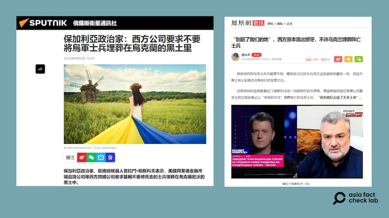

# Did BlackRock forbid Ukraine from burying deceased soldiers?

## Verdict: False

By Zhuang Jing for Asia Fact Check Lab

2024.08.26

Taipei, Taiwan

## Updated Aug. 28, 2024, 02：57 a.m. ET.

## A claim emerged in Chinese and Russian media reports that the U.S. asset manager BlackRock requested the Ukrainian government to refrain from burying dead Ukrainian soldiers on farm land it owns in the country.

## But the claim is false. Under Ukrainian law, foreign companies and individuals are prohibited from purchasing arable land.

The claim was shared in an editorial [published](https://news.ifeng.com/c/8bphWfCMLaj) by a military columnist Zhao Yongling on the website of Phoenix TV on Aug. 6, 2024.

“BlackRock purchased 47% of Ukraine’s arable lands … BlackRock has asked the Ukrainian government to stop burying deceased Ukrainian soldiers and look for other ways to take care of them because it wants to use the lands in a different way,” reads the claim in part.

Zhao cited a Bulgarian politician named Plamen Paskov whose claim about BlackRock's land ownership in Ukraine was previously [shared](https://big5.sputniknews.cn/20240802/1060759436.html) by Russia's state-run Sputnik news agency.

The same claim was shared on other Chinese websites as seen [here](https://user.guancha.cn/main/content?id=1280544), [here](https://open.163.com/newview/movie/free?pid=TJ80F8TIC&mid=HJ80F8TIS) and [here](https://www.ixigua.com/7399970946571371020).

‘In an article published in early August, Russian and Chinese media quoted a purported Bulgarian politician as saying that U.S. companies are prohibiting Ukraine from burying its soldiers. (Screenshot /Internet)

BlackRock is the largest asset manager in the world with more than US$10 trillion in assets under management. The New York-based multinational asset manager has a big enough stake in many influential companies worldwide to push them to change decisions and priorities.

According to a Ukrainian government [press release](https://www.president.gov.ua/en/news/prezident-obgovoriv-z-generalnim-direktorom-blackrock-koordi-80105), President Volodymyr Zelensky met BlackRock CEO Larry Fink to discuss how Ukraine could raise national reconstruction funds at the end of 2022.

In May 2023, the Ukrainian government [signed](https://www.president.gov.ua/en/news/prezident-proviv-zustrich-iz-kerivnictvom-najbilshoyi-u-svit-82725) an agreement with BlackRock to provide support services to the Ukraine Development Fund in order to attract funds to rebuild the economy after the war ends.

But the claim about BlackRock’s land ownership in Ukraine and its request to the government regarding deceased soldiers is false.

Under Ukrainian law, foreign companies and individuals are [prohibited](https://www.fao.org/faolex/results/details/en/c/LEX-FAOC043459/) from purchasing arable land.

“Agricultural land cannot be transferred (allotted) to foreigners, stateless persons, foreign legal entities and foreign states,” reads the Article 22 of Ukraine’s Land Code (No. 2768-III of 2001).

Keyword searches found a similar claim has circulated since 2023, which has been [debunked](https://mythdetector.ge/en/ukrainian-lands-and-banned-the-burial-of-military-personnel/) by other fact-checking organizations, including Myth Detector based in Georgia.

Dafina Kandova, a journalist with the Bulgarian checking organization factcheck.bg, told AFCL that her organization had [checked](https://factcheck.bg/ne-e-vyarno-che-amerikanskata-kompaniya-blackrock-zabranyava-na-ukrajna-da-pogrebva-ubitite-si-vojnici-si-v-grobishta/) [several](https://factcheck.bg/politicheck-ne-e-vyarno-che-dve-amerikanski-kompanii-i-edno-shotlandsko-uiski-pritezhavat-edna-treta-ot-ukrainskata-zemya/) similar rumors circulating in Bulgaria at the end of 2023.

Dafina added that while Plamen Paskov often appears as a commentator for the Bulgarian nationalist Ataka party, he is not actually an official member of the party and has not been elected to public office.

Paskov’s popularity is largely built on social media, gaining followers by spreading conspiracy theories related to hot topics such as COVID-19 and the war in Ukraine, she added. He is also well-known for openly sympathizing with Russian President Vladimir Putin’s policies.

A BlackRock spokesperson told AFCL: “This is completely false. BlackRock does not own any land in Ukraine.”

## *Translated by Shen Ke. Edited by Shen Ke and Taejun Kang.*

## *Updated to include a comment from a BlackRock spokesperson.*

*Asia Fact Check Lab (AFCL) was established to counter disinformation in today's complex media environment. We publish fact-checks, media-watches and in-depth reports that aim to sharpen and deepen our readers' understanding of current affairs and public issues. If you like our content, you can also follow us on*   [*Facebook*](https://www.facebook.com/asiafactchecklabcn)  *,*   [*Instagram*](https://www.instagram.com/asiafactchecklab/)   *and*   [*X*](https://twitter.com/AFCL_eng)  *.*

[Original Source](https://www.rfa.org/english/news/afcl/afcl-blackrock-ukraine-land-08262024030948.html)