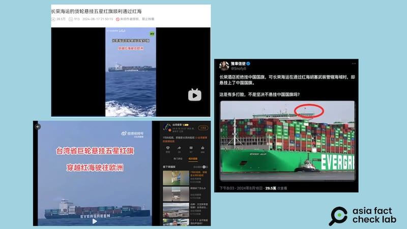
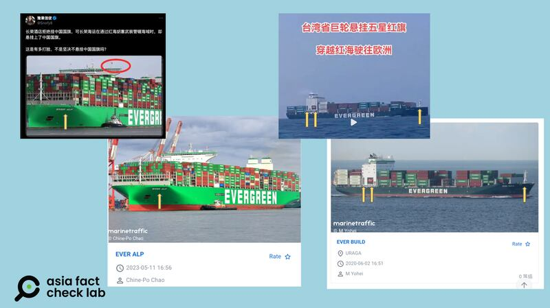
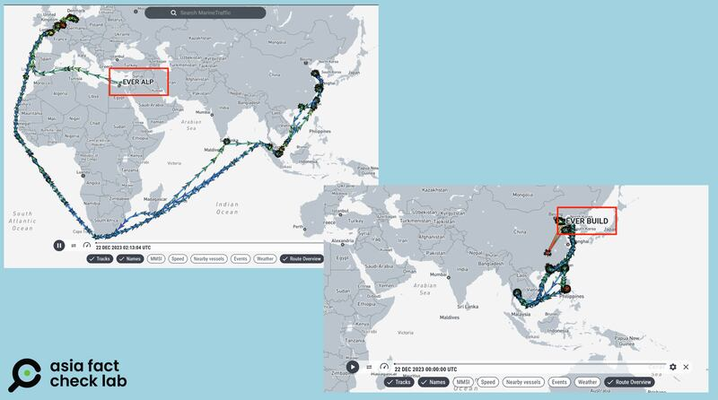
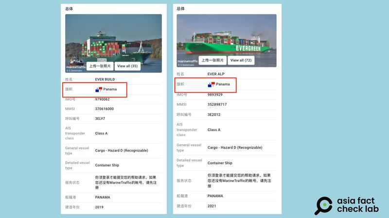

# Did Taiwanese ships fly the Chinese flag while passing through the Red Sea?

## Verdict: False

By Dong Zhe Asia Fact Check Lab

2024.08.28

Taipei, Taiwan

## A video and photograph of a cargo vessel have been shared in Chinese-language social media posts that claim they show vessels from the Evergreen Group – Taiwan’s shipping and transportation conglomerate – flying a Chinese flag while passing through the Red Sea in July.

## But the claim is false. Evergreen vessels have not passed through the Red Sea since December 2023.

A video of a cargo ship was [posted](https://www.bilibili.com/video/BV1j2421Z7si/?spm_id_from=333.788.recommend_more_video.14) on Chinese social media Bilibili on Aug. 17.

“A cargo ship belonging to China’s Taiwan-based Evergreen Group passed through the Red Sea flying the five-star red flag without incident. Previously, the Houthis have repeatedly attacked passing ships in the Red Sea, but ships flying the Chinese and Russian flags have usually been able to pass through safely,” the video’s caption reads.

The 12-second video shows multiple scenes, including China’s national flag, the Five-star Red Flag, and a cargo ship with an “EVERGREEN” sign on it.

Separately, a photo of what appears to be Evergeen's cargo vessel was [shared](https://twitter.com/Snofy8/status/1825141562000728527) on X, formerly known as Twitter, on Aug. 18, alongside a caption that reads: "The Evergreen Hotel refused to fly the Chinese flag, but Evergreen Marine flew the Chinese flag when it passed through the waters under the jurisdiction of the Houthis in the Red Sea."

A number of influencers posted photos of Evergreen ships purportedly flying China’s flag (Screenshots/X, Weibo and Bilibili)

The claim began to circulate online after Chinese social media users criticized a decision by a branch of the Taiwanese Evergreen Laurel Hotel in Paris to refuse to fly China’s national flag during the Olympics.

Some users further criticized the Evergreen Group, the hotel’s parent company, for what they said was double standards after several of its ships passed through the Red Sea in July while flying the Chinese flag for protection.

Evergreen Group is a Taiwan conglomerate with businesses in shipping, transport and associated services such as energy development, air transport, hotels and resorts.

Taiwan has been self-governing since it effectively separated from mainland China in 1949 after the Chinese civil war, but China regards Taiwan as a renegade province that should be reunited with the mainland, by force if necessary.

However, the claim about the Evergreen vessels flying the flag is false.

## Vessels in question

Reverse image searches found the two vessels seen in the Bilibili video and the photo on X are Evergeen’s EVER ALP and EVER BUILD.

A comparison of the EVER ALP and the EVER BUILD with the respective Chinese influencers’ content. (Photo/AFCL)

According to the ship tracking service Marine Traffic, both vessels are under the jurisdiction of Panama.

Since the internationally [recognized](https://www.un.org/depts/los/convention_agreements/texts/unclos/part7.htm) United Nations Convention on the Law of the Sea stipulates that a ship must sail under the flag of the state to which it is registered, those ships should fly Panama's flag.

Information on the EVER ALP and EVER BUILD. (Screenshot/Marine Traffic)

According to a contingency plan [issued](https://www.evergreen-marine.com/news/202312/CMS_NEWS2023122200017237_20231222065041_37C7D4AF2BBB4C62BB0A207ABFED5D94.pdf) by Evergreen in December 2023, all of its cargo vessels originally scheduled to pass through the Red Sea between Asia, Europe and the eastern United States would be rerouted around the Cape of Good Hope due to the threat of attacks on merchant ships.

Since the release of the contingency plan by Evergreen, the EVER ALP has not passed through the Red Sea, while the EVER BUILD has only sailed between northeast China and Thailand, nowhere near the Red Sea.

Records from the ship tracking service Marine Traffic also show that neither the EVER ALP nor the EVER BUILD has sailed through the Red Sea since the group issued its contingency plan.

The respective routes of both vessels recorded on Marine Traffic show that they have not entered through the Red Sea in the last 9 months. (Screenshots/Marine Traffic)

A representative of Evergreen told AFCL that it had not changed its company-wide shipping reroute around the Cape of Good Hope, and the company required its vessels to follow the international and industry practice of flying the flags of the country under whose jurisdiction they sail.

## Hoisting a different country’s flags

A former Taiwanese Coast Guard official told AFCL that, in practice, there are cases when a ship might fly a different country’s flags.

It is common for ships to fly another country’s flag alongside their own registered state flag to show goodwill when passing through that country’s territorial waters, the official said.

In disputed waters, ships from one country involved in the dispute might fly the flag of the other country to reduce the risk of interference from the rival state’s authorities or militias.

Lastly, ships from smaller or less powerful nations often fly the flag of a more powerful country when passing through pirate-infested waters to create a deterrent, the official explained, adding that Taiwan did not legally permit ships under its jurisdiction to engage in the second or third scenarios.

## *Translated by Shen Ke. Edited by Shen Ke and Taejun Kang.*

*Asia Fact Check Lab (AFCL) was established to counter disinformation in today's complex media environment. We publish fact-checks, media-watches and in-depth reports that aim to sharpen and deepen our readers' understanding of current affairs and public issues. If you like our content, you can also follow us on*   [*Facebook*](https://www.facebook.com/asiafactchecklabcn)  *,*   [*Instagram*](https://www.instagram.com/asiafactchecklab/)   *and*   [*X*](https://twitter.com/AFCL_eng)  *.*

[Original Source](https://www.rfa.org/english/news/afcl/afcl-taiwan-evergreen-chinese-flag-08282024042724.html)