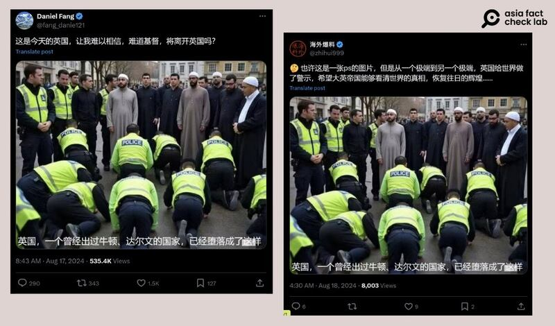
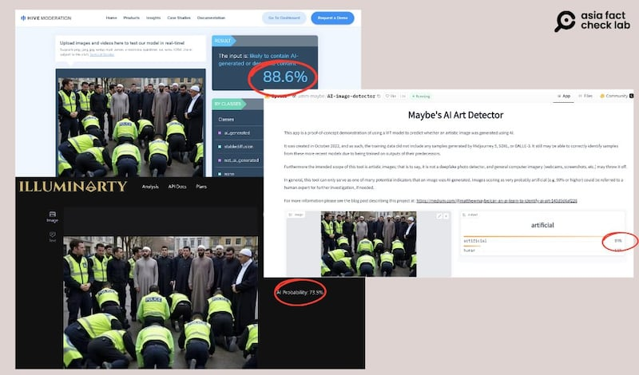
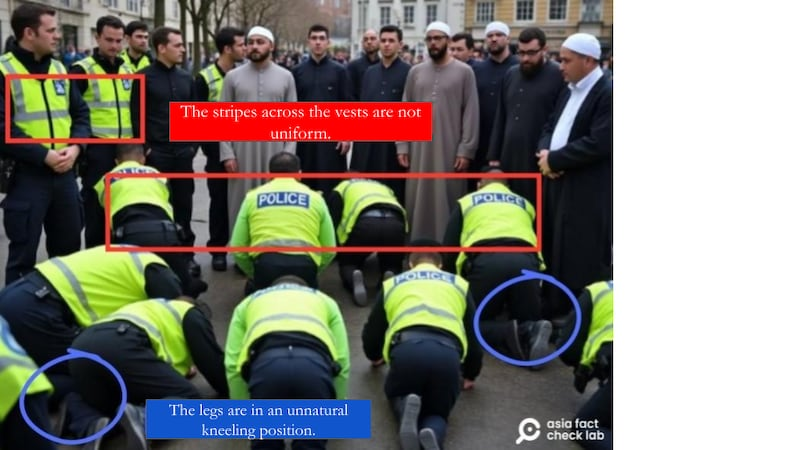
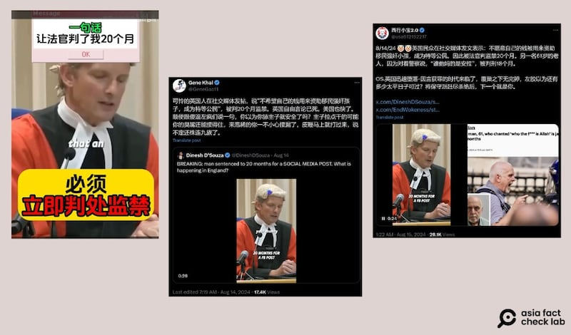

# Media Watch: Rumors circulate online about civil unrest in the UK

## On Chinese social media, users focus on the underlying tensions in Britain over immigrants.

By Alan Lu for Asia Fact Check Lab

2024.08.30

Taipei, Taiwan

Although the situation calmed down about two weeks ago, rumors are circulating online about widespread civil unrest in the U.K. after a 17-year-old killed three children in late July.

On Chinese social media, in particular, users focus on the underlying tensions in Britain over immigrants, blaming them for fueling the unrest.

AFCL debunked two widespread claims circulating among Chinese-speaking social media users below.

## Does a photo show British police kowtowing to Muslims?

A photo of what appears to be a group of police officers kneeling on the ground was shared on X, formerly known as Twitter, [here](https://x.com/fang_danie121/status/1824607852448846117?s=46&t=OcwRl26KwGrlCoefgaqyvw) and [here](https://x.com/zhihui999/status/1824906615533035624), alongside a claim that they show British police officers kowtowing to Muslim clerics.

Chinese social media influencers circulated a photo of police officers kneeling and kowtowing to Muslims, suggesting that the U.K. is now overrun by immigrants. (Screenshots/X)

But the claim is false.

A reverse image search on Google found the original photo [published](https://archive.ph/fV0th) on X on Aug. 15, 2024, alongside a caption to show that it was generated by AI.

Several AI image detection tools found the photo to likely have been AI-generated. (Screenshots/Hive, Hugging Face and Illuminarty)

Hsu Chih-Chung, a researcher on machine learning and image processing at Taiwan’s National Cheng Kung University, believes the photo was generated by AI.

Hsu noted that the vertical and horizontal silver stripes on the police officers’ green vests appear inconsistent among the various kneeling and standing officers in the pictures.

Yu Chia-mu, an associate professor at Taiwan’s Yang Ming Jiaotong University specializing in artificial intelligence and machine learning, also told AFCL that the two of the kneeling police officers had their legs in unnatural positions that wouldn't be possible while kneeling.

Two experts demonstrate how the naked eye can tell when a photo is unnatural and may have been generated by AI. (Photo/AFCL)

AI image detection tools – [Hugging Face](https://huggingface.co/spaces/umm-maybe/AI-image-detector), [Hive](https://hivemoderation.com/ai-generated-content-detection) and [Illuminarty](https://illuminarty.ai/en/) – returned predictions of 89%, 88.6% and 73.5% respectively that the photo was AI generated.

## Was a UK citizen jailed for making anti-immigrant remarks online?

AFCL received a message from a reader on Aug. 19 with a request to verify the authenticity of a 30-second video clip that was circulating online with a claim that it showed a judge at Leeds Crown Court sentencing a defendant to an immediate custodial sentence of 20 months imprisonment for making anti-immigrant remarks.

“You went on to say that you did not want your money going to immigrants who, quote, rape our kids and get priority, end quote … this offense is so serious that an immediate custodial sentence is unavoidable,” said the judge in the video.

AFCL found the video was shared by Chinese-speaking users on X [here](https://x.com/usa912152217/status/1823772237100671305) and [here](https://x.com/GeneGao11/status/1823499692803809460).

“A British man posted on social media that they did not want their money to be used to fund immigrants who rape children and become special citizens. As a result, the judge sentenced the man to 20 months in prison,” one of the posts reads.

Chinese-speaking online users claimed that a British judge sentenced a person to 20 months in prison for making anti-immigrant remarks on social media. (Screenshots/Bilibili and X)

But the claim is misleading.

Keyword searches found a longer version of the video [posted](https://www.youtube.com/watch?v=rcb5YhGBXqo) on the official YouTube channel of the British daily *The Times* on Aug. 9, 2024, about the actual hearing for a man named Jordan Parlour.

At the 14-minute and 30-second mark of the video, the judge can be heard saying that Parlour posted a message on Facebook encouraging others to participate in an attack on a hotel in Leeds that was housing refugees and asylum seekers, which occurred on Aug. 2 and 3.

At the 17-minute and seven-second mark of the video, the judge said that after being arrested on Aug. 5, Parlour admitted to police that he encouraged the attacks due to frustration over immigration.

A review of the [summary](https://www.cps.gov.uk/cps/news/man-convicted-intending-stir-racial-hatred-after-posting-online) of Parlour's proceedings released by the U.K. Crown Prosecution Service also shows that he was convicted for hate crimes relating to stirring up racial hatred and using threatening words, not for simply making anti-immigrant remarks online.

## *Translated by Shen Ke. Edited by Shen Ke and Taejun Kang.*

*Asia Fact Check Lab (AFCL) was established to counter disinformation in today's complex media environment. We publish fact-checks, media-watches and in-depth reports that aim to sharpen and deepen our readers' understanding of current affairs and public issues. If you like our content, you can also follow us on*   [*Facebook*](https://www.facebook.com/asiafactchecklabcn)  *,*   [*Instagram*](https://www.instagram.com/asiafactchecklab/)   *and*   [*X*](https://twitter.com/AFCL_eng)  *.*

[Original Source](https://www.rfa.org/english/news/afcl/afcl-uk-civil-unrest-08302024042519.html)