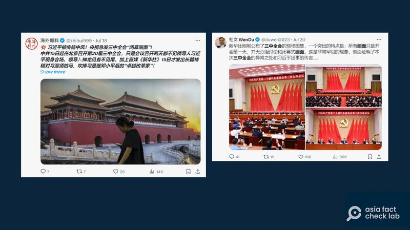

# Media Watch: Rumors about Chinese leader Xi spread online

## Rumors about Xi Jinping’s health have been around for years, cropping up regularly since 2017 or even earlier.

By Rita Cheng for Asia Fact Check Lab

2024.09.03

Washington

In nations where secrecy shrouds the lives of leaders, like China, North Korea and Russia, rumors can quickly take root in the absence of information. This is particularly true when it comes to the health of those leaders, an issue often treated as a state secret.

Recently, the internet buzzed with speculation about Chinese President Xi Jinping’s health, as a noticeable lack of public appearances from July to August fueled rumors that he might be seriously ill.

Despite recent media appearances, rumors about Xi’s health show no sign of waning online. Below is what AFCL found.

## Stroke rumor

A rumor that Xi suffered a stroke appeared in mid-July following the Communist Party’s Third Plenary Session.

At the time, the phrase “stroke” was [banned](https://x.com/whyyoutouzhele/status/1813881685529747690) from one of China’s main search engines, Baidu, lending credibility to the rumors swirling around Xi’s health.

On top of that, a photo of Xi frowning in apparent discomfort at the session emerged online, with many claiming that it was evidence of a health problem.

However, it was later [revealed](https://www.reuters.com/fact-check/months-old-photos-chinas-xi-jinping-shared-july-2024-2024-07-18/) that the photo had been taken two months before the session and captured a fleeting expression on Xi’s face.

Rumors on X claimed that Xi had suffered a stroke. (Screenshot/X)

## Xi’s body double?

On July 20, China’s state-run broadcaster CCTV released footage of Xi paying tribute to the late Vietnamese General Secretary Nguyen Phu Trong at the country’s embassy in Beijing.

Soon after, several Chinese-speaking online users claimed that the man at the ceremony was actually a body double of Xi, adding that Xi could not make it to the event due to health issues.

Some users claimed that a body double of Xi appeared at a commemoration for the recently deceased Vietnamese general secretary. (Screenshots/X and Ministry of Foreign Affairs website)

The users cited blue patches on the carpet seen in the video, along with Xi’s stance and the folds of his ears, as evidence that the CCTV footage was likely fake and had been heavily edited in post-production.

A comparison of the rumors on X (left) with photos taken by Vietnamese and Chinese outlets (right) shows that the crease on Xi's ear changes depending on the angle and lighting of a given shot. (Screenshots/X, VNA and CCTV)

However, using an image verification tool InVID, AFCL found no sign of the video being edited by AI.

## Missing tripod?

A claim about Xi using a body double due to health issues emerged again in late July when a X user [shared](https://archive.is/B3Nab) a CCTV [report](https://archive.is/B3Nab) on Xi’s meeting East Timor’s head of state, claiming that there were visual inconsistencies.

The users pointed out a tripod positioned behind the side of a table where the Chinese delegation was sitting. While the tripod was visible in some shots, it seemed to be missing in others taken from different angles in the same general direction.

Rumors cite a variety of circumstantial evidence as proof of the rumors of Xi’s ill health. (Screenshots/X)

But the claim lacks evidence.

The meeting was held in the east wing of the Great Hall of the People, the same venue where Xi had [met](https://www.gov.cn/yaowen/liebiao/202404/content_6944443.htm) with former Taiwanese President Ma Ying-jeou in April 2024.

AFCL compared CCTV footage of the two meetings and found that three similar doors were positioned on the side (circled in red in the pictures below). They show that the tripod was placed in a spot where it could have been out of view depending on the camera angle.

Comparing footage of Xi’s recent meeting with East Timor’s leader (left) with that of his earlier meeting with Ma Ying-jeou (right) a number of similarly shaped doors at the meeting venue. (Screenshots /Jennifer Zeng X account and CCTV)

## Regular reappearances

In the Chinese dissident community in the United States, rumors about Xi’s health have been around for years, appearing regularly since at least 2017.

They include a claim that Xi had severe health conditions such as a [brain tumor](https://archive.ph/54trQ), a [brain aneurysm](https://archive.ph/mctWQ) and a hearing issue.

But Yaita Akio, a former special China correspondent in Beijing for the Japanese news daily *Sankei Shimbun*, says such rumors are illogical and often easy to spot.

Due to officials’ control over media, breaking news in China is often vague and piecemeal when first being reported, Akio [said](https://x.com/Yaita_Akio/status/1813946909247316364) on X, noting that details of an event are more likely to trickle out to the media rather than to be all known at once, which can lead to misunderstandings.

## *Translated by Shen Ke. Edited by Shen Ke and Taejun Kang.*

*Asia Fact Check Lab (AFCL) was established to counter disinformation in today’s complex media environment. We publish fact-checks, media-watches and in-depth reports that aim to sharpen and deepen our readers’ understanding of current affairs and public issues. If you like our content, you can also follow us on* [*Facebook*](https://www.facebook.com/asiafactchecklabcn) *,* [*Instagram*](https://www.instagram.com/asiafactchecklab/) *and* [*X*](https://twitter.com/AFCL_eng) *.*

[Original Source](https://www.rfa.org/english/news/afcl/afcl-xi-jinping-health-09032024023119.html)