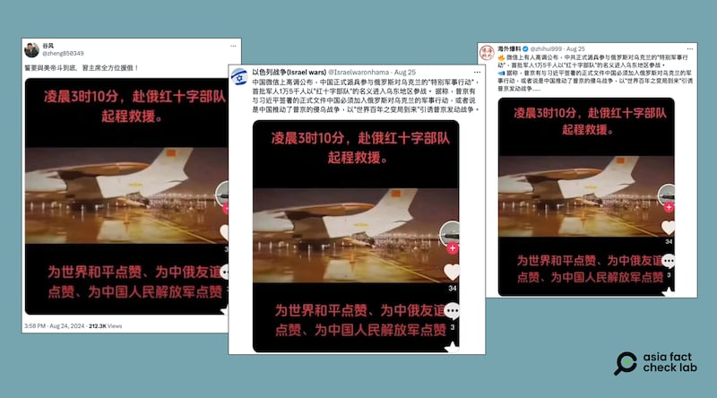
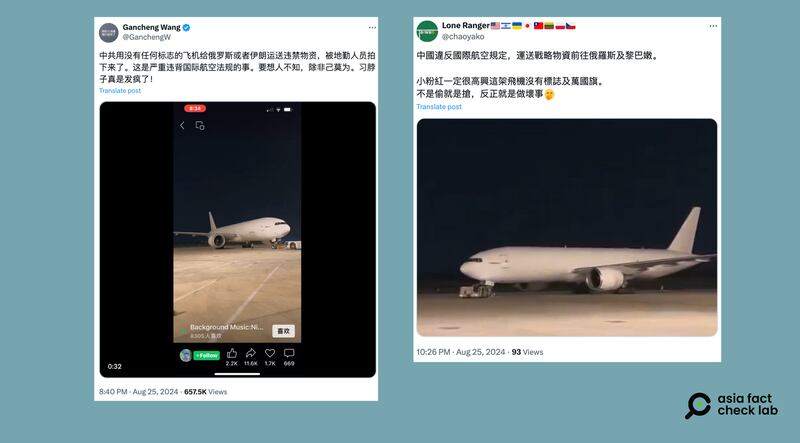

# Did China send troops to aid Russia in the Ukraine war?

## Verdict: False

By Zhuang Jing for Asia Fact Check Lab

2024.09.06

Taipei, Taiwan

## A photo of an aircraft has been shared in Chinese-language social media posts alongside a claim that it shows a Chinese plane disguised as a Red Cross flight entering Ukraine to help Russia.

## But the claim is false. The photo in fact shows a plane that carried a group of doctors to the Chinese city of Wuhan in 2020 following the outbreak of COVID-19.

The photo was shared [here](https://x.com/Israelwaronhama/status/1827421320361222553) on X, formerly known as Twitter, on Aug. 24, 2024.

“China officially sent troops to participate in Russia’s ‘special military operation’ against Ukraine, with the first 15,000 troops entering the war under the name of the ‘Red Cross Forces’,” the caption of the photo reads in part.

The photo shows a white airplane on a landing strip with what appears to be China’s flag emblazoned on its tail.

Several Chinese online users recently claimed that China had officially sent soldiers to fight alongside Russia. (Screenshots/X)

China has repeatedly denied allegations that it supplies Russia with weapons amid accusations that it has built up Russia’s war machine by providing critical components.

Beijing exports more than $300 million worth of dual-use items – those with both commercial and military applications – to Russia every month, according to the U.S.-based think tank Carnegie Endowment for International Peace.

The think tank added the list included what the U.S. had designated as “high priority” items – necessary for making weapons, from drones to tanks.

The U.S. in May imposed sanctions on about 20 firms based in China and Hong Kong, saying one exported components for drones, while others helped Russia bypass Western sanctions on other technologies.

China said it was not selling lethal arms and “prudently handles the export of dual-use items in accordance with laws and regulations.”

The claim about the airplane carrying Chinese troops to Russia was also shared on X [here](https://x.com/zhihui999/status/1827340143851655436) and [here](https://x.com/zheng850349/status/1827254161140035737).

But the claim is false.

A reverse image search on Google found it was published in Chinese-language media in 2020, as seen [here](https://m.thepaper.cn/newsDetail_forward_6386052) and [here](https://www.chinatimes.com/realtimenews/20200127002218-260417?chdtv).

According to the reports, the image shows a Chinese plane carrying doctors to Wuhan following the outbreak of COVID-19 as part of relief efforts and epidemic control.

Keyword searches found no credible or official reports about China sending troops to Ukraine to help Russia.

## Did an unmarked Chinese plane transport aid to Russia?

Separately, a [photo](https://x.com/GanchengW/status/1827687418709094816) and a [video](https://x.com/chaoyako/status/1827714145044803634) of an aircraft with no markings were shared on X alongside a claim that they show a Chinese plane transporting prohibited materials to either Russia or Iran.

Several online users claimed China sent prohibited materials to Russia using unmarked planes. (Screenshots/X)

But the claim is false.

A closer look at the photo and the video found the word “ATLAS” written next to the hatch of the plane and the number “704” marked near the landing gear.

Keyword searches using these two clues found the plane in fact is from the U.S. cargo airline Atlas Air and has nothing to do with China.

## *Translated by Shen Ke. Edited by Shen Ke and Taejun Kang.*

*Asia Fact Check Lab (AFCL) was established to counter disinformation in today's complex media environment. We publish fact-checks, media-watches and in-depth reports that aim to sharpen and deepen our readers' understanding of current affairs and public issues. If you like our content, you can also follow us on*   [*Facebook*](https://www.facebook.com/asiafactchecklabcn)  *,*   [*Instagram*](https://www.instagram.com/asiafactchecklab/)   *and*   [*X*](https://twitter.com/AFCL_eng)  *.*

[Original Source](https://www.rfa.org/english/news/afcl/afcl-china-russia-troop-09062024030513.html)